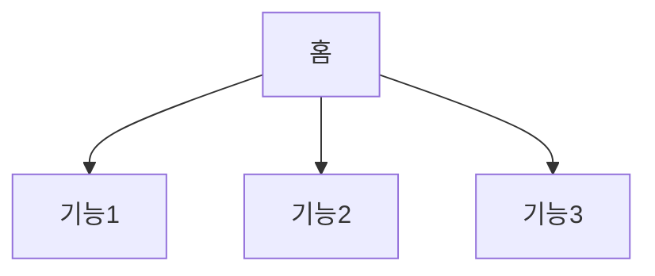
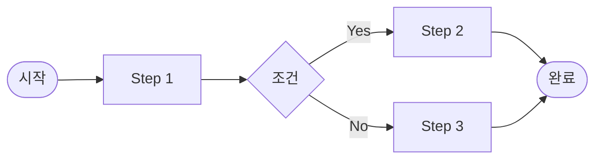

# 정보구조도 (Information Architecture)

> Week 3 산출물. Claude Code에 다음 명령으로 자동 생성:
> `claude "기능명세서.md를 기반으로 정보구조도를 Mermaid flowchart로 작성해줘. 사용자 흐름과 화면 간 이동을 포함해줘"`

**프로젝트명**: [프로젝트명]
**작성일**: YYYY-MM-DD

---

## 1. 전체 사이트맵

## 2. 사용자 흐름 (User Flow)

### 2.1 [주요 흐름 1]

## 3. 화면-기능 매핑

| 화면명 | URL | 주요 기능 | 관련 기능 ID |
|--------|-----|-----------|-------------|
| | | | |
