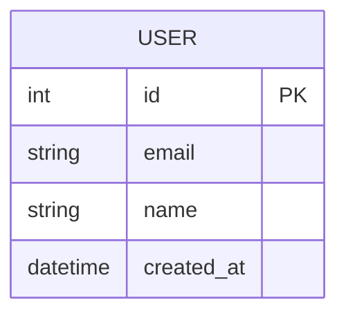

# 데이터베이스 설계서

> 데이터베이스의 논리적/물리적 구조를 정의한다.

## ERD (Entity-Relationship Diagram)

## 테이블 정의

### users

| 컬럼명 | 타입 | 제약조건 | 기본값 | 설명 |
|--------|------|----------|--------|------|
| id | SERIAL | PK | auto | 사용자 고유 ID |
| email | VARCHAR(255) | UNIQUE, NOT NULL | - | 이메일 |
| name | VARCHAR(100) | NOT NULL | - | 이름 |
| password_hash | VARCHAR(255) | NOT NULL | - | 비밀번호 해시 |
| created_at | TIMESTAMP | NOT NULL | NOW() | 생성일시 |
| updated_at | TIMESTAMP | NOT NULL | NOW() | 수정일시 |

### [테이블명]

| 컬럼명 | 타입 | 제약조건 | 기본값 | 설명 |
|--------|------|----------|--------|------|
| | | | | |

## 인덱스 정의

| 테이블 | 인덱스명 | 컬럼 | 유형 | 목적 |
|--------|----------|------|------|------|
| users | idx_users_email | email | UNIQUE | 로그인 조회 |

## 관계 정의

| 부모 테이블 | 자식 테이블 | 관계 | FK 컬럼 | 설명 |
|-------------|-------------|------|---------|------|
| | | | | |

## 초기 데이터

| 테이블 | 데이터 | 용도 |
|--------|--------|------|
| [테이블명] | [데이터 설명] | [용도] |
