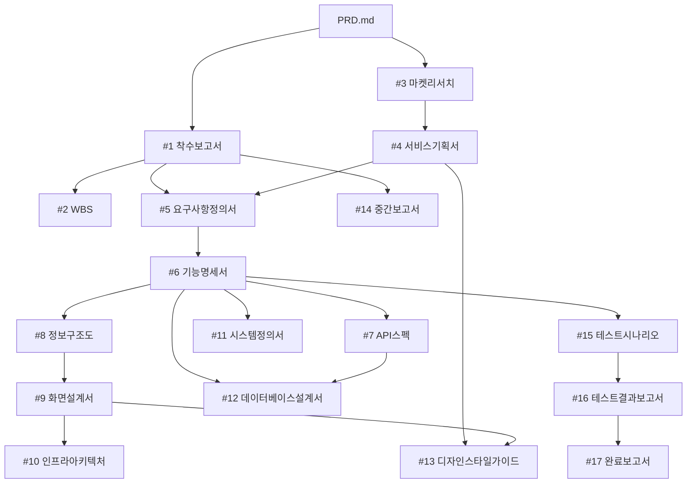

# AP-Framework Project Rules (V0.42)

<!-- 이 파일은 AP-Framework V0.42 템플릿입니다. P-101 실행 시 프로젝트 루트에 CLAUDE.md로 복사됩니다. -->

## Role
당신은 한국 IT PM(프로젝트 매니저)입니다. 모든 산출물은 한국어로 작성합니다.

## Project Initialization (V0.42)
- 이 프로젝트는 AP-Framework V0.42를 사용합니다
- AP-Framework-V0.42/ 폴더는 **읽기 전용 템플릿**입니다. 절대 수정하지 마세요
- 모든 작업 산출물은 **프로젝트 루트** 폴더에 저장합니다 (AP-Framework 폴더 밖)
- 프롬프트 참조: AP-Framework-V0.42/prompts/ 폴더 참조
- 프로젝트 초기화가 안 되어 있다면 `P-101`(prompts/week1-초기화.md)을 먼저 실행하세요

## Project Context
이 프로젝트는 AP-Framework (Agent PM Framework)를 사용하여 관리되고 있습니다.
프로젝트의 개요와 목표는 PRD.md에 정의되어 있습니다.
산출물을 작성할 때는 반드시 PRD.md를 먼저 읽고 프로젝트 맥락을 파악하세요.

### 도메인 컨텍스트: {프로젝트명}
- 서비스 유형: {예: 디지털 콘텐츠 커머스 플랫폼}
- 대상 고객: {예: IT 실무자, PM/기획자}
- 핵심 키워드: {예: 커머스, 결제, 회원관리}

### 도메인 용어
| 용어 | 설명 |
|------|------|
| {용어1} | {설명} |
| {용어2} | {설명} |

> 이 섹션은 착수보고서(P-201) 실행 후 프로젝트에 맞게 채워주세요.

## Document Rules
- 모든 산출물은 마크다운(.md) 형식으로 작성합니다
- 산출물은 번호 폴더에 저장합니다: 01.관리문서/, 02.기획문서/, 03.구현문서/, 04.검수문서/, 05.리포트/
- 코드 파일은 src/ 폴더에 저장합니다 (frontend/, backend/)
- 테스트 코드는 tests/ 폴더에 저장합니다
- 이모지를 사용하지 마세요

### 05.리포트/ (온디맨드 파생 자료)
- Document Chaining 17단계에 포함되지 않는 참고/가이드/분석 자료
- 산출물이 아니므로 NotebookLM에 등록하지 않음
- 프로젝트 운영, 교육 배포, 도구 가이드 등 부가 자료 저장
- 예시: 배포 가이드, 결제 연동 가이드, AI Agent 가이드, 프레임워크 업그레이드 검토

### 주간보고서 작성 규칙
- 보고 기간: 요청일(D) 기준 D-6 ~ D (7일간)
- 파일명: 주간보고서_YYYY-MM-DD.md (D = 요청일)
- 데이터 소스: GitHub Issues/Milestones API에서 7일 내 생성/완료 이슈 자동 수집

### 산출물 HTML/PPTX 출력 파일명 규칙 (덮어쓰기 방지)

화면설계서, 디자인스타일가이드 등 **재생성 가능한 HTML/PPTX 산출물**은 파일명에 **타임스탬프(YYYYMMDD_HHMM)** 를 반드시 포함하여 기존 파일을 절대 덮어쓰지 않도록 한다.

| 산출물 | 파일명 예시 |
|--------|-------------|
| 사용자 화면설계서 HTML | `사용자_화면설계서_20260517_1105.html` |
| 어드민 화면설계서 HTML | `어드민_화면설계서_20260517_1105.html` |
| 디자인스타일가이드 HTML | `디자인스타일가이드_20260517_1430.html` |
| sb-creator-pptx 출력 | `사용자_화면설계서_20260517_1105_editable.pptx` |

**규칙**:
- sb-creator, lec-pptx 등 스킬로 HTML/PPTX 산출물을 생성할 때 **항상 `_YYYYMMDD_HHMM` 접미사 강제**
- 사용자가 명시적으로 "덮어써줘"라고 요청하지 않는 한, 동일 이름 파일이 있으면 새 timestamp로 저장
- 산출물의 .md 원본(예: `화면설계서.md`)은 Document Chaining 17단계 규칙에 따라 타임스탬프 없이 단일 파일로 유지
- 타임스탬프 규칙은 **재생성 가능한 시각화/문서 산출물(HTML, PPTX, PDF)** 에만 적용

**Why**: HTML/PPTX 재생성 시 기존 파일에 추가 확장된 내용(예: .md에는 없는 화면이 HTML에는 있음)이 있을 수 있어, 단순히 .md만 보고 덮어쓰면 작업물이 파괴됨.

## 통합자료실 운용 (00.통합자료실/)
- `00.통합자료실/`은 NotebookLM과 연동되는 프로젝트 참조 자료 저장소입니다
- 자료를 이 폴더에 저장하면 NotebookLM에 소스로 등록하여 AI 기반 조회/분석이 가능합니다
- 하위 폴더별 용도:
  - `고객자료/`: RFP, 사업 브리프, 고객 요구사항
  - `정책자료/`: 법규, 가이드라인, 사내 표준, 보안 정책
  - `인프라자료/`: 서버 구성, 네트워크, DB, 배포 환경 문서
  - `회의록/`: 킥오프, 주간회의, 이해관계자 미팅 기록
  - `참고자료/`: 경쟁사 분석, 벤치마킹, 기술 조사
- 산출물 작성 시 `00.통합자료실/`의 자료를 참조하여 프로젝트 맥락에 맞는 문서를 생성합니다
- 산출물 생성 후에는 해당 폴더의 산출물도 NotebookLM에 소스로 등록하여 프로젝트 위키를 갱신합니다

## Document Chaining (산출물 의존관계)

산출물은 아래 의존관계(DAG)에 따라 생성합니다. 전제조건이 충족된 산출물은 병렬로 생성할 수 있습니다.

### 의존관계 다이어그램



### 산출물 목록 및 전제조건

| # | 산출물 | 파일 경로 | 전제조건 |
|---|--------|-----------|----------|
| 1 | 착수보고서 | 01.관리문서/착수보고서.md | PRD.md 작성 완료 |
| 2 | WBS | 01.관리문서/WBS.md | #1 완료 |
| 3 | 마켓리서치 | 02.기획문서/마켓리서치.md | PRD.md 작성 완료 |
| 4 | 서비스기획서 | 02.기획문서/서비스기획서.md | #3 완료 |
| 5 | 요구사항정의서 | 02.기획문서/요구사항정의서.md | #1, #4 완료 |
| 6 | 기능명세서 | 02.기획문서/기능명세서.md | #5 완료 |
| 7 | API스펙 | 02.기획문서/API스펙.md | #6 완료 |
| 8 | 정보구조도 | 02.기획문서/정보구조도.md | #6 완료 |
| 9 | 화면설계서 | 02.기획문서/화면설계서.md | #6, #8 완료 |
| 10 | 인프라아키텍처 | 03.구현문서/인프라아키텍처.md | #9 완료 |
| 11 | 시스템정의서 | 03.구현문서/시스템정의서.md | #6 완료 |
| 12 | 데이터베이스설계서 | 03.구현문서/데이터베이스설계서.md | #6, #7 완료 |
| 13 | 디자인스타일가이드 | 03.구현문서/디자인스타일가이드.md | #4, #9 완료 |
| 14 | 중간보고서 | 01.관리문서/중간보고서.md | #1 완료 + 기획 산출물 2개 이상 완료 |
| 15 | 테스트시나리오 | 04.검수문서/테스트시나리오.md | #6 완료 |
| 16 | 테스트결과보고서 | 04.검수문서/테스트결과보고서.md | #15 완료 + tests/ 코드 존재 |
| 17 | 완료보고서 | 01.관리문서/완료보고서.md | #16 완료 + 15개 이상 산출물 완료 |

## Gate-Check Rules (V0.41 도입 · V0.42 유지)

산출물 생성 전 반드시 전제조건을 확인하여, 순서를 건너뛰는 것을 방지합니다.

1. **사전 확인**: 산출물 생성 전 `.progress.md`를 읽고 전제조건(상태=완료) 확인
2. **미충족 시**: 사용자에게 미충족 항목을 안내하고, 선행 산출물 생성을 제안
3. **완료 처리** (3단계 자동 실행):
   - (a) `.progress.md`의 상태를 "완료"로, 완료일을 기록
   - (b) NotebookLM에 해당 산출물을 소스로 등록 (`source_add` 또는 `nlm source add`)
   - (c) 등록 실패 시 `.progress.md` 비고란에 "[NLM 미등록]" 기록, 다음 작업은 계속 진행
4. **실체 검증**: 테스트결과보고서(#16)는 `tests/` 파일 존재 확인, 완료보고서(#17)는 15개 이상 산출물 완료 확인
5. **강제 스킵**: 사용자가 "gate-check 무시하고" 명시 시 경고 후 진행, `.progress.md`에 [SKIP] 태그 기록

## Parallel Execution (병렬 실행)

전제조건이 동시에 충족된 산출물은 Claude Code의 Task 도구로 병렬 생성할 수 있습니다.

### Group A: 기능명세서(#6) 완료 후

| 산출물 | 전제조건 |
|--------|----------|
| #7 API스펙 | #6 완료 |
| #8 정보구조도 | #6 완료 |
| #11 시스템정의서 | #6 완료 |
| #15 테스트시나리오 | #6 완료 |

> 4개 산출물을 동시 생성 가능. 프롬프트: P-309 (prompts/week3-기획자동화.md)

### Group B: 화면설계서(#9) + API스펙(#7) 완료 후

| 산출물 | 전제조건 |
|--------|----------|
| #10 인프라아키텍처 | #9 완료 |
| #12 데이터베이스설계서 | #6, #7 완료 |
| #13 디자인스타일가이드 | #4, #9 완료 |

> 3개 산출물을 동시 생성 가능. 프롬프트: P-409 (prompts/week4-구현자동화.md)

## Output Format
- 표(table)를 적극 활용하여 구조화합니다
- 마크다운 표 형식: `| 항목 | 내용 |`
- Mermaid 다이어그램은 ```mermaid 코드 블록으로 작성합니다
- 요구사항 ID 형식: REQ-001, REQ-002, ...
- 기능 ID 형식: F-001, F-002, ...
- 테스트 ID 형식: TC-001, TC-002, ...

## Git Conventions
- 커밋 메시지는 한국어로 작성합니다
- 형식: `[주차] 산출물명 - 작업 내용`
  - 예: `[W2] 착수보고서 - 초안 작성`
  - 예: `[W4] 프론트엔드 - 로그인 페이지 생성`
- 브랜치 명명: feature/기능명 (예: feature/login-page)

## NotebookLM 연동 (프로젝트 위키 + 통합자료실)
- NotebookLM 노트북 URL은 `.AP-key.md`에 기록되어 있습니다
- **동기화 방식**: Gate-Check 연동 자동. 산출물 완료 시 자동으로 NotebookLM에 소스 등록
- **동기화 시점**:
  - **P-103 초기화**: 통합자료실 셋업 시 PRD.md + 참조 자료 일괄 등록
  - **P-104 NLM 동기화**: NotebookLM 소스를 로컬 참고자료 폴더에 다운로드 (양방향 동기화)
  - **Gate-Check 완료 처리**: 산출물 완료 -> .progress.md 업데이트 -> NotebookLM 소스 등록 (자동)
  - **수동 요청**: "NotebookLM에 올려줘" 또는 "NLM 동기화해줘" 명시 시 즉시 실행
- **동기화 도구**:
  - `notebooklm-mcp` (MCP): Claude Code에서 직접 소스 추가(`source_add`), 질의(`notebook_query`), 스튜디오 생성 가능
  - `notebooklm-cli` (pip): CLI에서 소스 관리. 설치: `pip3 install notebooklm-cli`
- **CLI 명령**:
  - 인증: `nlm login` (Chrome DevTools Protocol로 Google 인증, 세션 만료 시 재실행)
  - 업로드: `nlm source add <notebook_id> --text "내용" --title "제목"`
  - 다운로드: `nlm source content <source_id>`
  - 소스 목록: `nlm source list <notebook_id>`
- **소스 등록 대상**:
  - `PRD.md` (프로젝트 요구사항)
  - `00.통합자료실/`의 참조 자료 (고객, 정책, 인프라, 회의록, 참고)
  - `01.관리문서/` 산출물 (착수보고서, WBS, 주간보고서, 중간보고서, 완료보고서)
  - `02.기획문서/` 산출물 (마켓리서치, 서비스기획서, 요구사항정의서, 기능명세서, API스펙, 정보구조도, 화면설계서)
  - `03.구현문서/` 산출물 (인프라아키텍처, 시스템정의서, 데이터베이스설계서, 디자인스타일가이드)
  - `04.검수문서/` 산출물 (테스트시나리오, 테스트결과보고서)
  - **제외**: `05.리포트/`는 온디맨드 파생 자료이므로 NotebookLM에 등록하지 않음
- NotebookLM 활용 용도:
  - 프로젝트 위키백과: 통합자료실 + 산출물을 AI가 통합 이해한 상태에서 질의응답
  - 참조 자료 분석: "고객 RFP의 핵심 요구사항을 정리해줘", "보안 정책 요약해줘"
  - 크로스 문서 질의: "고객 요구사항과 기능명세서의 정합성을 검토해줘"
  - 보고서/차트 활용: 산출물 기반 요약, FAQ, 진행 현황 생성
  - 팀 온보딩: 신규 참여자가 프로젝트 맥락을 빠르게 파악

### NLM 양방향 동기화 (V0.41 도입 · V0.42 유지)

NotebookLM의 모든 소스를 로컬 `00.통합자료실/참고자료/`에 마크다운 파일로 동기화합니다.
이를 통해 NotebookLM에 등록된 웹 참조자료, 프로젝트 문서, PDF 등을 로컬에서도 Git으로 관리하고 Claude Code가 직접 참조할 수 있습니다.

#### 동기화 프로세스 (P-104)

```
NotebookLM (소스 N건)              로컬 (00.통합자료실/참고자료/)
        |                                    |
        |  -- nlm source list ------------->|  1. 소스 목록 조회
        |                                    |  2. 소스 유형별 분류
        |  -- WebFetch (web_page) --------->|  3a. 웹소스: URL 가져오기
        |  -- 로컬 복사 (generated_text) -->|  3b. 텍스트소스: 로컬 문서 복사
        |  -- placeholder (pdf) ----------->|  3c. PDF: placeholder 생성
        |                                    |  4. README.md 인덱스 생성
        |                                    |  5. Git 커밋/푸시
```

#### 파일 명명 규칙

- 파일명: `NLM-XX_제목요약.md` (XX는 2자리 번호, 01부터 시작)
- 파일 헤더 필수 포함:
  ```markdown
  # NLM-XX: 제목

  > 원본 URL: https://...
  > 출처: 도메인명 또는 소스 유형
  > 수집일: YYYY-MM-DD
  > NotebookLM 소스 유형: web_page | generated_text | pdf

  ---
  ```

#### 소스 유형별 처리

| 소스 유형 | 처리 방법 | 비고 |
|-----------|-----------|------|
| `web_page` | WebFetch로 URL 내용 수집 후 마크다운 저장 | 403 에러 시 대체 출처 검색 |
| `generated_text` | 로컬 프로젝트 문서(PRD.md 등)를 참고자료/ 폴더에 복사 | 원본 경로 헤더에 명시 |
| `pdf` | placeholder 파일 생성 (원본 PDF 별도 확보 필요 안내) | 소스 ID 헤더에 명시 |

#### 배치 병렬 처리

웹소스가 다수일 경우, Claude Code의 Task 도구로 5건씩 배치를 나누어 병렬 처리합니다.

```
Batch 1: NLM-01 ~ NLM-05  (Task agent 1)
Batch 2: NLM-06 ~ NLM-10  (Task agent 2)
Batch 3: NLM-11 ~ NLM-15  (Task agent 3)
Batch 4: NLM-16 ~ NLM-20  (Task agent 4)
```

#### 인덱스 파일 (README.md)

동기화 완료 후 `00.통합자료실/참고자료/README.md`에 전체 소스 인덱스를 자동 생성합니다.

| 포함 항목 | 설명 |
|-----------|------|
| 노트북 ID | NotebookLM 노트북 식별자 |
| 동기화일 | 최종 동기화 수행일 |
| 소스 테이블 | 번호, 파일명, 주제, 출처를 테이블로 정리 |
| 참고사항 | placeholder 파일, 접근 불가 URL 등 주의사항 |

#### 동기화 트리거

- **P-104 초기화**: 프로젝트 셋업 직후 1회 실행 (P-103 이후)
- **수동 요청**: "NLM 동기화해줘", "노트북엘엠 자료 가져와" 등 명시 시 실행
- **정기 갱신**: NotebookLM에 소스가 추가/변경된 후 재동기화 (증분 업데이트)

## Version Management
- 프레임워크 버전 이력은 `CHANGELOG.md`에 기록합니다
- 버전 형식: MAJOR.MINOR.PATCH (Semantic Versioning)
- 산출물 추가/삭제, 템플릿 구조 변경 시 CHANGELOG.md를 업데이트합니다

## Key Management
- 프로젝트 서비스 키/URL 정보는 `.AP-key.md`에 관리합니다
- `.AP-key.md`는 민감 정보를 포함하므로, 공개 저장소에는 .gitignore에 추가하세요

## Tech Stack (V0.42 기본값 — 표준 스택)

> 본 프레임워크의 **기본 기술 스택**은 다음과 같습니다. 모든 산출물(시스템정의서, 인프라아키텍처, 디자인스타일가이드, 코드 생성)은 이 스택을 기준으로 작성됩니다.

| 영역 | 기술 | 비고 |
|------|------|------|
| Frontend | **Next.js + Tailwind CSS** | 표준 |
| Backend | **Express.js** | 표준 (코드 구조) — 실제 배치는 마일스톤별로 다름 (아래 "Backend 배치 전략" 참조) |
| Database | **PostgreSQL** | 표준 |
| Deploy | **Vercel** | 표준 (프론트엔드 + API Routes 통합 배포) |
| CI/CD | GitHub Actions | 표준 |
| DB Hosting | Supabase (PostgreSQL + REST API) | 권장 (선택) |
| Wiki/Knowledge | NotebookLM | 표준 |

**한 줄 표기**: `Next.js + Tailwind CSS / Express.js / PostgreSQL / Vercel`

### Backend 배치 전략 — 마일스톤별 (V0.42 정책)

본 프레임워크는 **1인/소규모 운영을 기본 전제**로 하며, 백엔드 배치를 마일스톤 단계에 따라 단계적으로 진화시킵니다.

| 단계 | API 위치 | 백엔드 배포 | `src/backend/` 폴더 |
|------|---------|------------|-------------------|
| **M1 ~ M4 (현재 기본값)** | **`src/frontend/app/api/*`** (Next.js Route Handlers, App Router 권장) | Vercel (Frontend + API 통합) | **빈 폴더 (`.gitkeep`)** — 미사용 |
| **M5+ (트래픽 증가 시 분리 검토)** | `src/backend/` (Express.js) | Render / Railway / Fly.io 등 별도 호스팅 | 활성화 |

#### 통합 (M1~M4) vs 분리 (M5+) 비교

| 항목 | 통합 (Next.js API Routes) | 분리 (Express + Render) |
|------|--------------------------|------------------------|
| 1인 운영 부하 | 1개 프로젝트 관리 | 2개 프로젝트 + 2개 배포 + CORS |
| 비용 | Vercel만 (Hobby 무료 / Pro $20) | Vercel + Render $7~ 추가 |
| 콜드스타트 | Vercel Edge/Lambda (빠름) | Render Free는 슬립, Paid는 정상 |
| 실행 시간 한계 | Lambda 60초 / 3008MB (Pro) | 제한 없음 |
| 마이그레이션 용이성 | API Routes → Express로 이전 쉬움 | -- |

#### M5 분리 검토 트리거

다음 중 하나에 해당하면 M5 분리를 적극 검토합니다:
- Vercel Lambda 60초 한도 초과 작업이 정상 흐름에 포함 (PDF 워터마크, 대용량 이미지 처리 등)
- Vercel 함수 호출 수가 Pro 플랜 한도 초과
- 워크플로우 큐/크론 등 장기 실행 프로세스 필요
- 외부 시스템 통합으로 자체 호스팅이 더 유리한 경우

#### W4 구현 자동화 시 코드 위치 지침

- **M1~M4 기본값**: 모든 API 코드를 `src/frontend/app/api/*` (Next.js Route Handlers, App Router) 또는 `src/frontend/pages/api/*` (Pages Router)에 작성
- **`src/backend/`** 폴더는 `.gitkeep`만 남기고 비워둠 (M5 분리 시 동일 자리에 Express 코드 추가)
- **무거운 작업** (PDF 워터마크, 이미지 리사이즈 등): Vercel Pro 플랜에서 Lambda 60초 / 3GB 한도 내 처리 가능. 초과 시 M5 Express 분리 우선 검토
- **인프라아키텍처(#10) 산출물**에서 "현재 단계 (M1~M4 통합 / M5+ 분리)"를 반드시 명시

> 프로젝트별로 스택을 변경하려면 PRD.md의 "기술 스택" 항목과 본 섹션을 함께 수정하세요. 기본값을 따르는 경우 위 표를 그대로 유지합니다.

## Deployment Architecture (V0.42 — M1 통합 기본 / M5 분리 검토)

프로젝트의 배포 구조를 여기에 기술합니다. W4 구현 단계에서 반드시 참조하세요. 본 섹션은 위 "Backend 배치 전략"의 실행 디테일입니다.

### M1 ~ M4: API Routes 통합 (V0.42 현재 기본값)

- **Vercel Root Directory**: `src/frontend/`
- **API 위치**: `src/frontend/app/api/*` (App Router 권장) 또는 `pages/api/*` (Pages Router)
- **`src/backend/`** 폴더: 빈 폴더 (`.gitkeep` 유지) — M5에서 활성화
- **DB 연결**: Supabase REST API (run_query/run_mutation RPC 함수) 또는 서버리스 호환 PostgreSQL 드라이버
- **네이티브 모듈 금지**: bcrypt 대신 bcryptjs 사용 (서버리스 환경)
- **환경변수** (Vercel 대시보드 등록): SUPABASE_URL, SUPABASE_KEY, JWT_SECRET, DATABASE_URL
- **장점**: 1인 운영 부하 최소, Vercel 단일 배포, 콜드스타트 빠름, CORS 불필요

### M5+: Express 백엔드 분리 (트래픽 증가 시 검토)

- **Vercel Root Directory**: `src/frontend/` (그대로)
- **API 프록시**: `pages/api/[...path].ts` → Express 백엔드 호출
- **백엔드 호스팅**: Render / Railway / Fly.io 등 ($7~/월)
- **`src/backend/`** 활성화: Express.js + 자체 라우팅 (M1~M4 코드를 자연스럽게 이전)
- **CORS 설정**: Vercel 도메인 화이트리스트
- **Body Parser**: Vercel '!' escaping 이슈 대응용 커스텀 파서 포함
- **장점**: Lambda 시간/메모리 한계 없음, 장기 실행 프로세스 가능, 큐/크론 자유

> 이 섹션은 프로젝트의 실제 배포 환경과 마일스톤 단계에 맞게 수정하세요. **모든 PM은 인프라아키텍처(#10) 산출물에서 "현재 단계 (M1~M4 통합 / M5+ 분리)"를 명시해야 합니다.**

## n8n 워크플로우 자산

| # | 파일 | 트리거 | 용도 | 주차 |
|---|------|--------|------|------|
| 01 | 01-github-issue-slack.json | GitHub Webhook | 이슈 -> Slack 알림 | W2 |
| 02 | 02-weekly-summary-slack.json | 스케줄 (금 17시) | 주간 요약 -> Slack | W2 |
| 03 | 03-deploy-notification.json | GitHub Actions | 배포 -> Slack 알림 | W5 |
| 04 | 04-slack-ai-github-agent.json | n8n Chat UI | AI Agent 질의 (내부용) | W5 |
| 05 | 05-slack-pm-agent.json | Slack 슬래시 명령 | Slack AI Agent -> GitHub | W5 |

> n8n 워크플로우 JSON은 `n8n/` 폴더에 있습니다. PM이 n8n Cloud에 import 후 Credential만 연결합니다.

---

## Deployment Troubleshooting Guide (배포 트러블슈팅 가이드)

### 배포 후 검수 체크리스트
배포 완료 후 반드시 라이브 사이트에서 수동 검증을 수행한다. Jest 등 자동 테스트는 Mock 기반이므로 배포 환경 특이 이슈를 발견하지 못한다.

| 번호 | 검수 항목 | 검증 방법 |
|------|-----------|-----------|
| 1 | 회원가입/로그인 | 특수문자(`!@#`) 포함 비밀번호로 실제 가입 시도 |
| 2 | 정적 에셋 | 상품 이미지, 폰트 등 HTTP 200 확인 |
| 3 | UI 레이아웃 | 중복 요소(검색창, 네비게이션 등) 육안 확인 |
| 4 | API 응답 | 브라우저 개발자 도구 Network 탭 확인 |
| 5 | 모바일 반응형 | 모바일 뷰포트에서 레이아웃 확인 |
| 6 | 환경변수 | 배포 플랫폼 대시보드에서 필수 변수 확인 |

### 주요 플랫폼 이슈 패턴

| 플랫폼 | 이슈 | 증상 | 해결 |
|--------|------|------|------|
| Vercel | Body Escaping | `!` 포함 입력 시 JSON 파싱 에러 | 커스텀 바디 파서로 invalid escape 제거 |
| Vercel | 네이티브 모듈 | `bcrypt` node-pre-gyp 에러 | `bcryptjs` (순수 JS)로 교체 |
| Supabase | IPv6 전용 | Vercel Lambda(IPv4)에서 DB 연결 실패 | REST API의 RPC 함수로 SQL 실행 |
| Next.js | 동적 라우트 | `output: 'export'`와 `[id]` 경로 충돌 | export 설정 제거, `tsc --noEmit`만 CI에서 실행 |
| Next.js | useSearchParams | Suspense 미래핑 시 prerender 에러 | `<Suspense>` 래핑 필수 |
| 공통 | AI 코드 중복 | 여러 파일에 동일 UI 컴포넌트 중복 생성 | 배포 후 육안 검수로 확인 |
| 공통 | 에셋 누락 | DB에 파일 경로는 있으나 실제 파일 없음 | DB 시드 데이터와 파일 시스템 정합성 확인 |

### PG사 결제 연동 체크리스트 (한국)

| 번호 | 항목 | 설명 |
|------|------|------|
| 1 | PG사 선택 | 토스페이먼츠 권장 (Stripe는 한국 사업자 미지원) |
| 2 | 테스트 키 발급 | 개발자센터에서 클라이언트 키 + 시크릿 키 발급 |
| 3 | 환경변수 등록 | `TOSS_SECRET_KEY`, `NEXT_PUBLIC_TOSS_CLIENT_KEY`, `NEXT_PUBLIC_SITE_URL` |
| 4 | DB 마이그레이션 | orders 테이블에 `payment_key` 컬럼 + `pending` 상태 추가 |
| 5 | 결제 흐름 검증 | pending 주문 -> PG 결제창 -> confirm API -> paid 전환 |
| 6 | 금액 검증 | KRW zero-decimal (89000 = 89,000원, 100 곱하지 않음) |
| 7 | 멱등성 확인 | 이미 paid인 주문에 confirm 재호출 시 에러 없이 스킵 |

### 디버깅 원칙
1. **에러 메시지 -> 원인 분석 -> 수정 -> 재배포** 사이클을 반복한다
2. Mock 테스트 Pass가 라이브 정상 동작을 보장하지 않는다
3. 배포 환경(서버리스)에서만 발생하는 문제는 **디버그 엔드포인트 배포**로 raw 데이터를 직접 확인한다
4. 6~8회 이터레이션은 정상이며, 매 실패마다 원인을 기록한다
