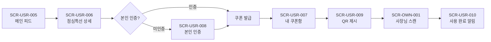
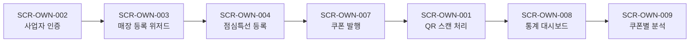
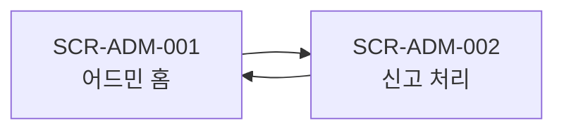

<style>
@media print {
    body, p, li { font-size: 13pt !important; line-height: 1.6 !important; }
    h1 { font-size: 22pt !important; margin-top: 22pt !important; margin-bottom: 14pt !important; }
    h2 { font-size: 18pt !important; margin-top: 18pt !important; margin-bottom: 12pt !important; }
    h3 { font-size: 16pt !important; margin-top: 16pt !important; margin-bottom: 10pt !important; }
    h4 { font-size: 14pt !important; margin-top: 12pt !important; margin-bottom: 8pt !important; }
    ul, ol { margin-top: 5pt !important; margin-bottom: 5pt !important; padding-left: 22pt !important; }
    pre, code { font-size: 10pt !important; }
}
</style>

# 화면 설계서 (Screen Design Specification) · 점심특강

**프로젝트명**: 점심특강 (Lunch Special Lecture)
**작성일**: 2026-05-31
**버전**: v1.0
**근거 문서**:
- [기능명세서.md](기능명세서.md) v1.0 (F-XXXX 59건 + SCR 33종 + API 34종)
- [정보구조도.md](정보구조도.md) v1.0 (사이트맵 + User Flow 4종 + 화면 전이 매트릭스)
- [요구사항정의서.md](요구사항정의서.md) v1.0
- [서비스기획서.md](서비스기획서.md) v1.0

**ID 체계** (정보구조도와 동일):
- 화면 ID: `SCR-{USR|OWN|ADM}-{NNN}`
- 기능 ID: `F-{기능군 2자리}{순번 2자리}`
- API ID: `API-{METHOD}-{path-slug}`

**범위**:
- 사용자 앱 (SCR-USR) — 18 화면
- 사장님 앱 (SCR-OWN) — 13 화면
- 어드민 (SCR-ADM) — 2 화면
- **총 33 화면**

---

## 1. 화면 목록 (Master List)

### 1.1 사용자 앱 (SCR-USR — 18개)

| 화면 ID | 화면명 | URL | 관련 F-ID | 우선순위 |
|---------|--------|------|------------|----------|
| SCR-USR-001 | 메인 지도 | `/map` | F-0101, F-0103~107 | P0 |
| SCR-USR-002 | 메인 리스트 | `/list` | F-0102, F-0103~107 | P0 |
| SCR-USR-003 | 카테고리 필터 모달 | `/map?filter=category` | F-0104 | P0 |
| SCR-USR-004 | 검색 | `/search?q=` | F-0108 | P0 |
| SCR-USR-005 | 메인 피드 (점심특선) | `/` | F-0201~205, F-0207 | P0 |
| SCR-USR-006 | 점심특선 상세 | `/special/:id` | F-0206, F-0301, F-0503 | P0 |
| SCR-USR-007 | 내 쿠폰함 | `/coupons` | F-0307, F-0309 | P0 |
| SCR-USR-008 | 본인 인증 | `/auth/verify` | F-0302 | P0 |
| SCR-USR-009 | 쿠폰 QR 제시 | `/coupons/:id/qr` | F-0303, F-0306 | P0 |
| SCR-USR-010 | 알림 센터 | `/notifications` | F-0308, F-9006 | P0 |
| SCR-USR-011 | 회원가입 | `/signup` | F-9001 | P0 |
| SCR-USR-012 | 신고 | `/reports/new` | F-9004 | P0 |
| SCR-USR-013 | 회원 탈퇴 | `/settings/withdraw` | F-9005 | P0 |
| SCR-USR-014 | 설정 (큰 글씨·알림) | `/settings` | F-9007, F-7003 | P0 |
| SCR-USR-015 | 리뷰 작성/조회 | `/stores/:id/reviews` | F-7001 | P1 (Phase 2) |
| SCR-USR-016 | 즐겨찾기 | `/favorites` | F-7002 | P1 (Phase 2) |
| SCR-USR-017 | 결제 | `/payments/checkout` | F-8002, F-8003 | P2 (Phase 3) |
| SCR-USR-018 | 친구 초대 | `/invite` | F-8004 | P2 (Phase 3) |

### 1.2 사장님 앱 (SCR-OWN — 13개)

| 화면 ID | 화면명 | URL | 관련 F-ID | 우선순위 |
|---------|--------|------|------------|----------|
| SCR-OWN-001 | QR 스캐너 | `/owner/qr-scan` | F-0304, F-0305, F-0306 | P0 |
| SCR-OWN-002 | 사업자 인증 | `/owner/onboarding` | F-0401, F-9002 | P0 |
| SCR-OWN-003 | 매장 등록 위저드 (3단계) | `/owner/stores/new` | F-0402, F-0403 | P0 |
| SCR-OWN-004 | 점심특선 등록 | `/owner/specials/new` | F-0404~406 | P0 |
| SCR-OWN-005 | 홈 대시보드 (상태 토글) | `/owner/dashboard` | F-0407 | P0 |
| SCR-OWN-006 | 매장 관리 (수정·이력) | `/owner/stores/:id` | F-0408 | P0 |
| SCR-OWN-007 | 쿠폰 발행 | `/owner/coupons/new` | F-0501~503 | P0 |
| SCR-OWN-008 | 통계 대시보드 (4지표·ROI) | `/owner/analytics` | F-0504~506, F-0508 | P0 |
| SCR-OWN-009 | 쿠폰별 분석 | `/owner/coupons/:id/analytics` | F-0507 | P0 |
| SCR-OWN-010 | 설정 (큰 글씨) | `/owner/settings` | F-9007 | P0 |
| SCR-OWN-011 | B2B 대시보드 | `/owner/b2b/dashboard` | F-7005 | P1 (Phase 2) |
| SCR-OWN-012 | B2B 정산 | `/owner/b2b/settlements` | F-7006 | P1 (Phase 2) |
| SCR-OWN-013 | 광고 | `/owner/ads` | F-8001 | P2 (Phase 3) |

### 1.3 어드민 (SCR-ADM — 2개)

| 화면 ID | 화면명 | URL | 관련 F-ID | 우선순위 |
|---------|--------|------|------------|----------|
| SCR-ADM-001 | 어드민 홈 | `/admin` | F-9003 | P0 |
| SCR-ADM-002 | 신고 처리 | `/admin/reports/:id` | F-9004 | P0 |

---

## 2. 사용자 앱 (USR) 화면 상세 설계

### 2.1 SCR-USR-001: 메인 지도

| 항목 | 내용 |
|------|------|
| **URL** | `/map` |
| **목적** | 사용자의 현재 GPS 위치를 중심으로 주변 식당을 지도 마커로 시각화 |
| **관련 기능** | F-0101, F-0103, F-0104, F-0105, F-0106, F-0107 |
| **인증 요구** | 게스트 가능 (위치 권한 필수) |
| **핵심 UI 컴포넌트** | 상단 헤더(로고·알림·설정 아이콘), 검색 바, 필터 바(반경·카테고리·1인좌석·가격대·즉시입장), 카카오맵(마커 클러스터링·현재 위치 핀·반경 원), 우상단 지도↔리스트 토글, 하단 Tab Bar 5종 |
| **연동 API** | `API-GET-restaurants?lat=&lng=&radius=&category[]=&solo_seating=&price_range=&available_now=` |
| **상태 흐름** | 진입 → GPS 권한 요청 → 좌표 확보 → API 호출(1초 이내) → 마커 표시 → 사용자 필터 변경 시 재요청 |
| **예외 처리** | ❶ GPS 권한 거부 → 수동 위치 검색 폴백 / ❷ 3초 타임아웃 → 안내 토스트 / ❸ 결과 0건 → "반경 확대?" CTA |

**레이아웃 ASCII (모바일 세로)**:
```
┌──────────────────────────┐
│ ☰  점심특강       🔔 ⚙   │ ← 헤더
├──────────────────────────┤
│  🔍 매장·메뉴 검색       │ ← 검색바
├──────────────────────────┤
│ [500m▼][한식·분식+][🪑1인][즉시] │ ← 필터바
├──────────────────────────┤
│                          │
│       ◯ 사용자 위치       │
│   📍       📍             │
│      📍 카카오맵 영역     │
│   📍   📍                  │
│         📍                │
│                  [🗺/📋]  │ ← 지도/리스트 토글 (FAB)
├──────────────────────────┤
│ 홈 | 탐색 | 쿠폰 | 알림 | 마이│ ← Tab Bar
└──────────────────────────┘
```

---

### 2.2 SCR-USR-002: 메인 리스트

| 항목 | 내용 |
|------|------|
| **URL** | `/list` |
| **목적** | 지도와 동일 데이터를 거리순 정렬된 카드 리스트로 노출 |
| **관련 기능** | F-0102 (+ F-0103~107) |
| **인증 요구** | 게스트 가능 |
| **핵심 UI 컴포넌트** | 헤더·검색 바·필터 바(SCR-USR-001과 공유), 카드 리스트(썸네일/식당명/거리/카테고리 태그/점심특선 뱃지/즉시입장 뱃지), 무한 스크롤, 우상단 토글 버튼 |
| **연동 API** | `API-GET-restaurants` (SCR-USR-001과 동일 엔드포인트, 클라이언트 캐시 활용 → 재요청 없음) |
| **상태 흐름** | 토글 진입 시 캐시 데이터 즉시 렌더 → 사용자 필터 변경 시 재요청 → 카드 탭 시 SCR-USR-006 진입 |
| **예외 처리** | 빈 결과 → "주변에 등록된 매장이 없습니다" + 반경 확대 CTA |

---

### 2.3 SCR-USR-003: 카테고리 필터 모달

| 항목 | 내용 |
|------|------|
| **URL** | `/map?filter=category` (Bottom Sheet 형태) |
| **목적** | 한식·분식·카페·양식·중식·일식·건강식 등 카테고리 다중 선택 |
| **관련 기능** | F-0104 |
| **인증 요구** | 게스트 가능 |
| **핵심 UI 컴포넌트** | Bottom Sheet(50% 높이), 카테고리 칩 그리드(체크박스 토글), "선택 N개" 카운터, 하단 "적용"·"초기화" 버튼 |
| **연동 API** | URL 쿼리 동기화 → `API-GET-restaurants?category[]=` 재요청 |
| **상태 흐름** | 필터 버튼 → Bottom Sheet 슬라이드 업 → 다중 선택 → 적용 → 모달 닫힘 + 결과 갱신 |
| **예외 처리** | 미선택 시 "전체" 자동 적용 |

---

### 2.4 SCR-USR-004: 검색

| 항목 | 내용 |
|------|------|
| **URL** | `/search?q=` |
| **목적** | 식당명·메뉴명 부분 일치 검색 (한글 자모 분리 매칭 지원) |
| **관련 기능** | F-0108 |
| **인증 요구** | 게스트 가능 |
| **핵심 UI 컴포넌트** | 풀스크린 모달, 검색 입력창(자동 포커스·자동완성), 최근 검색 기록, 인기 키워드 (선택), 검색 결과 카드 리스트, 빈 결과 일러스트 |
| **연동 API** | `API-GET-search?q={}&lat=&lng=` (300ms 디바운스) |
| **상태 흐름** | 1자 이상 입력 → 디바운스 → API 호출 → 결과 20건 → 카드 탭 시 SCR-USR-006 진입 |
| **예외 처리** | 결과 0건 → "관련 매장이 없어요. 다른 키워드를 시도해보세요." |

---

### 2.5 SCR-USR-005: 메인 피드 (점심특선)

| 항목 | 내용 |
|------|------|
| **URL** | `/` (디폴트 진입점) |
| **목적** | "오늘의 점심특선" 카드를 위치 기반으로 노출. 11:00~14:00 운영 매장 우선 |
| **관련 기능** | F-0201, F-0202, F-0203, F-0204, F-0205, F-0207 |
| **인증 요구** | 게스트 가능 |
| **핵심 UI 컴포넌트** | 헤더, **정렬 드롭다운**(거리/할인율/인기/즉시입장), 필터 바, 점심특선 카드 4요소(대표 사진 60% + 메뉴명/정상가·할인가/할인율%/영업 상태 뱃지), 시간 외 매장 별도 그룹 헤더, 무한 스크롤, Tab Bar |
| **연동 API** | `API-GET-lunch-specials?lat=&lng=&radius=&sort_by=&page=` |
| **상태 흐름** | 진입 → 현재 시각 판정 → API 호출 → 카드 20건/페이지 노출 → 카드 탭 시 SCR-USR-006 |
| **예외 처리** | 결과 0건 → "반경 확대 또는 카테고리 변경" 안내 |

**레이아웃 ASCII**:
```
┌──────────────────────────┐
│ 점심특강           🔔 ⚙  │
├──────────────────────────┤
│ [정렬 ▼] [필터 ⛭]       │
├──────────────────────────┤
│ ┌──────────────────────┐ │
│ │  [영업중]  📷 대표사진 │ │ ← 카드 1
│ │  진고개 한식당        │ │
│ │  제육볶음 쌈밥정식    │ │
│ │  ₩10,000 → ₩7,500    │ │
│ │  -25%      🕐 15-25분 │ │
│ └──────────────────────┘ │
│ ┌──────────────────────┐ │
│ │  ...                 │ │ ← 카드 2 ...
│ └──────────────────────┘ │
├──────────────────────────┤
│ 홈 | 탐색 | 쿠폰 | 알림 | 마이│
└──────────────────────────┘
```

---

### 2.6 SCR-USR-006: 점심특선 상세

| 항목 | 내용 |
|------|------|
| **URL** | `/special/:id` |
| **목적** | 선택된 점심특선 상세 + 쿠폰 발급 CTA |
| **관련 기능** | F-0206, F-0301, F-0503 |
| **인증 요구** | 게스트 가능 (단, "쿠폰 받기"는 본인 인증 필수 → SCR-USR-008 이동) |
| **핵심 UI 컴포넌트** | 상단 사진 갤러리(Swiper), 매장명/카테고리/주소, 메뉴명·정상가·할인가·할인율, **잔여 수량 카운터**(실시간), 잔여 시간(만료까지), 사장님 설명, **카카오맵 미니맵**, 1인좌석/예상 식사 시간 메타, 하단 고정 CTA "쿠폰 받기" |
| **연동 API** | `API-GET-lunch-specials-detail` (GET `/api/lunch-specials/{id}`), `API-POST-coupons-issue` (POST `/api/coupons/issue`) |
| **상태 흐름** | 카드 탭 → 0.5초 이내 진입 → API 호출 → 상세 렌더 → "쿠폰 받기" 탭 → (미인증 시) SCR-USR-008 → (인증 시) 발급 → 토스트 + SCR-USR-007 자동 이동 |
| **예외 처리** | ❶ 매진 → CTA 비활성 "마감되었습니다" / ❷ 만료 → 자동 비노출 / ❸ 1일 5건 초과 → 차단 토스트 |

**레이아웃 ASCII**:
```
┌──────────────────────────┐
│ ← 뒤로            ♡ 공유 │
├──────────────────────────┤
│   📷 메뉴 사진 갤러리    │
│      ◯◯◯◯◯ (페이지)    │
├──────────────────────────┤
│ 진고개 한식당           │
│ ⭐ 4.8 · 한식 · 0.1km   │
│ 🪑 1인좌석 OK · 🕐15-25분│
├──────────────────────────┤
│ 제육볶음 쌈밥정식        │
│ ₩10,000 → ₩7,500 (-25%) │
│ 🔥 잔여 8개 · 만료 14:00│
├──────────────────────────┤
│ "국산 한돈 + 유기농 쌈채소"│ ← 사장님 설명
├──────────────────────────┤
│   [카카오맵 미니맵]      │
├──────────────────────────┤
│  [   🎟  쿠폰 받기   ]   │ ← 하단 고정 CTA
└──────────────────────────┘
```

---

### 2.7 SCR-USR-007: 내 쿠폰함

| 항목 | 내용 |
|------|------|
| **URL** | `/coupons` |
| **목적** | 발급받은 쿠폰을 상태별(사용 가능/완료/만료)로 관리 |
| **관련 기능** | F-0309, F-0307 |
| **인증 요구** | 인증 사용자 |
| **핵심 UI 컴포넌트** | 3탭(사용 가능 디폴트 / 사용 완료 / 만료), 쿠폰 카드(매장명/메뉴/할인가/만료까지 카운터/QR 버튼), 만료 임박순 정렬, 빈 상태 일러스트 + 메인 피드 CTA |
| **연동 API** | `API-GET-coupons-me?status=` |
| **상태 흐름** | 진입 → 사용 가능 탭 로드 → 만료 임박순 정렬 → 카드 탭 시 SCR-USR-009 |
| **예외 처리** | 빈 탭 → "아직 발급받은 쿠폰이 없어요" + "지금 점심특선 보러가기" CTA |

---

### 2.8 SCR-USR-008: 본인 인증

| 항목 | 내용 |
|------|------|
| **URL** | `/auth/verify` |
| **목적** | KISA 인증 사업자(NICE/KCB) SMS 본인 인증 |
| **관련 기능** | F-0302 |
| **인증 요구** | 로그인 사용자 |
| **핵심 UI 컴포넌트** | 안내 텍스트("쿠폰 발급에 본인 인증이 필요합니다"), KISA 인증 SDK iframe·팝업, 인증 후 자동 복귀 안내 |
| **연동 API** | `API-POST-auth-verify-identity` (KISA 콜백 후 토큰 검증) |
| **상태 흐름** | 진입 → SDK 호출 → KISA 인증 페이지 → 결과 토큰 콜백 → 서버 검증 → `user.verified=true` → 원래 흐름 복귀 |
| **예외 처리** | ❶ 5분 초과 → 재요청 / ❷ 미성년자 → 차단 안내 / ❸ 동일 휴대폰 다중 계정 → 정지 처리 |

---

### 2.9 SCR-USR-009: 쿠폰 QR 제시

| 항목 | 내용 |
|------|------|
| **URL** | `/coupons/:id/qr` |
| **목적** | 매장 제시용 QR/바코드 (60초 만료, 스크린샷 도용 방지) |
| **관련 기능** | F-0303, F-0306 |
| **인증 요구** | 인증 사용자 |
| **핵심 UI 컴포넌트** | 풀스크린 화이트 배경(밝기 자동 최대화), 매장명·메뉴명, **QR 코드**(중앙 대형), 원형 카운터(60→0초), 만료 시 자동 재발급 표시, "복사 코드"(백업) |
| **연동 API** | `API-POST-coupons-token` (POST `/api/coupons/{id}/token`) |
| **상태 흐름** | 진입 → 토큰 요청 → QR 렌더 → 60초 카운트다운 → 0초 도달 시 자동 재발급 |
| **예외 처리** | ❶ 토큰 검증 실패 → "다시 시도해주세요" / ❷ 이미 사용 → 차단 + "이미 사용된 쿠폰입니다" |

**레이아웃 ASCII**:
```
┌──────────────────────────┐
│ ✕                        │
├──────────────────────────┤
│                          │
│  진고개 한식당           │
│  제육볶음 쌈밥정식        │
│  -25% (₩7,500)          │
│                          │
│     ┌────────┐           │
│     │ ▓▓▓▓▓▓│           │
│     │ ▓▓ ▓▓▓│ ← QR        │
│     │ ▓▓▓▓ ▓│           │
│     └────────┘           │
│                          │
│     ⏱ 0:42 남음          │ ← 60초 카운터
│                          │
│   [코드 복사 (백업)]     │
└──────────────────────────┘
```

---

### 2.10 SCR-USR-010: 알림 센터

| 항목 | 내용 |
|------|------|
| **URL** | `/notifications` |
| **목적** | 시스템 공지·쿠폰 사용/만료·푸시 알림 통합 센터 |
| **관련 기능** | F-9006, F-0308 |
| **인증 요구** | 인증 사용자 |
| **핵심 UI 컴포넌트** | 알림 리스트(읽음/안 읽음 구분: 안 읽음은 좌측 점), 알림 카드(아이콘/제목/메시지/시간), "모두 읽음" 버튼, 30일 후 자동 정리 안내 |
| **연동 API** | `API-GET-notifications`, `API-PATCH-notifications/{id}/read` |
| **상태 흐름** | 진입 → 알림 리스트 페이지네이션 → 탭 시 DeepLink (쿠폰→쿠폰함, 특선→상세, 공지→본문 모달) → 읽음 처리 PATCH |
| **예외 처리** | 빈 알림함 → "새 알림이 없어요" + 일러스트 |

---

### 2.11 SCR-USR-011: 회원가입

| 항목 | 내용 |
|------|------|
| **URL** | `/signup` |
| **목적** | 카카오·네이버 소셜 + KISA 본인 인증 결합 회원가입 |
| **관련 기능** | F-9001 |
| **인증 요구** | 비로그인 |
| **핵심 UI 컴포넌트** | 환영 배너, "카카오로 시작"/"네이버로 시작" 버튼, 약관 동의 체크(필수: 이용약관·개인정보·위치정보, 선택: 마케팅), 본인 인증 진입 안내 |
| **연동 API** | `API-POST-auth-signup`, OAuth 콜백 → `/auth/oauth/callback` → SCR-USR-008 |
| **상태 흐름** | 진입 → 소셜 버튼 탭 → OAuth → 콜백 → 약관 동의 → 본인 인증 (SCR-USR-008) → JWT 발급 → `/` 자동 이동 |
| **예외 처리** | 중복 가입 → "이미 가입된 휴대폰입니다. 로그인해주세요" |

---

### 2.12 SCR-USR-012: 신고

| 항목 | 내용 |
|------|------|
| **URL** | `/reports/new?coupon_id=&store_id=` |
| **목적** | 쿠폰 사용 거부·부정 사용 등 신고 접수 |
| **관련 기능** | F-9004 |
| **인증 요구** | 인증 사용자 |
| **핵심 UI 컴포넌트** | 신고 대상 카드(쿠폰/매장 정보 자동 채움), 신고 유형 라디오(`STORE_REJECTION`/`ABUSE_USER`/`OTHER`), 상세 내용 텍스트 영역(500자), 첨부 사진 업로드(최대 3장), 제출 버튼 |
| **연동 API** | `API-POST-reports` |
| **상태 흐름** | 진입 → 폼 작성 → 제출 → 24h SLA 안내 토스트 → 알림 센터에서 처리 결과 수신 |
| **예외 처리** | 동일 사용자 24h 내 중복 신고 → 통합 처리 안내 |

---

### 2.13 SCR-USR-013: 회원 탈퇴

| 항목 | 내용 |
|------|------|
| **URL** | `/settings/withdraw` |
| **목적** | 회원 탈퇴 (30일 유예 + 5년 거래 기록 보관) |
| **관련 기능** | F-9005 |
| **인증 요구** | 인증 사용자 |
| **핵심 UI 컴포넌트** | 안내 헤더, 보관 정책 안내(개인정보 30일 유예 후 파기 / 거래 기록 5년 익명 보관), 탈퇴 사유 드롭다운(선택), 미사용 쿠폰 경고, 비밀번호 재입력, "탈퇴" 버튼(코랄 레드) |
| **연동 API** | `API-DELETE-users-me` |
| **상태 흐름** | 진입 → 안내 확인 → 사유 선택 → 비밀번호 확인 → 탈퇴 신청 → 30일 유예 안내 → 자동 로그아웃 |
| **예외 처리** | 미사용 쿠폰 존재 → 사전 안내 모달 |

---

### 2.14 SCR-USR-014: 설정 (큰 글씨·알림)

| 항목 | 내용 |
|------|------|
| **URL** | `/settings` |
| **목적** | 사용자 환경 설정 (큰 글씨 모드, 알림 옵트인, 다크 모드) |
| **관련 기능** | F-9007, F-7003, F-7004 |
| **인증 요구** | 인증 사용자 |
| **핵심 UI 컴포넌트** | 스위치 리스트: **큰 글씨 모드(1.0/1.25/1.5x 라디오)**, 푸시 알림(위치+시간 트리거 / 즐겨찾기 신규 특선), 다크 모드, 색 대비 강화, 언어(한국어 디폴트, 영어 Phase 4), 로그아웃, 회원 탈퇴 (→ SCR-USR-013) |
| **연동 API** | (클라이언트 LocalStorage + `PATCH /api/users/me/settings` Phase 2) |
| **상태 흐름** | 진입 → 토글 변경 → 즉시 CSS root 변수 반영 → LocalStorage 영속 |
| **예외 처리** | 레이아웃 깨짐 방지 — 큰 글씨 모드 시 컨테이너 max-width 별도 적용 |

---

### 2.15 SCR-USR-015: 리뷰 작성/조회 (Phase 2)

| 항목 | 내용 |
|------|------|
| **URL** | `/stores/:id/reviews` |
| **목적** | 쿠폰 사용 후 24시간 내 별점·후기 작성 (매장 1,000+ 이후 활성) |
| **관련 기능** | F-7001 |
| **인증 요구** | 인증 사용자 (구매 인증 필수: `verified_purchase`) |
| **핵심 UI 컴포넌트** | 별점 5점 슬라이더, 텍스트 영역(200~500자), 사진 첨부(최대 5장), 사장님 답글 카드, 정렬(최신순/별점순) |
| **연동 API** | `API-POST-reviews`, `API-POST-reviews/{id}/reply` (사장님) |
| **참고** | Phase 2 (M4+). 매장 1,000+ 이후 활성. v2.0에서 상세 확장 |

---

### 2.16 SCR-USR-016: 즐겨찾기 (Phase 2)

| 항목 | 내용 |
|------|------|
| **URL** | `/favorites` |
| **목적** | 즐겨찾기 매장 관리. 신규 점심특선 발행 시 알림 |
| **관련 기능** | F-7002 |
| **인증 요구** | 인증 사용자 |
| **핵심 UI 컴포넌트** | 즐겨찾기 매장 카드 리스트, 알림 토글(매장별), 정렬(추가순/거리순), 매장 상세 진입 |
| **연동 API** | `API-POST-favorites`, `API-GET-users/me/favorites` |
| **참고** | Phase 2 (M4+) |

---

### 2.17 SCR-USR-017: 결제 (Phase 3)

| 항목 | 내용 |
|------|------|
| **URL** | `/payments/checkout` |
| **목적** | 토스페이먼츠 + 카카오·네이버페이 선결제 |
| **관련 기능** | F-8002, F-8003 |
| **인증 요구** | 인증 사용자 |
| **핵심 UI 컴포넌트** | 주문 요약 카드, 결제 수단 선택(라디오), 토스페이 위젯, 동의 체크박스, 결제 버튼 |
| **연동 API** | `API-POST-payments-intent`, `API-POST-payments-confirm`, `API-POST-payments-refund` |
| **참고** | Phase 3 (M7+). KRW zero-decimal 처리, 토스페이먼츠 통합 모듈 활용 |

---

### 2.18 SCR-USR-018: 친구 초대 (Phase 3)

| 항목 | 내용 |
|------|------|
| **URL** | `/invite` |
| **목적** | 카카오톡·링크 공유 + 추천인 보상 |
| **관련 기능** | F-8004 |
| **인증 요구** | 인증 사용자 |
| **핵심 UI 컴포넌트** | 추천 코드 카드, "카카오톡 공유"·"링크 복사" 버튼, 초대 이력, 보상 누적 |
| **연동 API** | `API-POST-invitations`, `API-GET-invitations/me` |
| **참고** | Phase 3 (M7+) |

---

## 3. 사장님 앱 (OWN) 화면 상세 설계

### 3.1 SCR-OWN-001: QR 스캐너

| 항목 | 내용 |
|------|------|
| **URL** | `/owner/qr-scan` |
| **목적** | 고객 쿠폰 QR을 카메라로 스캔 → 사용 처리 + 위치 검증 |
| **관련 기능** | F-0304, F-0305, F-0306 |
| **인증 요구** | 인증 사장님 |
| **핵심 UI 컴포넌트** | 카메라 뷰(중앙 QR 가이드 박스), 스캔 가이드 텍스트("QR을 박스 안에 맞춰주세요"), 사용 결과 모달(성공 시 할인 금액·할인율, 실패 시 사유), 사용 내역 로그 (하단 미니 리스트) |
| **연동 API** | `API-POST-coupons-redeem` |
| **상태 흐름** | 카메라 권한 요청 → 스캔 대기 → QR 인식 → 토큰 검증 → 위치 검증(100m) → 사용 처리 → 결과 모달 → 자동 스캔 재개 |
| **예외 처리** | ❶ `TOKEN_EXPIRED` → "쿠폰이 만료되었습니다" / ❷ `ALREADY_REDEEMED` → "이미 사용된 쿠폰" / ❸ `OUT_OF_RANGE` → "매장 100m 이내에서 사용해주세요" |

---

### 3.2 SCR-OWN-002: 사업자 인증

| 항목 | 내용 |
|------|------|
| **URL** | `/owner/onboarding` |
| **목적** | 휴대폰 본인 인증 + 사업자 등록번호 + 국세청 진위 확인 |
| **관련 기능** | F-0401, F-9002 |
| **인증 요구** | 로그인 사장님 (미인증 시 자동 리다이렉트) |
| **핵심 UI 컴포넌트** | 진행 표시(2단계: 본인 인증→사업자 인증), KISA SDK 호출 버튼, 사업자번호 입력(자동 하이픈), 대표자명 입력, 개업일 입력, "확인" 버튼 |
| **연동 API** | `API-POST-auth-verify-identity` (F-0302 재사용) → `API-POST-owners-verify-business` |
| **상태 흐름** | 진입 → 본인 인증(SCR-USR-008 재사용) → 사업자번호 입력 → 국세청 진위 확인(평균 5분) → 인증 완료 → SCR-OWN-003 진입 |
| **예외 처리** | ❶ 진위 확인 실패 → "사업자 정보를 다시 확인해주세요" / ❷ 폐업 사업자 → "활성 사업자만 등록 가능합니다" |

---

### 3.3 SCR-OWN-003: 매장 등록 위저드 (3단계)

| 항목 | 내용 |
|------|------|
| **URL** | `/owner/stores/new?step=1\|2\|3` |
| **목적** | 매장 정보 입력 평균 5분 이내 완료 |
| **관련 기능** | F-0402, F-0403 |
| **인증 요구** | 사업자 인증 사장님 |
| **핵심 UI 컴포넌트** | **단계 진행 바**(1/2/3), 단계별 폼, "이전"·"다음" 버튼, "임시 저장" 자동, 3단계 시 "등록" 버튼 |
| **단계 구성** | (1) 기본정보: 매장명·카테고리·주소(카카오 지도 자동 좌표)·전화번호 / (2) 운영시간·메뉴·메타(**solo_seating·seats·meal_duration 필수**) / (3) 사진(대표 1장 + 추가 4장) + 확인 |
| **연동 API** | `API-POST-stores` (draft) → `API-PATCH-stores-meta` → publish |
| **상태 흐름** | 진입 → 1/3 입력 → 임시 저장 → 2/3 → 3/3 → publish → SCR-OWN-005 진입 |
| **예외 처리** | ❶ 메타데이터 미입력 → 다음 단계 진행 차단 / ❷ 24시간 내 재진입 → 이어쓰기 / ❸ 24시간 초과 → 처음부터 |

**레이아웃 ASCII (단계 1)**:
```
┌──────────────────────────┐
│ ←  매장 등록  1/3        │
├──────────────────────────┤
│ ●─○─○                    │ ← 진행 바
├──────────────────────────┤
│ 매장명 *                 │
│ [______________________]│
│                          │
│ 카테고리 *               │
│ [한식 ▼]                │
│                          │
│ 주소 *                   │
│ [______________________]│
│ 📍 카카오 주소 검색      │
│                          │
│ 전화번호 *               │
│ [______________________]│
├──────────────────────────┤
│  [이전]   [다음 →]       │
└──────────────────────────┘
```

---

### 3.4 SCR-OWN-004: 점심특선 등록

| 항목 | 내용 |
|------|------|
| **URL** | `/owner/specials/new` |
| **목적** | 일별/요일별 점심특선 등록 + 즉시/예약 발행 (30초 내 완료) |
| **관련 기능** | F-0404, F-0405, F-0406 |
| **인증 요구** | 인증 사장님 |
| **핵심 UI 컴포넌트** | 메뉴명 입력, 정상가·할인가 입력(할인율 자동 계산 표시), 사진 업로드(드래그·갤러리), 한정 수량 토글, 발행 옵션(즉시/예약/요일 반복), 요일별 반복 시 요일 칩 + 시간대(11~14시 디폴트), "발행" 버튼 |
| **연동 API** | `API-POST-lunch-specials`, `API-POST-recurring-specials`, `API-PATCH-lunch-specials-status` (취소) |
| **상태 흐름** | 진입 → 폼 입력 → 사진 자동 리사이즈(5MB 초과 시) → 발행 → 사용자 피드 즉시 노출 |
| **예외 처리** | ❶ 할인가 > 정상가 → 입력 차단 / ❷ 사용된 특선 취소 시도 → "취소 불가" |

---

### 3.5 SCR-OWN-005: 홈 대시보드 (상태 토글)

| 항목 | 내용 |
|------|------|
| **URL** | `/owner/dashboard` (디폴트 진입) |
| **목적** | 운영 현황 요약 + 영업 상태 토글 + 빠른 액션 |
| **관련 기능** | F-0407 |
| **인증 요구** | 인증 사장님 |
| **핵심 UI 컴포넌트** | **영업 상태 토글**(영업중/잠시 중단/마감 — 잠시 중단은 30분 후 자동 복귀), 오늘의 4지표 요약 카드(신규/재방문/사용률/객단가), 빠른 등록 카드(→ SCR-OWN-004), **우하단 FAB**(QR 스캐너 → SCR-OWN-001), Bottom Nav 5종 |
| **연동 API** | `API-PATCH-stores-status`, `API-GET-metrics?period=today` |
| **상태 흐름** | 진입 → 상태·지표 로드 → 토글 또는 빠른 액션 |
| **예외 처리** | 운영시간 외에 "open" 설정 시 경고 메시지 (강제 차단 X) |

**레이아웃 ASCII**:
```
┌──────────────────────────┐
│ 홍길동 제육마을  🔔 ⚙   │
├──────────────────────────┤
│ ● 영업중 [▼ 토글]        │
├──────────────────────────┤
│ 오늘 (실시간)            │
│ ┌────┬────┬────┬────┐    │
│ │ 신규│ 재방│ 사용│ 객단 │   │
│ │ 12 │ 18%│ 42%│9,200│   │
│ └────┴────┴────┴────┘    │
├──────────────────────────┤
│ 🍱 빠른 등록             │
│  [   오늘 특선 등록   ]  │
├──────────────────────────┤
│ 📊 통계 자세히 →         │
├──────────────────────────┤
│                  [📷 QR] │ ← FAB
│ 홈 | 매장 | 쿠폰 | 통계 | 설정│
└──────────────────────────┘
```

---

### 3.6 SCR-OWN-006: 매장 관리 (수정·이력)

| 항목 | 내용 |
|------|------|
| **URL** | `/owner/stores/:id` |
| **목적** | 매장 정보·메뉴 수정 + 30일 이력 조회 (분쟁 대비) |
| **관련 기능** | F-0408 |
| **인증 요구** | 인증 사장님 (자기 매장만) |
| **핵심 UI 컴포넌트** | 매장 정보 폼(SCR-OWN-003의 단순화), 사진 갤러리 편집, "수정" 버튼, **수정 이력 탭**(30일 보관, diff before/after) |
| **연동 API** | `API-PATCH-stores`, `API-GET-stores/{id}/audit` |
| **상태 흐름** | 진입 → 정보 로드 → 편집 → 저장 → audit log INSERT |
| **예외 처리** | 동시 수정 충돌 → Last-Write-Wins + 안내 메시지 |

---

### 3.7 SCR-OWN-007: 쿠폰 발행

| 항목 | 내용 |
|------|------|
| **URL** | `/owner/coupons/new` |
| **목적** | 정률/정액 할인 쿠폰 발행 + 타게팅 + 한정 수량 |
| **관련 기능** | F-0501, F-0502, F-0503 |
| **인증 요구** | 인증 사장님 |
| **핵심 UI 컴포넌트** | 할인 타입 라디오(정률%/정액원), 할인 값 입력, **권장 30~40% 가이드 표시**(라스트오더 벤치마크), 적용 메뉴 선택(체크박스), 타게팅 드롭다운(신규/단골/전체 + 단골 임계값), 한정 수량 입력, 유효기간 (당일/7일/사장님 지정), **미리보기 카드**(사용자 피드 노출 미리보기), "발행" 버튼 |
| **연동 API** | `API-POST-coupons` |
| **상태 흐름** | 진입 → 설정 → 미리보기 → 발행 → DB INSERT → 사용자 피드 즉시 노출 |
| **예외 처리** | 100% 할인 등 비정상 입력 → 경고 + 차단 |

---

### 3.8 SCR-OWN-008: 통계 대시보드 (4지표·ROI)

| 항목 | 내용 |
|------|------|
| **URL** | `/owner/analytics` (디폴트 기간=주) |
| **목적** | 핵심 4지표 + ROI 카드 + 통계 내보내기 (사장님 락인 핵심) |
| **관련 기능** | F-0504, F-0505, F-0506, F-0508 |
| **인증 요구** | 인증 사장님 |
| **핵심 UI 컴포넌트** | 기간 토글(일/주/월), **4지표 카드 1화면**(신규 고객/30일 재방문율/쿠폰 사용률/평균 객단가), 전 기간 대비 ▲/▼ %, **ROI 카드**(발행 비용 N원 → 신규 N명 → 추정 매출 N원 + "쿠폰 1장 = 단골 N명" 환산), 추세 그래프(7일/12주/12개월), 우상단 "내보내기" 버튼(CSV/XLSX) |
| **연동 API** | `API-GET-metrics?period=`, `API-GET-roi?period=week`, `API-GET-metrics-export?format=&month=` |
| **상태 흐름** | 진입 → 주별 지표 로드 → 기간 토글 시 재요청 → "내보내기" 탭 → CSV/XLSX 다운로드 |
| **예외 처리** | 가입 7일 미만 → "데이터 누적 중" / 첫 주 ROI → "다음 주부터 ROI를 확인하세요" |

---

### 3.9 SCR-OWN-009: 쿠폰별 분석

| 항목 | 내용 |
|------|------|
| **URL** | `/owner/coupons/:id/analytics` |
| **목적** | 개별 쿠폰의 발행/사용/사용률/시간대별 분포 + 저성과 가이드 |
| **관련 기능** | F-0507 |
| **인증 요구** | 인증 사장님 |
| **핵심 UI 컴포넌트** | 쿠폰 요약 카드, 발행/사용/사용률 4지표, **시간대별 히트맵**(11~14시 분포), **자동 가이드 카드**(사용률 < 20% 시 "할인율 +10% 조정 권장" 등) |
| **연동 API** | `API-GET-coupons-analytics` |
| **상태 흐름** | 진입 → 쿠폰별 데이터 로드 → 가이드 메시지 자동 생성 |
| **예외 처리** | 쿠폰 0건 → "첫 쿠폰을 발행해보세요" CTA |

---

### 3.10 SCR-OWN-010: 설정 (큰 글씨)

| 항목 | 내용 |
|------|------|
| **URL** | `/owner/settings` |
| **목적** | 사장님 환경 설정 (50대 페르소나 대응) |
| **관련 기능** | F-9007 |
| **인증 요구** | 인증 사장님 |
| **핵심 UI 컴포넌트** | 큰 글씨 모드(1.0/1.25/1.5x), 알림 옵트인(신규 쿠폰 발행 알림/사용 알림), 계정 관리(비밀번호 변경/로그아웃), 매장 휴업·임시 휴업 토글 |
| **연동 API** | (클라이언트 LocalStorage) |
| **참고** | UI는 SCR-USR-014와 유사하나 사장님 특화 항목 추가 |

---

### 3.11 SCR-OWN-011: B2B 대시보드 (Phase 2)

| 항목 | 내용 |
|------|------|
| **URL** | `/owner/b2b/dashboard` |
| **목적** | HR 담당자가 임직원 등록·식권 일괄 발행 (84.6% 식비 지원 선호 정량 근거) |
| **관련 기능** | F-7005 |
| **인증 요구** | 인증 B2B 법인 (별도 권한) |
| **핵심 UI 컴포넌트** | 회사 정보 카드, 임직원 일괄 등록(CSV 업로드 또는 수동 입력), 식권 발행 옵션(월 N매), 발행 결과 리스트 |
| **연동 API** | `API-POST-b2b-employees/bulk`, `API-POST-meal-tickets-issue` |
| **참고** | Phase 2 (M4+) |

---

### 3.12 SCR-OWN-012: B2B 정산 (Phase 2)

| 항목 | 내용 |
|------|------|
| **URL** | `/owner/b2b/settlements` |
| **목적** | 사용처별·임직원별 식대 정산 + 월말 CSV/PDF 자동 생성 |
| **관련 기능** | F-7006 |
| **인증 요구** | 인증 B2B 법인 |
| **핵심 UI 컴포넌트** | 월 선택 드롭다운, 사용처별 표(매장별 사용 횟수·금액), 임직원별 표, "CSV 다운로드"·"PDF 다운로드" 버튼 |
| **연동 API** | `API-GET-b2b-settlements?month=` |
| **참고** | Phase 2 (M4+) |

---

### 3.13 SCR-OWN-013: 광고 (Phase 3)

| 항목 | 내용 |
|------|------|
| **URL** | `/owner/ads` |
| **목적** | 메인 상단 노출·카테고리 1위 슬롯·키워드 광고 (셀프 서비스) |
| **관련 기능** | F-8001 |
| **인증 요구** | 인증 사장님 |
| **핵심 UI 컴포넌트** | 캠페인 생성(상품 선택·예산·기간), 노출/클릭/전환 리포트, 입찰 관리 |
| **연동 API** | `API-POST-ads-campaigns`, `API-GET-ads-campaigns/{id}/report` |
| **참고** | Phase 3 (M7+) |

---

## 4. 어드민 (ADM) 화면 상세 설계

### 4.1 SCR-ADM-001: 어드민 홈

| 항목 | 내용 |
|------|------|
| **URL** | `/admin` |
| **목적** | 전체 서비스 모니터링 (PC 데스크탑 우선) |
| **관련 기능** | F-9003 |
| **인증 요구** | role=admin 필수 (IP 화이트리스트) |
| **핵심 UI 컴포넌트** | 좌측 SideNav (홈/신고 관리/(Phase 2+)사용자 관리), 상단 알림 바, 시스템 상태 카드(API 응답 시간·DB 연결·Redis 큐), **신고 미처리 카운터**(24시간 SLA 모니터링), 일일 KPI(DAU/매장 수/쿠폰 사용 수), 최근 신고 리스트(빠른 진입) |
| **연동 API** | `GET /api/admin/overview`, `GET /api/admin/reports?status=pending` |
| **상태 흐름** | 어드민 로그인 → IP 검증 → 진입 → 미처리 신고 알림 → 신고 처리(→ SCR-ADM-002) |
| **예외 처리** | 비허용 IP → 403 + 차단 로그 / 어드민 외 진입 → 403 + 안내 페이지 |

**레이아웃 ASCII (데스크탑 가로)**:
```
┌──────┬───────────────────────────────────────┐
│      │  어드민 대시보드                    🔔│
│ 홈   ├───────────────────────────────────────┤
│ 신고 │  ┌──────────┐ ┌──────────┐ ┌────────┐│
│ 관리 │  │ API 응답 │ │ DB 연결  │ │ 큐 상태 ││
│      │  │  120ms ✓│ │   OK ✓  │ │  OK ✓ ││
│      │  └──────────┘ └──────────┘ └────────┘│
│      │  ┌────────────────────────────────────┐│
│      │  │ 🚨 미처리 신고 12건 (24h SLA)      ││
│      │  │  [신고 처리하러 가기 →]            ││
│      │  └────────────────────────────────────┘│
│      │  일일 KPI                              │
│      │  DAU 12,450 · 매장 3,200 · 쿠폰 5,890│
└──────┴───────────────────────────────────────┘
```

---

### 4.2 SCR-ADM-002: 신고 처리

| 항목 | 내용 |
|------|------|
| **URL** | `/admin/reports/:id` |
| **목적** | 사용자/사장님 신고 검토 + 24h SLA 처리 |
| **관련 기능** | F-9004 |
| **인증 요구** | role=admin |
| **핵심 UI 컴포넌트** | 신고 리스트 테이블(좌측, 검색·필터 — 상태/유형/접수일), 상세 패널(우측, 신고자/대상/내용/첨부 사진), **24h SLA 카운터**, 처리 액션(수락/기각/보류/제재), 처리 사유 입력, "처리 결과 알림 전송" 자동 토글 |
| **연동 API** | `GET /api/admin/reports`, `PATCH /api/admin/reports/{id}` |
| **상태 흐름** | 진입 → 리스트 → 신고 탭 → 상세 패널 → 액션 → 24h 이내 처리 완료 → 사용자/사장님 알림 발송 |
| **예외 처리** | 중복 신고 24h 내 → 자동 통합 처리 안내 |

---

## 5. 공통 UI 원칙

### 5.1 반응형 레이아웃
- 모바일 우선 설계 (320px ~ 1024px). 디자인스타일가이드(#13)에서 컴포넌트 단위 정의
- 사용자 앱: 모바일 100%, 사장님 앱: 모바일+태블릿, 어드민: PC 데스크탑 우선

### 5.2 접근성 (WCAG 2.1 AA)
- 모든 이미지 `alt` 텍스트 필수
- 색 대비 4.5:1 이상
- 키보드 내비게이션 + ARIA 라벨
- 큰 글씨 모드 (F-9007): 1.0x / 1.25x / 1.5x

### 5.3 컨텍스트 내비게이션 (정보구조도 Section 8 참조)

| 패턴 | 사용 사례 | 행동 |
|------|----------|------|
| Bottom Sheet | SCR-USR-003 카테고리 필터, 정렬 드롭다운 | 50% 높이, 드래그 닫기 |
| Center Modal | 스캔 결과 알림, 확인 다이얼로그 | OK/Cancel 명시 |
| Full Modal | SCR-USR-004 검색, SCR-USR-008 본인 인증 | 우상단 X로 닫기 |
| Toast | 발급 성공, 위치 권한 안내 | 3초 자동 닫힘 |

### 5.4 에러·빈 상태
- 모든 빈 상태에 일러스트 + 친근 메시지 + 다음 액션 CTA
- 에러는 Toast 우선, 치명적 에러는 Center Modal
- 네트워크 실패 시 캐시 데이터 노출 + "오프라인" 배너

### 5.5 디자인 토큰 (디자인스타일가이드에서 상세)
- Primary 컬러: 오렌지 옐로 #FFA726 (식욕·점심시간 햇살)
- Secondary: 그린 #43A047 (가성비)
- Accent: 코랄 레드 #FF5722 (할인·한정)
- 폰트: Pretendard / Noto Sans KR
- 다크 모드 지원

---

## 6. 페르소나별 화면 흐름 (User Flow)

> 정보구조도 Section 3과 동일 흐름. 본 화면설계서에서는 화면 간 전이만 재요약.

### 6.1 김대리 (직장인 · Primary)


### 6.2 박사장 (식당 사장님 · Supplier)


### 6.3 어드민


> 이미경(주부)·HR 김과장(B2B Phase 2) Flow는 [정보구조도.md](정보구조도.md) Section 3.2/3.4 참조.

---

## 7. 화면 인수 기준 요약

각 P0 화면의 인수 기준은 [테스트시나리오.md](../04.검수문서/테스트시나리오.md) v1.0의 TC와 1:1 매핑:

| 화면 | 관련 TC |
|------|---------|
| SCR-USR-001/002 | TC-F1-001~005 |
| SCR-USR-003 | TC-F1-005 |
| SCR-USR-004 | TC-F1-008 |
| SCR-USR-005 | TC-F2-001~007 |
| SCR-USR-006 | TC-F2-006, TC-F3-001 |
| SCR-USR-007 | TC-F3-009 |
| SCR-USR-008 | TC-F3-002 |
| SCR-USR-009 | TC-F3-003 |
| SCR-USR-010 | TC-OPS-USR-002 |
| SCR-USR-011 | TC-OPS-USR-001 |
| SCR-USR-013 | TC-OPS-USR-005 |
| SCR-USR-014 | TC-OPS-USR-003 |
| SCR-OWN-001 | TC-F3-004, TC-F3-005 |
| SCR-OWN-002 | TC-F4-001, TC-F4-002 |
| SCR-OWN-003 | TC-F4-003~005 |
| SCR-OWN-004 | TC-F4-006~008 |
| SCR-OWN-005 | TC-F4-009 |
| SCR-OWN-006 | TC-F4-010 |
| SCR-OWN-007 | TC-F5-001~003 |
| SCR-OWN-008 | TC-F5-004~006 |
| SCR-OWN-009 | TC-F5-007 |
| SCR-ADM-001 | TC-ADM-001, TC-ADM-003 |
| SCR-ADM-002 | TC-ADM-002 |

---

## 8. 변경 이력

| 버전 | 일자 | 변경 내용 | 작성자 |
|------|------|----------|--------|
| v1.0 | 2026-05-31 | 최초 작성. 기능명세서 v1.0 + 정보구조도 v1.0 기반. 화면 33종 풀 명세 (USR 18 + OWN 13 + ADM 2). 핵심 화면 6종에 ASCII 레이아웃 추가(SCR-USR-001/005/006/009, SCR-OWN-003/005, SCR-ADM-001). 페르소나별 User Flow 3종(Mermaid) + 화면-TC 매핑 표 + 공통 UI 원칙(WCAG 2.1 AA·반응형·컨텍스트 내비게이션) 완비. | PM |

---

**작성 완료 여부**: [x] Master List(33종) + USR 18종 + OWN 13종 + ADM 2종 풀 명세 + 공통 UI 원칙 + 페르소나 Flow + TC 매핑

**다음 산출물 (Group B 병렬 가능 — 기능명세서 #6 + 화면설계서 #9 + 서비스기획서 #4 완료)**:
- **#10 인프라아키텍처** (전제: #9 완료 ✓)
- **#12 데이터베이스설계서** (전제: #6, #7 완료 ✓)
- **#13 디자인스타일가이드** (전제: #4, #9 완료 ✓)
