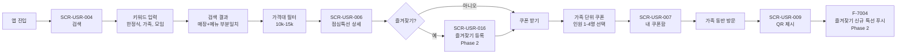
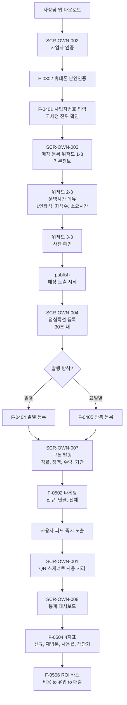

<style>
@media print {
    body, p, li { font-size: 13pt !important; line-height: 1.6 !important; }
    h1 { font-size: 22pt !important; margin-top: 22pt !important; margin-bottom: 14pt !important; }
    h2 { font-size: 18pt !important; margin-top: 18pt !important; margin-bottom: 12pt !important; }
    h3 { font-size: 16pt !important; margin-top: 16pt !important; margin-bottom: 10pt !important; }
    h4 { font-size: 14pt !important; margin-top: 12pt !important; margin-bottom: 8pt !important; }
    ul, ol { margin-top: 5pt !important; margin-bottom: 5pt !important; padding-left: 22pt !important; }
}
</style>

# 정보구조도 (Information Architecture) · 점심특강

**프로젝트명**: 점심특강 (Lunch Special Lecture)
**작성일**: 2026-05-31
**버전**: v1.0
**근거 문서**:
- [기능명세서.md](기능명세서.md) v1.0 (기능 59건 + 화면 SCR 33종 + API 34종)
- [서비스기획서.md](서비스기획서.md) v1.0 (페르소나 4종)
- [요구사항정의서.md](요구사항정의서.md) v1.0

**ID 체계 재확인**:
- 화면 ID: `SCR-{앱구분}-{순번}` — USR(사용자 18개), OWN(사장님 13개), ADM(어드민 2개)
- 기능 ID: `F-{기능군 2자리}{순번 2자리}`
- 라우트 패턴: 모바일 반응형 웹 SPA 기준

---

## 1. 정보구조 원칙 (IA Principles)

본 서비스의 IA는 "5초 안의 점심 의사결정"이라는 핵심 가치 명제(VP)를 모든 화면 레벨에 일관되게 적용한다.

| # | 원칙 | 적용 방식 | 화면 영향 |
|---|------|----------|----------|
| 1 | **카드 1개 = 1결정** | 점심특선 카드는 대표 사진/메뉴명/할인가/할인율 4요소만 노출. 비교 결정 요소를 카드 안에 모두 담는다. | SCR-USR-005, SCR-USR-006 |
| 2 | **5초 의사결정 동선** | 앱 진입 → 메인 피드 → 카드 탭 → 쿠폰 발급까지 3 탭 이내 도달 | SCR-USR-005 → SCR-USR-006 → SCR-USR-009 |
| 3 | **페르소나별 진입 차별화** | 사용자/사장님/어드민 3 앱 분리. 동일 URL 진입 시 role 클레임으로 자동 라우팅 | F-9003 적용 |
| 4 | **글로벌 vs 컨텍스트 내비게이션** | Tab Bar(글로벌 5종)는 항상 노출, Modal/Drawer/Back은 컨텍스트 흐름 안에서만 작동 | 전 화면 |
| 5 | **시각약자·시니어 친화** | 큰 글씨 모드 토글(F-9007) + WCAG 2.1 AA(F-9008) 전 화면 적용 | 모든 SCR |
| 6 | **오프라인·약전파 폴백** | GPS 실패 시 수동 검색, 네트워크 실패 시 마지막 캐시 노출 | SCR-USR-001/002/005 |
| 7 | **권한 분리 IA** | 사용자/사장님/어드민의 화면 트리는 절대 교차하지 않는다 (보안·UX 양면) | 3개 IA 트리 분리 |

---

## 2. 전체 사이트맵 (Site Map)

```mermaid
graph TD
    ROOT[점심특강 서비스] --> APP_USR[사용자 앱<br/>18 화면]
    ROOT --> APP_OWN[사장님 앱<br/>13 화면]
    ROOT --> APP_ADM[어드민<br/>2 화면]

    APP_USR --> USR_TAB1[탭1: 홈]
    APP_USR --> USR_TAB2[탭2: 탐색]
    APP_USR --> USR_TAB3[탭3: 쿠폰함]
    APP_USR --> USR_TAB4[탭4: 알림]
    APP_USR --> USR_TAB5[탭5: 마이]

    USR_TAB1 --> S005[SCR-USR-005<br/>메인 피드]
    USR_TAB1 --> S006[SCR-USR-006<br/>점심특선 상세]
    USR_TAB1 --> S009[SCR-USR-009<br/>쿠폰 QR 제시]

    USR_TAB2 --> S001[SCR-USR-001<br/>메인 지도]
    USR_TAB2 --> S002[SCR-USR-002<br/>메인 리스트]
    USR_TAB2 --> S003[SCR-USR-003<br/>카테고리 필터 모달]
    USR_TAB2 --> S004[SCR-USR-004<br/>검색]

    USR_TAB3 --> S007[SCR-USR-007<br/>내 쿠폰함]
    USR_TAB3 --> S015[SCR-USR-015<br/>리뷰 작성/조회<br/>Phase 2]

    USR_TAB4 --> S010[SCR-USR-010<br/>알림 센터]

    USR_TAB5 --> S008[SCR-USR-008<br/>본인 인증]
    USR_TAB5 --> S011[SCR-USR-011<br/>회원가입]
    USR_TAB5 --> S012[SCR-USR-012<br/>신고]
    USR_TAB5 --> S013[SCR-USR-013<br/>회원 탈퇴]
    USR_TAB5 --> S014[SCR-USR-014<br/>설정]
    USR_TAB5 --> S016[SCR-USR-016<br/>즐겨찾기<br/>Phase 2]
    USR_TAB5 --> S017[SCR-USR-017<br/>결제<br/>Phase 3]
    USR_TAB5 --> S018[SCR-USR-018<br/>친구 초대<br/>Phase 3]

    APP_OWN --> OWN_TAB1[탭1: 홈]
    APP_OWN --> OWN_TAB2[탭2: 매장]
    APP_OWN --> OWN_TAB3[탭3: 쿠폰]
    APP_OWN --> OWN_TAB4[탭4: 통계]
    APP_OWN --> OWN_TAB5[탭5: 설정]

    OWN_TAB1 --> O005[SCR-OWN-005<br/>홈 대시보드]
    OWN_TAB1 --> O001[SCR-OWN-001<br/>QR 스캐너]

    OWN_TAB2 --> O002[SCR-OWN-002<br/>사업자 인증]
    OWN_TAB2 --> O003[SCR-OWN-003<br/>매장 등록 위저드]
    OWN_TAB2 --> O004[SCR-OWN-004<br/>점심특선 등록]
    OWN_TAB2 --> O006[SCR-OWN-006<br/>매장 관리]

    OWN_TAB3 --> O007[SCR-OWN-007<br/>쿠폰 발행]
    OWN_TAB3 --> O013[SCR-OWN-013<br/>광고<br/>Phase 3]

    OWN_TAB4 --> O008[SCR-OWN-008<br/>통계 대시보드]
    OWN_TAB4 --> O009[SCR-OWN-009<br/>쿠폰별 분석]
    OWN_TAB4 --> O011[SCR-OWN-011<br/>B2B 대시보드<br/>Phase 2]
    OWN_TAB4 --> O012[SCR-OWN-012<br/>B2B 정산<br/>Phase 2]

    OWN_TAB5 --> O010[SCR-OWN-010<br/>설정]

    APP_ADM --> A001[SCR-ADM-001<br/>어드민 홈]
    APP_ADM --> A002[SCR-ADM-002<br/>신고 처리]
```



> Tab Bar 5종(홈/탐색/쿠폰함/알림/마이)은 사용자 앱 정보 계층의 글로벌 내비게이션. 모든 깊이의 화면에서 항상 접근 가능.

---

## 3. 페르소나별 핵심 User Flow

### 3.1 김대리 (직장인 · Primary) — "5초 점심 결정 풀 플로우"

```mermaid
flowchart LR
    A[앱 진입<br/>홈 탭] --> B[SCR-USR-005<br/>메인 피드<br/>거리순 정렬]
    B --> C{1인 좌석 필요?}
    C -->|예| D[상단 필터바<br/>1인 좌석 토글]
    C -->|아니오| E[카드 4요소 스캔]
    D --> E
    E --> F[SCR-USR-006<br/>점심특선 상세]
    F --> G{본인 인증 완료?}
    G -->|아니오| H[SCR-USR-008<br/>본인 인증]
    G -->|예| I[쿠폰 받기 CTA]
    H --> I
    I --> J[F-0301 발급 처리]
    J --> K[SCR-USR-007<br/>내 쿠폰함 이동 안내]
    K --> L[매장 도착]
    L --> M[SCR-USR-009<br/>QR 제시<br/>1분 만료 카운터]
    M --> N[사장님 스캔<br/>SCR-OWN-001]
    N --> O[F-0305 위치 검증<br/>100m 이내]
    O --> P[사용 완료 알림<br/>SCR-USR-010]
```



**핵심 의사결정 지점**: 카드 4요소(사진/메뉴/할인가/할인율)와 즉시 입장 가능 뱃지(F-0107) 만으로 카드 단위 결정 가능. 평균 5초 이내.

### 3.2 이미경 (주부 · Secondary) — "가족 단위 가성비 발견 플로우"



**핵심 의사결정 지점**: 광고/실제 후기 구분 어려움 통점에 대응 → 사장님 검증된 점심특선 카드 + 가격대 필터로 신뢰 확보.

### 3.3 박사장 (식당 사장님 · Supplier) — "30분 셀프 온보딩, ROI 확인 플로우"



**핵심 의사결정 지점**: 위저드 평균 5분 완료(F-0402), 점심특선 등록 30초 완료(F-0404), ROI는 발행 1주 후 가시화(F-0506).

### 3.4 HR 김과장 (B2B 법인 · Phase 2) — "임직원 식권 자동화 플로우"

```mermaid
flowchart LR
    A["B2B 별도 채널 가입"] --> B["법인 인증<br/>사업자등록증 첨부"]
    B --> C["SCR-OWN-011<br/>B2B 대시보드<br/>Phase 2"]
    C --> D["임직원 일괄 등록<br/>CSV 업로드"]
    D --> E["F-7005<br/>월 식권 일괄 발행<br/>인당 N매"]
    E --> F["임직원 사용자 앱<br/>SCR-USR-005 노출"]
    F --> G["임직원 SCR-USR-006<br/>점심특선 선택"]
    G --> H["F-0301 쿠폰 발급<br/>식권 차감 결제"]
    H --> I["SCR-USR-009<br/>QR 제시"]
    I --> J["사장님 SCR-OWN-001<br/>스캔 처리"]
    J --> K["월말 SCR-OWN-012<br/>B2B 정산"]
    K --> L["F-7006<br/>사용처별, 임직원별 정산"]
    L --> M["CSV, PDF 자동 생성"]
```



**핵심 의사결정 지점**: 인사·총무 통점인 "어디 갔는지 모름·영수증 관리 부담"에 대응 → 식권 사용 데이터 자동 집계.

---

## 4. 화면 간 전이 매트릭스 (Transition Matrix)

### 4.1 전이 유형 정의

| 유형 | 표기 | 설명 |
|------|------|------|
| Tab | T | 글로벌 Tab Bar 전이 (홈/탐색/쿠폰함/알림/마이) |
| Push | > | 화면 진입 (Stack push, Back 가능) |
| Modal | M | 모달 오버레이 (Dismiss 가능) |
| Drawer | D | 사이드/하단 드로어 |
| Replace | R | 화면 교체 (Back 불가, 예: 로그아웃 후 가입) |
| Back | < | 이전 화면 복귀 |
| Deep | DL | 푸시·알림 딥링크 진입 |

### 4.2 사용자 앱 주요 전이

| From | To | 유형 | 트리거 |
|------|----|----|--------|
| (앱 진입) | SCR-USR-005 (메인 피드) | R | 첫 화면 |
| SCR-USR-005 | SCR-USR-001 (지도) | T | 탐색 탭 |
| SCR-USR-005 | SCR-USR-006 (특선 상세) | > | 카드 탭 |
| SCR-USR-001 | SCR-USR-002 (리스트) | M | 우상단 토글 |
| SCR-USR-001 | SCR-USR-003 (카테고리 필터) | M | 필터 버튼 |
| SCR-USR-002 | SCR-USR-006 | > | 리스트 항목 탭 |
| SCR-USR-005 | SCR-USR-004 (검색) | M | 검색 아이콘 |
| SCR-USR-006 | SCR-USR-008 (본인 인증) | > | 미인증 사용자 "쿠폰 받기" |
| SCR-USR-008 | SCR-USR-006 | < | 인증 완료 후 |
| SCR-USR-006 | SCR-USR-007 (쿠폰함) | T | 발급 후 자동 안내 |
| SCR-USR-007 | SCR-USR-009 (QR 제시) | > | 쿠폰 탭 |
| SCR-USR-009 | SCR-USR-010 (알림) | DL | 사용 완료 알림 |
| SCR-USR-010 | SCR-USR-007 | T | 쿠폰 알림 탭 |
| SCR-USR-014 (설정) | SCR-USR-013 (탈퇴) | > | 회원 탈퇴 메뉴 |
| SCR-USR-014 | SCR-USR-012 (신고) | > | 문의·신고 메뉴 |
| (로그아웃) | SCR-USR-011 (가입) | R | 미로그인 진입 |

### 4.3 사장님 앱 주요 전이

| From | To | 유형 | 트리거 |
|------|----|----|--------|
| (앱 진입·미인증) | SCR-OWN-002 (사업자 인증) | R | 사업자 미인증 |
| SCR-OWN-002 | SCR-OWN-003 (매장 등록 위저드) | > | 인증 완료 |
| SCR-OWN-003 | SCR-OWN-005 (홈 대시보드) | R | 위저드 3/3 완료 |
| SCR-OWN-005 | SCR-OWN-001 (QR 스캐너) | > | 우하단 FAB 또는 홈 카드 |
| SCR-OWN-005 | SCR-OWN-004 (특선 등록) | > | 빠른 등록 카드 |
| SCR-OWN-005 | SCR-OWN-006 (매장 관리) | T | 매장 탭 |
| SCR-OWN-006 | SCR-OWN-004 | > | 점심특선 관리 |
| SCR-OWN-005 | SCR-OWN-007 (쿠폰 발행) | T | 쿠폰 탭 |
| SCR-OWN-007 | SCR-OWN-009 (쿠폰 분석) | > | 발행 후 성과 보기 |
| SCR-OWN-005 | SCR-OWN-008 (통계) | T | 통계 탭 |
| SCR-OWN-008 | SCR-OWN-009 | > | 쿠폰별 드릴다운 |
| SCR-OWN-001 | (사용 완료 결과 모달) | M | 스캔 성공/실패 |
| SCR-OWN-005 | SCR-OWN-010 (설정) | T | 설정 탭 |

### 4.4 어드민 주요 전이

| From | To | 유형 | 트리거 |
|------|----|----|--------|
| (어드민 로그인) | SCR-ADM-001 (홈) | R | 로그인 후 |
| SCR-ADM-001 | SCR-ADM-002 (신고 처리) | > | 미처리 신고 카드 |
| SCR-ADM-002 | SCR-ADM-001 | < | 처리 완료 |
| SCR-ADM-002 | (외부 사용자/매장 상세) | M | 신고 대상 조회 |

---

## 5. 화면-기능 매핑 표 (33개 전수)

### 5.1 사용자 앱 (SCR-USR — 18개)

| 화면 ID | 화면명 | URL 패턴 | 주요 기능 (F-ID) | 관련 API | 우선순위 |
|---------|--------|----------|------------------|----------|----------|
| SCR-USR-001 | 메인 지도 | `/map` | F-0101, F-0103~107 | API-GET-restaurants | P0 |
| SCR-USR-002 | 메인 리스트 | `/list` | F-0102, F-0103~107 | API-GET-restaurants | P0 |
| SCR-USR-003 | 카테고리 필터 모달 | `/map?filter=category` | F-0104 | API-GET-restaurants | P0 |
| SCR-USR-004 | 검색 | `/search?q=` | F-0108 | API-GET-search | P0 |
| SCR-USR-005 | 메인 피드 (점심특선) | `/` | F-0201~205, F-0207 | API-GET-lunch-specials | P0 |
| SCR-USR-006 | 점심특선 상세 | `/special/:id` | F-0206, F-0301, F-0503 | API-GET-lunch-specials/{id}, API-POST-coupons/issue | P0 |
| SCR-USR-007 | 내 쿠폰함 | `/coupons` | F-0307, F-0309 | API-GET-coupons/me | P0 |
| SCR-USR-008 | 본인 인증 | `/auth/verify` | F-0302 | API-POST-auth/verify-identity | P0 |
| SCR-USR-009 | 쿠폰 QR 제시 | `/coupons/:id/qr` | F-0303, F-0306 | API-POST-coupons/{id}/token | P0 |
| SCR-USR-010 | 알림 센터 | `/notifications` | F-0308, F-9006 | API-GET-notifications | P0 |
| SCR-USR-011 | 회원가입 | `/signup` | F-9001 | API-POST-auth/signup, API-POST-auth/oauth/callback | P0 |
| SCR-USR-012 | 신고 | `/reports/new` | F-9004 | API-POST-reports | P0 |
| SCR-USR-013 | 회원 탈퇴 | `/settings/withdraw` | F-9005 | API-DELETE-users/me | P0 |
| SCR-USR-014 | 설정 (큰 글씨·알림) | `/settings` | F-9007, F-7003, F-7004 | (클라이언트) | P0 |
| SCR-USR-015 | 리뷰 작성/조회 | `/stores/:id/reviews` | F-7001 | API-POST-stores/{id}/reviews | P1 |
| SCR-USR-016 | 즐겨찾기 | `/favorites` | F-7002 | API-POST-users/me/favorites | P1 |
| SCR-USR-017 | 결제 (Phase 3) | `/payments/checkout` | F-8002, F-8003 | API-POST-payments/intent, /confirm | P2 |
| SCR-USR-018 | 친구 초대 (Phase 3) | `/invite` | F-8004 | API-POST-invitations | P2 |

### 5.2 사장님 앱 (SCR-OWN — 13개)

| 화면 ID | 화면명 | URL 패턴 | 주요 기능 (F-ID) | 관련 API | 우선순위 |
|---------|--------|----------|------------------|----------|----------|
| SCR-OWN-001 | QR 스캐너 | `/owner/qr-scan` | F-0304, F-0305, F-0306 | API-POST-coupons/redeem | P0 |
| SCR-OWN-002 | 사업자 인증 | `/owner/onboarding` | F-0401, F-9002 | API-POST-owners/verify-business, API-POST-auth/signup-owner | P0 |
| SCR-OWN-003 | 매장 등록 위저드 (3단계) | `/owner/stores/new` | F-0402, F-0403 | API-POST-stores, API-PATCH-stores/{id}/meta | P0 |
| SCR-OWN-004 | 점심특선 등록 | `/owner/specials/new` | F-0404, F-0405, F-0406 | API-POST-stores/{id}/lunch-specials, /recurring-specials, API-PATCH-lunch-specials/{id}/status | P0 |
| SCR-OWN-005 | 홈 대시보드 (상태 토글) | `/owner/dashboard` | F-0407 | API-PATCH-stores/{id}/status | P0 |
| SCR-OWN-006 | 매장 관리 (수정·이력) | `/owner/stores/:id` | F-0408 | API-PATCH-stores/{id}, API-GET-stores/{id}/audit | P0 |
| SCR-OWN-007 | 쿠폰 발행 | `/owner/coupons/new` | F-0501, F-0502, F-0503 | API-POST-stores/{id}/coupons | P0 |
| SCR-OWN-008 | 통계 대시보드 (4지표·ROI) | `/owner/analytics` | F-0504, F-0505, F-0506, F-0508 | API-GET-stores/{id}/metrics, /roi, /metrics/export | P0 |
| SCR-OWN-009 | 쿠폰별 분석 | `/owner/coupons/:id/analytics` | F-0507 | API-GET-stores/{id}/coupons/analytics | P0 |
| SCR-OWN-010 | 설정 (큰 글씨) | `/owner/settings` | F-9007 | (클라이언트) | P0 |
| SCR-OWN-011 | B2B 대시보드 (Phase 2) | `/owner/b2b/dashboard` | F-7005 | API-POST-b2b/{companyId}/employees/bulk | P1 |
| SCR-OWN-012 | B2B 정산 (Phase 2) | `/owner/b2b/settlements` | F-7006 | API-GET-b2b/{companyId}/settlements | P1 |
| SCR-OWN-013 | 광고 (Phase 3) | `/owner/ads` | F-8001 | API-POST-ads/campaigns | P2 |

### 5.3 어드민 (SCR-ADM — 2개)

| 화면 ID | 화면명 | URL 패턴 | 주요 기능 (F-ID) | 관련 API | 우선순위 |
|---------|--------|----------|------------------|----------|----------|
| SCR-ADM-001 | 어드민 홈 | `/admin` | F-9003 | (게이트웨이 미들웨어) | P0 |
| SCR-ADM-002 | 신고 처리 | `/admin/reports/:id` | F-9004 | API-PATCH-reports/{id} | P0 |

---

## 6. 정보 계층 (IA Tree)

### 6.1 사용자 앱 — Tab Bar 5개 기준 IA 트리

```
사용자 앱 (모바일 반응형 웹)
├── [Tab 1] 홈 (디폴트 진입점)
│   └── SCR-USR-005 메인 피드 — 오늘의 점심특선
│       ├── 정렬 드롭다운 (거리/할인율/인기/즉시입장)
│       ├── 필터 바 (반경/카테고리/1인좌석/가격대)
│       └── [Push] SCR-USR-006 점심특선 상세
│           ├── 메뉴 사진 갤러리
│           ├── 사장님 설명 + 잔여 시간·수량
│           ├── 미니맵 (카카오맵)
│           └── [CTA] 쿠폰 받기
│               ├── (미인증) → [Push] SCR-USR-008 본인 인증
│               └── (인증) → 발급 후 토스트 안내 + 쿠폰함 이동
│
├── [Tab 2] 탐색
│   ├── SCR-USR-001 메인 지도 (기본)
│   │   ├── 마커 클러스터 + 사용자 위치 핀 + 반경 원
│   │   ├── [Toggle] SCR-USR-002 메인 리스트
│   │   └── [Modal] SCR-USR-003 카테고리 필터 모달
│   ├── SCR-USR-002 메인 리스트
│   └── [Modal] SCR-USR-004 검색
│       └── 검색 결과 → SCR-USR-006
│
├── [Tab 3] 쿠폰함
│   ├── SCR-USR-007 내 쿠폰함 (탭: 사용가능 / 사용완료 / 만료)
│   │   └── [Push] SCR-USR-009 쿠폰 QR 제시
│   │       └── 1분 만료 카운터 + 자동 재발급
│   └── (Phase 2) SCR-USR-015 리뷰 작성/조회
│
├── [Tab 4] 알림
│   └── SCR-USR-010 알림 센터 (읽음/안읽음)
│       └── [DeepLink] 알림 카테고리별 화면 이동
│           ├── 쿠폰 발급/사용/만료 → SCR-USR-007
│           ├── 신규 특선 (Phase 2) → SCR-USR-006
│           └── 시스템 공지 → 본문 모달
│
└── [Tab 5] 마이
    ├── SCR-USR-014 설정
    │   ├── 큰 글씨 모드 토글 (1.0/1.25/1.5x)
    │   ├── 알림 옵트인 (위치+시간 / 즐겨찾기)
    │   └── [Push] SCR-USR-013 회원 탈퇴
    ├── (미로그인) SCR-USR-011 회원가입
    ├── (Phase 2) SCR-USR-016 즐겨찾기
    ├── SCR-USR-012 신고 (문의·신고)
    ├── (Phase 3) SCR-USR-017 결제
    └── (Phase 3) SCR-USR-018 친구 초대
```

### 6.2 사장님 앱 — Bottom Nav 5개 기준 IA 트리

```
사장님 앱 (모바일 반응형 웹 + 태블릿 대응)
├── [Nav 1] 홈
│   ├── SCR-OWN-005 홈 대시보드
│   │   ├── 영업 상태 토글 (영업중/잠시중단/마감)
│   │   ├── 오늘의 4지표 요약
│   │   ├── 빠른 등록 카드 → SCR-OWN-004
│   │   └── [FAB] SCR-OWN-001 QR 스캐너
│   └── SCR-OWN-001 QR 스캐너
│       └── 스캔 결과 모달 (성공 금액 / 만료 / 위치 오류)
│
├── [Nav 2] 매장
│   ├── (미인증) SCR-OWN-002 사업자 인증
│   │   └── [Wizard] SCR-OWN-003 매장 등록 위저드
│   │       ├── 1/3 기본정보
│   │       ├── 2/3 운영시간 + 메타(좌석/소요시간/1인좌석)
│   │       └── 3/3 사진·확인 → publish
│   ├── SCR-OWN-006 매장 관리
│   │   ├── 정보·메뉴 수정 (이력 30일)
│   │   └── [Push] SCR-OWN-004 점심특선 등록
│   └── SCR-OWN-004 점심특선 등록
│       ├── 일별 등록 (30초 완료)
│       ├── 요일별 반복 등록
│       └── 즉시/예약 발행 토글
│
├── [Nav 3] 쿠폰
│   ├── SCR-OWN-007 쿠폰 발행
│   │   ├── 정률/정액 선택
│   │   ├── 타게팅 (신규/단골/전체)
│   │   └── 한정 수량 + 잔여 카운터
│   └── (Phase 3) SCR-OWN-013 광고
│
├── [Nav 4] 통계
│   ├── SCR-OWN-008 통계 대시보드
│   │   ├── 4지표 카드 (신규/재방문/사용률/객단가)
│   │   ├── 일/주/월 토글
│   │   ├── ROI 카드 (비용→유입→매출)
│   │   └── [Push] SCR-OWN-009 쿠폰별 분석
│   ├── SCR-OWN-009 쿠폰별 분석
│   ├── (Phase 2) SCR-OWN-011 B2B 대시보드
│   └── (Phase 2) SCR-OWN-012 B2B 정산
│
└── [Nav 5] 설정
    └── SCR-OWN-010 설정
        ├── 큰 글씨 모드 (사장님 50대 페르소나 대응)
        ├── 알림 옵트인
        └── 계정·로그아웃
```

### 6.3 어드민 — 사이드 메뉴 기준 IA 트리

```
어드민 (PC 데스크탑 우선 / 태블릿 보조)
├── [SideNav 1] 홈
│   └── SCR-ADM-001 어드민 홈
│       ├── 신고 미처리 카운터
│       ├── 24시간 SLA 모니터링
│       └── 일일 KPI (DAU/매장수/쿠폰 사용수)
├── [SideNav 2] 신고 관리
│   └── SCR-ADM-002 신고 처리
│       ├── 신고 상세 (사용자/사장님 양측 의견)
│       ├── 처리 액션 (수락/기각/보류/제재)
│       └── 처리 이력
└── [SideNav 3+] (Phase 2+) 사용자·매장·쿠폰 관리, KPI 통계 등 — v2.0 확장
```

---

## 7. URL 패턴 (Routing Map)

### 7.1 사용자 앱 라우트 (Next.js App Router 기준)

| URL 패턴 | 화면 | 메서드/특이사항 |
|----------|------|-----------------|
| `/` | SCR-USR-005 (메인 피드) | 디폴트 진입. 미로그인도 탐색 가능 |
| `/map` | SCR-USR-001 (메인 지도) | Geolocation 권한 요청 |
| `/list` | SCR-USR-002 (메인 리스트) | `/map`과 동일 데이터, viewMode=list |
| `/search?q=` | SCR-USR-004 (검색) | URL 쿼리 동기화 |
| `/special/:id` | SCR-USR-006 (점심특선 상세) | `:id`는 점심특선 ID |
| `/coupons` | SCR-USR-007 (쿠폰함) | 인증 필수 |
| `/coupons/:id/qr` | SCR-USR-009 (QR 제시) | 인증 필수, 1분 만료 |
| `/notifications` | SCR-USR-010 (알림 센터) | 인증 필수 |
| `/auth/verify` | SCR-USR-008 (본인 인증) | KISA SDK 콜백 |
| `/signup` | SCR-USR-011 (회원가입) | 소셜 OAuth 콜백: `/auth/oauth/callback` |
| `/settings` | SCR-USR-014 (설정) | 인증 필수 |
| `/settings/withdraw` | SCR-USR-013 (탈퇴) | 인증 필수 |
| `/reports/new` | SCR-USR-012 (신고) | 인증 필수, 신고 대상 ID 쿼리 |
| `/stores/:id/reviews` | SCR-USR-015 (리뷰) | Phase 2 |
| `/favorites` | SCR-USR-016 (즐겨찾기) | Phase 2, 인증 필수 |
| `/payments/checkout` | SCR-USR-017 (결제) | Phase 3 |
| `/invite` | SCR-USR-018 (친구 초대) | Phase 3 |

### 7.2 사장님 앱 라우트 (`/owner/*` 네임스페이스)

| URL 패턴 | 화면 | 메서드/특이사항 |
|----------|------|-----------------|
| `/owner/dashboard` | SCR-OWN-005 (홈 대시보드) | 디폴트 진입 |
| `/owner/onboarding` | SCR-OWN-002 (사업자 인증) | 미인증 사장님 자동 리다이렉트 |
| `/owner/stores/new` | SCR-OWN-003 (매장 등록 위저드) | 3단계 Wizard 쿼리: `?step=1\|2\|3` |
| `/owner/stores/:id` | SCR-OWN-006 (매장 관리) | 자기 매장만 권한 통과 |
| `/owner/specials` | SCR-OWN-004 (점심특선 등록 — 리스트) | 발행 이력 |
| `/owner/specials/new` | SCR-OWN-004 (등록 폼) | |
| `/owner/coupons/new` | SCR-OWN-007 (쿠폰 발행) | |
| `/owner/coupons/:id/analytics` | SCR-OWN-009 (쿠폰별 분석) | |
| `/owner/analytics` | SCR-OWN-008 (통계 대시보드) | 디폴트 기간=주 |
| `/owner/qr-scan` | SCR-OWN-001 (QR 스캐너) | 카메라 권한 요청 |
| `/owner/settings` | SCR-OWN-010 (설정) | |
| `/owner/b2b/dashboard` | SCR-OWN-011 (B2B 대시보드) | Phase 2, 법인 권한 |
| `/owner/b2b/settlements` | SCR-OWN-012 (B2B 정산) | Phase 2 |
| `/owner/ads` | SCR-OWN-013 (광고) | Phase 3 |

### 7.3 어드민 라우트 (`/admin/*` 네임스페이스)

| URL 패턴 | 화면 | 메서드/특이사항 |
|----------|------|-----------------|
| `/admin` | SCR-ADM-001 (어드민 홈) | role=admin 필수, 403 처리 |
| `/admin/reports/:id` | SCR-ADM-002 (신고 처리) | |

### 7.4 라우트 가드 (권한 미들웨어 매트릭스)

| 라우트 패턴 | 비로그인 | 사용자 | 사장님 | 어드민 |
|------------|---------|--------|--------|--------|
| `/`, `/map`, `/list`, `/search`, `/special/:id` | 통과 | 통과 | 통과 | 통과 |
| `/coupons*`, `/notifications`, `/settings*`, `/reports/new`, `/favorites`, `/invite` | 가입 리다이렉트 | 통과 | 통과 | 통과 |
| `/auth/verify`, `/signup` | 통과 | 본인 인증 후 `/`로 리다이렉트 | 동일 | 동일 |
| `/owner/*` | 가입 리다이렉트 | 403 (사용자 앱으로 안내) | 통과 (단, 미인증 시 `/owner/onboarding` 강제) | 통과 |
| `/admin/*` | 가입 리다이렉트 | 403 | 403 | 통과 |

---

## 8. 컨텍스트 내비게이션 패턴

### 8.1 Modal · Drawer · Toast 규약

| 패턴 | 사용 사례 | 행동 |
|------|----------|------|
| Bottom Sheet | SCR-USR-003 카테고리 필터, 정렬 드롭다운 | 50% 높이, 드래그 닫기 |
| Center Modal | 결과 알림 (스캔 성공/실패), 확인 다이얼로그 | OK/Cancel 버튼 명시 |
| Full Modal | SCR-USR-004 검색, SCR-USR-008 본인 인증 | 우상단 X로 닫기, Back 동작 |
| Drawer | (Phase 2) 즐겨찾기 빠른 보기 | 좌측 슬라이드 |
| Toast | 발급 성공, 위치 권한 안내 | 3초 자동 닫힘, 액션 1개 허용 |

### 8.2 Back 동작 표

| 화면 | Back 동작 |
|------|----------|
| SCR-USR-006 (상세) | 진입 직전 탭(홈/탐색)으로 복귀 |
| SCR-USR-009 (QR) | SCR-USR-007 쿠폰함으로 복귀 |
| SCR-OWN-003 (위저드) | 단계 1로 복귀 시 임시 저장 + "이어서 작성" |
| SCR-USR-008 (인증) | 인증 완료 후 진입 직전 화면으로 자동 복귀 |
| SCR-USR-011 (가입) | 진입 직전 보호 라우트 기억 → 가입 후 복귀 |

---

## 9. 변경 이력

| 버전 | 일자 | 변경 내용 | 작성자 |
|------|------|----------|--------|
| v1.0 | 2026-05-31 | 최초 작성. 기능명세서 v1.0의 SCR 33종(USR 18 + OWN 13 + ADM 2) 풀 매핑. 페르소나 4종(김대리/이미경/박사장/HR 김과장) User Flow + Tab Bar 기반 IA 트리 + URL Routing Map(라우트 가드 매트릭스 포함) + 화면 전이 매트릭스(Tab/Push/Modal/Drawer/Replace/Back/DeepLink 7유형) 완비. 카드 1개=1결정 등 7대 IA 원칙 정의. | PM |

---

**작성 완료 여부**: [x] 8개 섹션(IA 원칙·사이트맵·페르소나 Flow·전이 매트릭스·화면 매핑·IA 트리·URL 라우팅·컨텍스트 패턴) + 변경 이력

**다음 의존 산출물**:
- #9 화면설계서 — 본 문서 IA 트리·URL 패턴 기반 와이어프레임 33종 생성
- #13 디자인스타일가이드 — 본 문서 컨텍스트 내비게이션 패턴(Bottom Sheet/Modal/Toast) 기반 컴포넌트 정의
