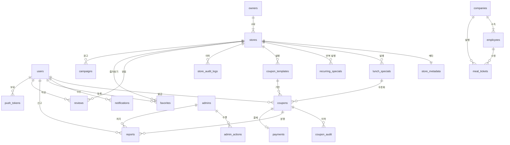

<style>
@media print {
    body, p, li { font-size: 13pt !important; line-height: 1.6 !important; }
    h1 { font-size: 22pt !important; margin-top: 22pt !important; margin-bottom: 14pt !important; }
    h2 { font-size: 18pt !important; margin-top: 18pt !important; margin-bottom: 12pt !important; }
    h3 { font-size: 16pt !important; margin-top: 16pt !important; margin-bottom: 10pt !important; }
    h4 { font-size: 14pt !important; margin-top: 12pt !important; margin-bottom: 8pt !important; }
    ul, ol { margin-top: 5pt !important; margin-bottom: 5pt !important; padding-left: 22pt !important; }
    pre, code { font-size: 10pt !important; }
}
</style>

# 데이터베이스 설계서 (Database Design) · 점심특강

**프로젝트명**: 점심특강 (Lunch Special Lecture)
**작성일**: 2026-06-01
**버전**: v1.0
**근거 문서**:
- [기능명세서.md](../02.기획문서/기능명세서.md) v1.0 (F-ID 59건)
- [API스펙.md](../02.기획문서/API스펙.md) v1.0 (37 API + Request/Response 페이로드)
- [시스템정의서.md](시스템정의서.md) v1.0 (ER 17엔티티 기초)
- [요구사항정의서.md](../02.기획문서/요구사항정의서.md) v1.0 (NFR-008·010·013·022)

**DBMS**: PostgreSQL 15+ (Supabase) + **PostGIS 3.4** (위치 기반 쿼리)

---

## 1. 설계 원칙

| # | 원칙 | 적용 |
|---|------|------|
| 1 | **외래키 NOT NULL 우선** | 무결성 보장. 선택적 관계만 NULL 허용 |
| 2 | **타임스탬프 표준화** | 모든 테이블 `created_at`, `updated_at` TIMESTAMPTZ DEFAULT NOW() |
| 3 | **소프트 삭제 우선** | `deleted_at` NULL 허용 (회원 탈퇴 30일 유예 F-9005) |
| 4 | **위치 컬럼은 PostGIS** | `geography(Point, 4326)` 표준, GiST 인덱스 필수 |
| 5 | **금액은 정수 (원 단위)** | KRW zero-decimal, BIGINT 사용 (오버플로 방지) |
| 6 | **개인정보 컬럼은 암호화** | `pgcrypto` PGP_SYM_ENCRYPT (NFR-008) |
| 7 | **ENUM 대신 CHECK CONSTRAINT** | 마이그레이션 유연성 |
| 8 | **인덱스는 사용 패턴 기반** | API 쿼리에 맞춰 복합·부분 인덱스 |
| 9 | **시드 데이터는 별도 마이그레이션** | 운영 환경 격리 |

---

## 2. ERD (Entity-Relationship Diagram)



**전체 엔티티 (18종)**: users · owners · admins · stores · store_metadata · store_audit_logs · lunch_specials · recurring_specials · coupon_templates · coupons · coupon_audit · notifications · push_tokens · reviews · favorites · reports · companies · employees · meal_tickets · campaigns · payments · audit_logs

---

## 3. 테이블 정의 (MVP Must)

### 3.1 users (사용자)

| 컬럼명 | 타입 | 제약 | 기본값 | 설명 |
|--------|------|------|--------|------|
| `id` | UUID | PK | `gen_random_uuid()` | 사용자 ID |
| `phone_hash` | VARCHAR(64) | UNIQUE NOT NULL | - | 휴대폰 SHA-256 해시 (중복 가입 차단) |
| `phone_enc` | BYTEA | NOT NULL | - | 휴대폰 AES-256 암호화 |
| `email_enc` | BYTEA | NULL | - | 이메일 암호화 (소셜 가입 시) |
| `name_enc` | BYTEA | NULL | - | 이름 암호화 |
| `social_provider` | VARCHAR(10) | NULL | - | `kakao` / `naver` / `apple` / NULL |
| `social_id` | VARCHAR(255) | NULL | - | OAuth provider ID |
| `verified` | BOOLEAN | NOT NULL | `false` | KISA 본인 인증 완료 (F-0302) |
| `verified_at` | TIMESTAMPTZ | NULL | - | 인증 시각 |
| `role` | VARCHAR(10) | NOT NULL CHECK (`role IN ('user', 'owner', 'admin')`) | `'user'` | 권한 |
| `font_scale` | NUMERIC(3,2) | NOT NULL CHECK (`font_scale IN (1.0, 1.25, 1.5)`) | `1.0` | 큰 글씨 모드 (F-9007) |
| `dark_mode` | BOOLEAN | NOT NULL | `false` | 다크 모드 |
| `push_opt_in_location` | BOOLEAN | NOT NULL | `true` | 위치 트리거 푸시 (F-7003) |
| `push_opt_in_favorite` | BOOLEAN | NOT NULL | `true` | 즐겨찾기 푸시 (F-7004) |
| `status` | VARCHAR(15) | NOT NULL CHECK (`status IN ('active', 'suspended', 'withdrawn')`) | `'active'` | 계정 상태 |
| `suspended_reason` | TEXT | NULL | - | 정지 사유 (어드민 입력) |
| `withdrawn_at` | TIMESTAMPTZ | NULL | - | 탈퇴 신청일 |
| `purged_at` | TIMESTAMPTZ | NULL | - | 개인정보 파기 시각 (탈퇴 30일 후) |
| `created_at` | TIMESTAMPTZ | NOT NULL | `NOW()` | 가입일 |
| `updated_at` | TIMESTAMPTZ | NOT NULL | `NOW()` | 수정일 |

**관련 API**: `API-POST-auth-signup`, `API-POST-auth-verify-identity`, `API-DELETE-users-me`

---

### 3.2 owners (사장님)

| 컬럼명 | 타입 | 제약 | 기본값 | 설명 |
|--------|------|------|--------|------|
| `id` | UUID | PK | `gen_random_uuid()` | 사장님 ID |
| `user_id` | UUID | FK → users(id) UNIQUE NOT NULL | - | 1:1 사용자 매핑 |
| `business_number_hash` | VARCHAR(64) | UNIQUE NOT NULL | - | 사업자 등록번호 해시 |
| `business_number_enc` | BYTEA | NOT NULL | - | 사업자 등록번호 암호화 |
| `representative_name_enc` | BYTEA | NOT NULL | - | 대표자명 암호화 |
| `opening_date` | DATE | NOT NULL | - | 개업일 |
| `business_status` | VARCHAR(15) | NOT NULL CHECK (`business_status IN ('active', 'closed', 'suspended')`) | `'active'` | 국세청 진위 결과 |
| `verified_at` | TIMESTAMPTZ | NOT NULL | `NOW()` | 인증 시각 |
| `verification_proof` | JSONB | NOT NULL | - | 국세청 API 응답 원본 (감사용) |
| `created_at` | TIMESTAMPTZ | NOT NULL | `NOW()` | - |
| `updated_at` | TIMESTAMPTZ | NOT NULL | `NOW()` | - |

**관련 API**: `API-POST-owners-verify-business`

---

### 3.3 admins (어드민)

| 컬럼명 | 타입 | 제약 | 기본값 | 설명 |
|--------|------|------|--------|------|
| `id` | UUID | PK | `gen_random_uuid()` | 어드민 ID |
| `user_id` | UUID | FK → users(id) UNIQUE NOT NULL | - | 사용자 매핑 |
| `level` | VARCHAR(15) | NOT NULL CHECK (`level IN ('super', 'ops', 'support')`) | `'support'` | 권한 레벨 |
| `allowed_ip_cidrs` | INET[] | NOT NULL | `'{}'::inet[]` | 허용 IP CIDR (NFR-008) |
| `last_login_at` | TIMESTAMPTZ | NULL | - | 마지막 로그인 |
| `last_login_ip` | INET | NULL | - | 마지막 로그인 IP |
| `created_at` | TIMESTAMPTZ | NOT NULL | `NOW()` | - |

---

### 3.4 stores (매장)

| 컬럼명 | 타입 | 제약 | 기본값 | 설명 |
|--------|------|------|--------|------|
| `id` | UUID | PK | `gen_random_uuid()` | 매장 ID |
| `owner_id` | UUID | FK → owners(id) NOT NULL | - | 소유자 |
| `name` | VARCHAR(80) | NOT NULL | - | 매장명 |
| `phone` | VARCHAR(20) | NOT NULL | - | 전화번호 |
| `address` | TEXT | NOT NULL | - | 주소 |
| `location` | GEOGRAPHY(Point, 4326) | NOT NULL | - | **PostGIS 좌표** (lat/lng) |
| `categories` | TEXT[] | NOT NULL CHECK (`array_length(categories, 1) >= 1`) | - | 한식·분식·카페·양식·중식·일식·건강식 |
| `representative_image_url` | TEXT | NULL | - | 대표 사진 (Supabase Storage) |
| `additional_images` | TEXT[] | NOT NULL | `'{}'` | 추가 사진 최대 4장 |
| `status` | VARCHAR(15) | NOT NULL CHECK (`status IN ('draft', 'active', 'paused', 'closed', 'suspended')`) | `'draft'` | 매장 상태 |
| `status_badge` | VARCHAR(10) | NOT NULL CHECK (`status_badge IN ('open', 'paused', 'closed')`) | `'open'` | 영업 상태 (F-0407) |
| `paused_until` | TIMESTAMPTZ | NULL | - | "잠시 중단" 자동 복귀 시각 (30분 후) |
| `draft_data` | JSONB | NULL | - | 위저드 임시 저장 (F-0402) |
| `draft_step` | SMALLINT | NULL CHECK (`draft_step BETWEEN 1 AND 3`) | - | 위저드 단계 |
| `published_at` | TIMESTAMPTZ | NULL | - | 공개 시각 |
| `created_at` | TIMESTAMPTZ | NOT NULL | `NOW()` | - |
| `updated_at` | TIMESTAMPTZ | NOT NULL | `NOW()` | - |

**관련 API**: `API-POST-stores`, `API-PATCH-stores`, `API-PATCH-stores-status`

---

### 3.5 store_metadata (매장 페르소나 메타데이터)

| 컬럼명 | 타입 | 제약 | 기본값 | 설명 |
|--------|------|------|--------|------|
| `store_id` | UUID | PK + FK → stores(id) | - | 매장 (1:1) |
| `solo_seating` | BOOLEAN | NOT NULL | `false` | 1인 좌석 가능 (F-0105, F-0403) |
| `total_seats` | INTEGER | NOT NULL CHECK (`total_seats > 0`) | - | 좌석 수 |
| `meal_duration_enum` | VARCHAR(10) | NOT NULL CHECK (`meal_duration_enum IN ('15-25', '25-40', '40+')`) | - | 예상 식사 시간 (F-0204) |
| `available_now_toggle` | BOOLEAN | NOT NULL | `false` | 즉시 입장 자가 신고 (F-0107) |
| `operating_hours` | JSONB | NOT NULL | - | 요일별 운영시간 `{mon:{open,close}, ...}` |
| `updated_at` | TIMESTAMPTZ | NOT NULL | `NOW()` | - |

---

### 3.6 lunch_specials (점심특선)

| 컬럼명 | 타입 | 제약 | 기본값 | 설명 |
|--------|------|------|--------|------|
| `id` | UUID | PK | `gen_random_uuid()` | 점심특선 ID |
| `store_id` | UUID | FK → stores(id) NOT NULL | - | 매장 |
| `menu_name` | VARCHAR(80) | NOT NULL | - | 메뉴명 |
| `description` | TEXT | NULL | - | 사장님 설명 |
| `normal_price` | BIGINT | NOT NULL CHECK (`normal_price > 0`) | - | 정상가 (KRW) |
| `discount_price` | BIGINT | NOT NULL CHECK (`discount_price > 0 AND discount_price < normal_price`) | - | 할인가 |
| `discount_rate` | SMALLINT | NOT NULL CHECK (`discount_rate BETWEEN 1 AND 99`) | - | 할인율 % (자동 계산) |
| `total_quantity` | INTEGER | NOT NULL CHECK (`total_quantity > 0`) | - | 한정 수량 |
| `gallery_images` | TEXT[] | NOT NULL | `'{}'` | 사진 1~5장 |
| `expires_at` | TIMESTAMPTZ | NOT NULL | - | 만료 시각 |
| `status` | VARCHAR(15) | NOT NULL CHECK (`status IN ('SCHEDULED', 'PUBLISHED', 'SOLD_OUT', 'EXPIRED', 'CANCELLED')`) | `'SCHEDULED'` | 발행 상태 |
| `publish_at` | TIMESTAMPTZ | NULL | - | 예약 발행 시각 |
| `published_at` | TIMESTAMPTZ | NULL | - | 실제 발행 시각 |
| `recurring_id` | UUID | FK → recurring_specials(id) NULL | - | 반복 발행 출처 (F-0405) |
| `created_at` | TIMESTAMPTZ | NOT NULL | `NOW()` | - |
| `updated_at` | TIMESTAMPTZ | NOT NULL | `NOW()` | - |

**관련 API**: `API-POST-lunch-specials`, `API-PATCH-lunch-specials-status`, `API-GET-lunch-specials`

---

### 3.7 recurring_specials (요일별 반복 점심특선)

| 컬럼명 | 타입 | 제약 | 기본값 | 설명 |
|--------|------|------|--------|------|
| `id` | UUID | PK | `gen_random_uuid()` | 반복 스케줄 ID |
| `store_id` | UUID | FK → stores(id) NOT NULL | - | 매장 |
| `menu_name` | VARCHAR(80) | NOT NULL | - | 메뉴명 |
| `normal_price` | BIGINT | NOT NULL | - | - |
| `discount_price` | BIGINT | NOT NULL | - | - |
| `total_quantity` | INTEGER | NOT NULL | - | - |
| `recurring_days` | VARCHAR(3)[] | NOT NULL CHECK (`recurring_days <@ ARRAY['MON','TUE','WED','THU','FRI','SAT','SUN']::VARCHAR(3)[]`) | - | 요일 |
| `start_time` | TIME | NOT NULL | `'11:00'` | 발행 시작 시각 |
| `end_time` | TIME | NOT NULL | `'14:00'` | 발행 종료 시각 |
| `active` | BOOLEAN | NOT NULL | `true` | 활성 여부 |
| `created_at` | TIMESTAMPTZ | NOT NULL | `NOW()` | - |

**관련 API**: `API-POST-recurring-specials`

---

### 3.8 coupon_templates (쿠폰 발행 템플릿)

| 컬럼명 | 타입 | 제약 | 기본값 | 설명 |
|--------|------|------|--------|------|
| `id` | UUID | PK | `gen_random_uuid()` | 템플릿 ID |
| `store_id` | UUID | FK → stores(id) NOT NULL | - | 매장 |
| `discount_type` | VARCHAR(10) | NOT NULL CHECK (`discount_type IN ('percent', 'amount')`) | - | 할인 유형 |
| `discount_value` | INTEGER | NOT NULL CHECK (`discount_value > 0`) | - | 할인 % 또는 원 |
| `applied_special_ids` | UUID[] | NOT NULL | `'{}'` | 적용 점심특선 |
| `target_user_group` | VARCHAR(10) | NOT NULL CHECK (`target_user_group IN ('NEW', 'LOYAL', 'ALL')`) | `'ALL'` | 타게팅 (F-0502) |
| `loyal_threshold` | SMALLINT | NULL | `3` | 단골 임계값 (방문 횟수) |
| `limit_quantity` | INTEGER | NULL CHECK (`limit_quantity > 0`) | - | 한정 수량 NULL = 무제한 |
| `remaining_quantity` | INTEGER | NULL | - | 남은 수량 (Redis 카운터 동기화) |
| `expires_at` | TIMESTAMPTZ | NOT NULL | - | 만료 시각 |
| `status` | VARCHAR(15) | NOT NULL CHECK (`status IN ('ACTIVE', 'EXHAUSTED', 'EXPIRED', 'CANCELLED')`) | `'ACTIVE'` | 상태 |
| `created_at` | TIMESTAMPTZ | NOT NULL | `NOW()` | - |

**관련 API**: `API-POST-coupons` (사장님 발행), `API-GET-coupons-analytics`

---

### 3.9 coupons (발급된 쿠폰)

| 컬럼명 | 타입 | 제약 | 기본값 | 설명 |
|--------|------|------|--------|------|
| `id` | UUID | PK | `gen_random_uuid()` | 쿠폰 ID |
| `template_id` | UUID | FK → coupon_templates(id) NULL | - | 발행 템플릿 |
| `lunch_special_id` | UUID | FK → lunch_specials(id) NOT NULL | - | 특선 |
| `store_id` | UUID | FK → stores(id) NOT NULL | - | 매장 (역정규화: 인덱스 효율) |
| `user_id` | UUID | FK → users(id) NOT NULL | - | 발급 사용자 |
| `status` | VARCHAR(15) | NOT NULL CHECK (`status IN ('ISSUED', 'USED', 'EXPIRED', 'REVOKED')`) | `'ISSUED'` | 상태 |
| `issued_at` | TIMESTAMPTZ | NOT NULL | `NOW()` | 발급 시각 |
| `expires_at` | TIMESTAMPTZ | NOT NULL | - | 만료 시각 |
| `used_at` | TIMESTAMPTZ | NULL | - | 사용 시각 |
| `used_location` | GEOGRAPHY(Point, 4326) | NULL | - | 사용 위치 (감사용) |
| `redeemed_by_owner_id` | UUID | FK → owners(id) NULL | - | 스캔 처리 사장님 |
| `revoke_reason` | TEXT | NULL | - | 무효화 사유 (어드민) |
| `created_at` | TIMESTAMPTZ | NOT NULL | `NOW()` | - |

**제약**: 동일 사용자 × 매장 × 날짜에 `status='ISSUED'` 1건 제한 (F-0306). 부분 UNIQUE 인덱스로 강제.

**관련 API**: `API-POST-coupons-issue`, `API-POST-coupons-redeem`, `API-GET-coupons-me`

---

### 3.10 coupon_audit (쿠폰 사용·만료 감사 로그)

| 컬럼명 | 타입 | 제약 | 기본값 | 설명 |
|--------|------|------|--------|------|
| `id` | BIGSERIAL | PK | - | 로그 ID |
| `coupon_id` | UUID | FK → coupons(id) NOT NULL | - | 쿠폰 |
| `event_type` | VARCHAR(20) | NOT NULL CHECK (`event_type IN ('ISSUED', 'TOKEN_GENERATED', 'REDEEM_ATTEMPT', 'REDEEM_SUCCESS', 'REDEEM_FAIL', 'EXPIRED', 'REVOKED')`) | - | 이벤트 |
| `event_data` | JSONB | NOT NULL | `'{}'` | 메타 (거리, 토큰, 실패 사유) |
| `actor_user_id` | UUID | FK → users(id) NULL | - | 행위자 |
| `created_at` | TIMESTAMPTZ | NOT NULL | `NOW()` | - |

**보관 기간**: 5년 (NFR-012 거래 기록)

---

### 3.11 notifications (인앱 알림)

| 컬럼명 | 타입 | 제약 | 기본값 | 설명 |
|--------|------|------|--------|------|
| `id` | UUID | PK | `gen_random_uuid()` | 알림 ID |
| `user_id` | UUID | FK → users(id) NOT NULL | - | 수신자 |
| `category` | VARCHAR(20) | NOT NULL CHECK (`category IN ('COUPON_ISSUED', 'COUPON_REDEEMED', 'COUPON_EXPIRE_SOON', 'COUPON_EXPIRED', 'NEAR_SPECIAL', 'FAVORITE_SPECIAL', 'REPORT_RESOLVED', 'SYSTEM_NOTICE')`) | - | 카테고리 |
| `title` | VARCHAR(120) | NOT NULL | - | 제목 |
| `body` | TEXT | NOT NULL | - | 본문 |
| `deep_link` | TEXT | NULL | - | 탭 시 진입 URL |
| `read` | BOOLEAN | NOT NULL | `false` | 읽음 여부 |
| `read_at` | TIMESTAMPTZ | NULL | - | 읽은 시각 |
| `expires_at` | TIMESTAMPTZ | NOT NULL DEFAULT `NOW() + INTERVAL '30 days'` | - | 30일 자동 정리 (F-9006) |
| `created_at` | TIMESTAMPTZ | NOT NULL | `NOW()` | - |

**관련 API**: `API-GET-notifications`, `API-PATCH-notifications-read`

---

### 3.12 push_tokens (FCM/APNS 토큰)

| 컬럼명 | 타입 | 제약 | 기본값 | 설명 |
|--------|------|------|--------|------|
| `id` | UUID | PK | `gen_random_uuid()` | - |
| `user_id` | UUID | FK → users(id) NOT NULL | - | 사용자 |
| `provider` | VARCHAR(10) | NOT NULL CHECK (`provider IN ('FCM', 'APNS')`) | - | 푸시 제공자 |
| `token` | TEXT | NOT NULL | - | 디바이스 토큰 |
| `device_id` | VARCHAR(100) | NULL | - | 디바이스 식별자 |
| `os_version` | VARCHAR(20) | NULL | - | iOS/Android 버전 |
| `last_active_at` | TIMESTAMPTZ | NOT NULL | `NOW()` | 마지막 활성 |
| `created_at` | TIMESTAMPTZ | NOT NULL | `NOW()` | - |

**제약**: `(user_id, token)` UNIQUE. 30일 이상 비활성 토큰은 크론으로 정리.

---

### 3.13 reports (신고)

| 컬럼명 | 타입 | 제약 | 기본값 | 설명 |
|--------|------|------|--------|------|
| `id` | UUID | PK | `gen_random_uuid()` | 신고 ID |
| `reporter_user_id` | UUID | FK → users(id) NOT NULL | - | 신고자 |
| `coupon_id` | UUID | FK → coupons(id) NULL | - | 관련 쿠폰 |
| `store_id` | UUID | FK → stores(id) NULL | - | 관련 매장 |
| `report_type` | VARCHAR(30) | NOT NULL CHECK (`report_type IN ('STORE_REJECTION', 'ABUSE_USER', 'INAPPROPRIATE_CONTENT', 'OTHER')`) | - | 유형 |
| `content` | TEXT | NOT NULL | - | 상세 내용 |
| `attached_images` | TEXT[] | NOT NULL | `'{}'` | 첨부 사진 최대 3장 |
| `status` | VARCHAR(15) | NOT NULL CHECK (`status IN ('RECEIVED', 'IN_REVIEW', 'RESOLVED', 'REJECTED', 'MERGED')`) | `'RECEIVED'` | 처리 상태 |
| `assigned_admin_id` | UUID | FK → admins(id) NULL | - | 담당 어드민 |
| `resolution_action` | VARCHAR(20) | NULL CHECK (`resolution_action IN ('WARNING', 'COUPON_REFUND', 'USER_SUSPEND', 'STORE_SUSPEND', 'NONE')`) | - | 처리 액션 |
| `resolution_note` | TEXT | NULL | - | 처리 사유 |
| `resolved_at` | TIMESTAMPTZ | NULL | - | 처리 완료 시각 |
| `sla_deadline` | TIMESTAMPTZ | NOT NULL DEFAULT `NOW() + INTERVAL '24 hours'` | - | 24h SLA |
| `merged_into_id` | UUID | FK → reports(id) NULL | - | 통합된 부모 신고 |
| `created_at` | TIMESTAMPTZ | NOT NULL | `NOW()` | - |

**관련 API**: `API-POST-reports`, `API-PATCH-reports/{id}`

---

### 3.14 store_audit_logs (매장 수정 이력)

| 컬럼명 | 타입 | 제약 | 기본값 | 설명 |
|--------|------|------|--------|------|
| `id` | BIGSERIAL | PK | - | - |
| `store_id` | UUID | FK → stores(id) NOT NULL | - | 매장 |
| `changed_by_owner_id` | UUID | FK → owners(id) NULL | - | 변경자 |
| `changed_by_admin_id` | UUID | FK → admins(id) NULL | - | 어드민 강제 변경 시 |
| `changed_fields` | JSONB | NOT NULL | - | `{field: {before, after}}` 형식 |
| `created_at` | TIMESTAMPTZ | NOT NULL | `NOW()` | - |

**보관 기간**: 30일 (F-0408). 30일 이상은 크론으로 정리.

---

### 3.15 audit_logs (어드민 감사 로그)

| 컬럼명 | 타입 | 제약 | 기본값 | 설명 |
|--------|------|------|--------|------|
| `id` | BIGSERIAL | PK | - | - |
| `admin_id` | UUID | FK → admins(id) NOT NULL | - | 어드민 |
| `action_type` | VARCHAR(30) | NOT NULL | - | `USER_SUSPEND`, `STORE_FORCE_EDIT`, `LOGIN`, `IP_REJECT` 등 |
| `target_type` | VARCHAR(20) | NULL | - | `user`, `store`, `coupon`, `report` |
| `target_id` | UUID | NULL | - | 대상 ID |
| `metadata` | JSONB | NOT NULL | `'{}'` | IP, User-Agent, 사유 |
| `ip_address` | INET | NOT NULL | - | 접근 IP |
| `created_at` | TIMESTAMPTZ | NOT NULL | `NOW()` | - |

**보관 기간**: **5년** (NFR-012)

---

## 4. 테이블 정의 (Phase 2 — Should)

### 4.1 reviews (리뷰)

| 컬럼명 | 타입 | 제약 | 기본값 | 설명 |
|--------|------|------|--------|------|
| `id` | UUID | PK | `gen_random_uuid()` | - |
| `store_id` | UUID | FK → stores(id) NOT NULL | - | - |
| `user_id` | UUID | FK → users(id) NOT NULL | - | - |
| `coupon_id` | UUID | FK → coupons(id) NOT NULL UNIQUE | - | 1 쿠폰 = 1 리뷰 |
| `rating` | SMALLINT | NOT NULL CHECK (`rating BETWEEN 1 AND 5`) | - | 별점 |
| `comment` | TEXT | NULL | - | 본문 200~500자 |
| `images` | TEXT[] | NOT NULL | `'{}'` | 최대 5장 |
| `verified_purchase` | BOOLEAN | NOT NULL | `true` | 쿠폰 사용 인증 |
| `owner_reply` | TEXT | NULL | - | 사장님 답글 (1회 한정) |
| `owner_replied_at` | TIMESTAMPTZ | NULL | - | - |
| `created_at` | TIMESTAMPTZ | NOT NULL | `NOW()` | - |

### 4.2 favorites (즐겨찾기)

| 컬럼명 | 타입 | 제약 | 기본값 | 설명 |
|--------|------|------|--------|------|
| `user_id` | UUID | PK + FK → users(id) | - | 복합 PK |
| `store_id` | UUID | PK + FK → stores(id) | - | - |
| `notify_new_special` | BOOLEAN | NOT NULL | `true` | 신규 특선 알림 |
| `created_at` | TIMESTAMPTZ | NOT NULL | `NOW()` | - |

### 4.3 companies (B2B 법인)

| 컬럼명 | 타입 | 제약 | 기본값 | 설명 |
|--------|------|------|--------|------|
| `id` | UUID | PK | `gen_random_uuid()` | - |
| `name` | VARCHAR(100) | NOT NULL | - | 회사명 |
| `business_number_enc` | BYTEA | NOT NULL UNIQUE | - | 사업자 등록번호 |
| `hr_admin_user_id` | UUID | FK → users(id) NOT NULL | - | HR 담당자 |
| `plan` | VARCHAR(15) | NOT NULL CHECK (`plan IN ('TEAM', 'ENTERPRISE')`) | `'TEAM'` | 요금제 |
| `monthly_quota_per_employee` | SMALLINT | NOT NULL | `20` | 인당 월 식권 수 |
| `created_at` | TIMESTAMPTZ | NOT NULL | `NOW()` | - |

### 4.4 employees (B2B 임직원)

| 컬럼명 | 타입 | 제약 | 기본값 | 설명 |
|--------|------|------|--------|------|
| `id` | UUID | PK | `gen_random_uuid()` | - |
| `company_id` | UUID | FK → companies(id) NOT NULL | - | 회사 |
| `user_id` | UUID | FK → users(id) UNIQUE NOT NULL | - | 사용자 |
| `employee_code` | VARCHAR(50) | NOT NULL | - | 사번 |
| `department` | VARCHAR(50) | NULL | - | 부서 |
| `status` | VARCHAR(15) | NOT NULL CHECK (`status IN ('active', 'leave', 'resigned')`) | `'active'` | - |
| `created_at` | TIMESTAMPTZ | NOT NULL | `NOW()` | - |

### 4.5 meal_tickets (B2B 식권)

| 컬럼명 | 타입 | 제약 | 기본값 | 설명 |
|--------|------|------|--------|------|
| `id` | UUID | PK | `gen_random_uuid()` | - |
| `company_id` | UUID | FK → companies(id) NOT NULL | - | - |
| `employee_id` | UUID | FK → employees(id) NOT NULL | - | - |
| `coupon_id` | UUID | FK → coupons(id) NULL | - | 쿠폰 전환 시 |
| `amount` | BIGINT | NOT NULL | - | 식권 금액 |
| `issued_month` | DATE | NOT NULL | - | 발행 월 |
| `status` | VARCHAR(15) | NOT NULL CHECK (`status IN ('ISSUED', 'USED', 'EXPIRED', 'CANCELLED')`) | `'ISSUED'` | - |
| `expires_at` | TIMESTAMPTZ | NOT NULL | - | 월말 만료 |
| `used_at` | TIMESTAMPTZ | NULL | - | - |
| `created_at` | TIMESTAMPTZ | NOT NULL | `NOW()` | - |

---

## 5. 테이블 정의 (Phase 3 — Could)

### 5.1 campaigns (광고 캠페인)

| 컬럼명 | 타입 | 제약 | 기본값 | 설명 |
|--------|------|------|--------|------|
| `id` | UUID | PK | `gen_random_uuid()` | - |
| `store_id` | UUID | FK → stores(id) NOT NULL | - | - |
| `lunch_special_id` | UUID | FK → lunch_specials(id) NULL | - | 광고 대상 |
| `slot` | VARCHAR(30) | NOT NULL CHECK (`slot IN ('MAIN_TOP', 'CATEGORY_TOP', 'KEYWORD')`) | - | 노출 슬롯 |
| `keyword` | VARCHAR(50) | NULL | - | 키워드 광고 |
| `daily_budget` | BIGINT | NOT NULL | - | 일 예산 |
| `start_date` | DATE | NOT NULL | - | - |
| `end_date` | DATE | NOT NULL | - | - |
| `status` | VARCHAR(20) | NOT NULL CHECK (`status IN ('PENDING_PAYMENT', 'ACTIVE', 'PAUSED', 'COMPLETED', 'CANCELLED')`) | `'PENDING_PAYMENT'` | - |
| `impressions` | BIGINT | NOT NULL | `0` | 노출수 |
| `clicks` | BIGINT | NOT NULL | `0` | 클릭수 |
| `conversions` | BIGINT | NOT NULL | `0` | 전환수 |
| `created_at` | TIMESTAMPTZ | NOT NULL | `NOW()` | - |

### 5.2 payments (결제)

| 컬럼명 | 타입 | 제약 | 기본값 | 설명 |
|--------|------|------|--------|------|
| `id` | UUID | PK | `gen_random_uuid()` | - |
| `coupon_id` | UUID | FK → coupons(id) NULL | - | 쿠폰 결제 |
| `campaign_id` | UUID | FK → campaigns(id) NULL | - | 광고 결제 |
| `user_id` | UUID | FK → users(id) NULL | - | 결제자 |
| `owner_id` | UUID | FK → owners(id) NULL | - | 광고는 사장님 |
| `payment_provider` | VARCHAR(15) | NOT NULL CHECK (`payment_provider IN ('TOSS_PAY', 'NAVER_PAY', 'KAKAO_PAY')`) | - | PG |
| `payment_key` | VARCHAR(200) | NOT NULL | - | PG 결제 키 |
| `amount` | BIGINT | NOT NULL | - | 금액 (KRW zero-decimal) |
| `status` | VARCHAR(20) | NOT NULL CHECK (`status IN ('PENDING', 'SUCCESS', 'FAILED', 'CANCELLED', 'REFUNDED', 'PARTIAL_REFUND')`) | `'PENDING'` | - |
| `paid_at` | TIMESTAMPTZ | NULL | - | - |
| `refund_amount` | BIGINT | NULL | - | 환불 금액 |
| `refunded_at` | TIMESTAMPTZ | NULL | - | - |
| `pg_response` | JSONB | NOT NULL | - | PG 원본 응답 |
| `created_at` | TIMESTAMPTZ | NOT NULL | `NOW()` | - |

---

## 6. 인덱스 정의

### 6.1 핵심 인덱스 (성능 NFR-001~003 충족)

| 테이블 | 인덱스명 | 컬럼 | 유형 | 목적 |
|--------|----------|------|------|------|
| `users` | `idx_users_phone_hash` | `phone_hash` | UNIQUE BTREE | 중복 가입 차단·로그인 |
| `users` | `idx_users_social` | `(social_provider, social_id)` | UNIQUE BTREE | OAuth 로그인 |
| `users` | `idx_users_status` | `status` WHERE `status != 'withdrawn'` | 부분 BTREE | 활성 사용자 조회 |
| `owners` | `idx_owners_business_hash` | `business_number_hash` | UNIQUE BTREE | 사업자 중복 차단 |
| `stores` | `idx_stores_location` | `location` | **GIST (PostGIS)** | 반경 검색 (NFR-003, F-0101) |
| `stores` | `idx_stores_status_active` | `status` WHERE `status = 'active'` | 부분 BTREE | 활성 매장 |
| `stores` | `idx_stores_categories` | `categories` | **GIN** | 카테고리 다중 필터 (F-0104) |
| `stores` | `idx_stores_owner_id` | `owner_id` | BTREE | 사장님 매장 조회 |
| `lunch_specials` | `idx_specials_store_status` | `(store_id, status, expires_at)` | BTREE | 매장 활성 특선 |
| `lunch_specials` | `idx_specials_active_now` | `expires_at` WHERE `status = 'PUBLISHED'` | 부분 BTREE | 메인 피드 (F-0201) |
| `lunch_specials` | `idx_specials_published_at` | `published_at DESC` WHERE `status = 'PUBLISHED'` | 부분 BTREE | 시간순 정렬 |
| `coupons` | `idx_coupons_user_status` | `(user_id, status, expires_at)` | BTREE | 내 쿠폰함 (F-0309) |
| `coupons` | `idx_coupons_daily_limit` | `(user_id, date(issued_at))` WHERE `status = 'ISSUED'` | 부분 BTREE | 1일 5건 제한 (F-0306) |
| `coupons` | `idx_coupons_per_store_user` | `(user_id, store_id)` WHERE `status = 'ISSUED'` | 부분 UNIQUE | 매장당 1건 제한 |
| `coupons` | `idx_coupons_expires_soon` | `expires_at` WHERE `status = 'ISSUED'` | 부분 BTREE | 만료 임박 크론 |
| `coupons` | `idx_coupons_store_status` | `(store_id, status, used_at DESC)` | BTREE | 사장님 통계 |
| `notifications` | `idx_notis_user_read` | `(user_id, read, created_at DESC)` | BTREE | 알림 센터 |
| `notifications` | `idx_notis_expires` | `expires_at` | BTREE | 30일 정리 크론 |
| `reports` | `idx_reports_sla` | `sla_deadline` WHERE `status IN ('RECEIVED', 'IN_REVIEW')` | 부분 BTREE | 24h SLA 모니터링 |
| `reports` | `idx_reports_assigned` | `assigned_admin_id` WHERE `status = 'IN_REVIEW'` | 부분 BTREE | 어드민 대기 큐 |
| `coupon_templates` | `idx_templates_store_active` | `(store_id, status, expires_at)` | BTREE | 활성 쿠폰 |
| `recurring_specials` | `idx_recurring_active` | `(store_id, active)` | BTREE | 크론 활성화 |
| `push_tokens` | `idx_push_user_provider` | `(user_id, provider)` | BTREE | 푸시 발송 |
| `push_tokens` | `idx_push_inactive` | `last_active_at` | BTREE | 비활성 정리 |
| `audit_logs` | `idx_audit_admin_date` | `(admin_id, created_at DESC)` | BTREE | 어드민 활동 추적 |

### 6.2 인덱스 생성 SQL 예시

```sql
-- PostGIS 위치 인덱스 (NFR-003 200ms 이내)
CREATE INDEX idx_stores_location ON stores USING GIST (location);

-- 1일 5건 제한 부분 인덱스
CREATE INDEX idx_coupons_daily_limit
  ON coupons (user_id, (date(issued_at)))
  WHERE status = 'ISSUED';

-- 메인 피드 핫 패스
CREATE INDEX idx_specials_active_now
  ON lunch_specials (expires_at)
  WHERE status = 'PUBLISHED';
```

---

## 7. 관계 정의 (FK 매트릭스)

| 부모 테이블 | 자식 테이블 | 관계 | FK 컬럼 | ON DELETE |
|------------|------------|------|---------|-----------|
| users | owners | 1:1 | `user_id` | CASCADE |
| users | admins | 1:1 | `user_id` | RESTRICT |
| users | coupons | 1:N | `user_id` | RESTRICT (거래 기록 보호) |
| users | notifications | 1:N | `user_id` | CASCADE |
| users | reports | 1:N | `reporter_user_id` | RESTRICT |
| users | reviews | 1:N | `user_id` | RESTRICT |
| users | push_tokens | 1:N | `user_id` | CASCADE |
| users | favorites | 1:N | `user_id` | CASCADE |
| users | employees | 1:1 | `user_id` | RESTRICT |
| owners | stores | 1:N | `owner_id` | RESTRICT |
| stores | store_metadata | 1:1 | `store_id` | CASCADE |
| stores | lunch_specials | 1:N | `store_id` | CASCADE |
| stores | recurring_specials | 1:N | `store_id` | CASCADE |
| stores | coupon_templates | 1:N | `store_id` | CASCADE |
| stores | store_audit_logs | 1:N | `store_id` | CASCADE |
| stores | reviews | 1:N | `store_id` | RESTRICT |
| stores | favorites | 1:N | `store_id` | CASCADE |
| stores | campaigns | 1:N | `store_id` | CASCADE |
| lunch_specials | coupons | 1:N | `lunch_special_id` | RESTRICT |
| coupon_templates | coupons | 1:N | `template_id` | SET NULL |
| coupons | coupon_audit | 1:N | `coupon_id` | CASCADE |
| coupons | reports | 1:N (선택) | `coupon_id` | SET NULL |
| coupons | reviews | 1:1 | `coupon_id` | RESTRICT |
| coupons | payments | 1:1 (선택) | `coupon_id` | SET NULL |
| companies | employees | 1:N | `company_id` | RESTRICT |
| companies | meal_tickets | 1:N | `company_id` | RESTRICT |
| employees | meal_tickets | 1:N | `employee_id` | RESTRICT |
| admins | audit_logs | 1:N | `admin_id` | RESTRICT |
| admins | reports | 1:N (담당) | `assigned_admin_id` | SET NULL |

> **ON DELETE 정책**: 거래·감사 관련은 모두 `RESTRICT`로 무결성 우선. 부가 데이터(알림·푸시 토큰·즐겨찾기·메타)는 `CASCADE`로 자동 정리.

---

## 8. 초기 데이터 (시드)

| 테이블 | 데이터 | 용도 | 마이그레이션 파일 |
|--------|--------|------|-------------------|
| `admins` | 1건 (super 권한, 운영자 계정) | 어드민 진입 초기화 | `seeds/001_admin.sql` |
| `audit_logs` | (없음) | — | — |
| 카테고리 ENUM | 한식·분식·카페·양식·중식·일식·건강식 | F-0104 카테고리 필터 | `migrations/001_categories.sql` (CHECK 제약) |
| 운영시간 기본값 | 11:00~22:00 평일 | `store_metadata.operating_hours` 기본값 | 매장 등록 시 기본 입력 |
| 테스트 매장 (Staging) | 강남·여의도 50개 (가상) | 클로즈드 베타용 | `seeds/staging_stores.sql` |
| 테스트 사용자 (Staging) | 100명 (가상) | 부하 테스트 | `seeds/staging_users.sql` |

---

## 9. 마이그레이션 전략

### 9.1 명명 규칙

```
migrations/
├── 001_initial_schema.sql           -- 17 테이블 + 인덱스
├── 002_postgis_extension.sql        -- PostGIS 활성
├── 003_pgcrypto_extension.sql       -- 암호화 함수
├── 004_seed_admin.sql               -- 초기 어드민
├── 005_partial_indexes.sql          -- 부분 인덱스
├── 010_phase2_reviews.sql           -- Phase 2 진입 (M4)
├── 011_phase2_favorites.sql
├── 012_phase2_b2b.sql               -- companies/employees/meal_tickets
├── 020_phase3_ads.sql               -- Phase 3 (M7)
├── 021_phase3_payments.sql
└── ...
```

### 9.2 마이그레이션 도구

- **Supabase CLI** (`supabase migration new`)
- 모든 마이그레이션은 **TRANSACTION으로 감싸기**
- 운영 적용 전 Staging에서 24h 이상 검증
- 점심 시간(11~14시) 적용 금지

### 9.3 Zero-Downtime 패턴

| 변경 유형 | 안전 패턴 |
|----------|----------|
| 컬럼 추가 (NULL 허용) | 그대로 추가 |
| NOT NULL 추가 | (1) NULL 허용 추가 → (2) 백필 → (3) NOT NULL 제약 |
| 컬럼 삭제 | (1) 코드에서 사용 중단 → (2) 1주 대기 → (3) DROP |
| 인덱스 추가 | `CREATE INDEX CONCURRENTLY` |
| 컬럼 타입 변경 | (1) 새 컬럼 추가 → (2) 백필 → (3) 코드 전환 → (4) 구 컬럼 삭제 |
| FK 제약 추가 | `NOT VALID` 후 `VALIDATE CONSTRAINT` |

---

## 10. 백업 & 보안 정책 (NFR-008, NFR-022)

### 10.1 데이터 분류

| 분류 | 컬럼 예시 | 처리 |
|------|----------|------|
| **민감 (P1)** | `users.phone_enc`, `email_enc`, `name_enc`, `owners.business_number_enc` | AES-256 `pgp_sym_encrypt` |
| **위치** | `stores.location`, `coupons.used_location` | 평문 저장 (PostGIS 인덱스 필요) + 5년 후 익명화 |
| **거래** | `coupons.*`, `payments.*` | 평문 + 5년 보관 |
| **로그** | `audit_logs.*` | 평문 + 5년 보관 |
| **임시** | `notifications.*` | 30일 자동 정리 |

### 10.2 백업

- **일 1회 자동 백업** (Supabase, UTC 17:00 = KST 02:00)
- **PITR 7일** (Supabase Pro)
- **월 1회 복구 모의 훈련**

### 10.3 회원 탈퇴 데이터 처리 (F-9005, NFR-012)

```
탈퇴 신청 → users.withdrawn_at 기록 + status = 'withdrawn'
30일 유예 → 30일 후 크론:
   - users.phone_enc, email_enc, name_enc = NULL
   - users.purged_at = NOW()
거래 기록 5년 보관 → coupons.user_id 그대로 유지
5년 후 → user_id를 anonymous user(상수 UUID)로 대체
```

---

## 11. 데이터 정합성 검증 (운영 크론)

| 크론 | 빈도 | 점검 항목 |
|------|------|----------|
| `cron_expire_coupons` | 5분 | `coupons.status='ISSUED' AND expires_at < NOW()` → `EXPIRED` |
| `cron_publish_recurring` | 매일 03:00 | 요일 매칭 `recurring_specials.active=true` → 당일 `lunch_specials` 생성 |
| `cron_cleanup_notifications` | 매일 04:00 | `notifications.expires_at < NOW()` → DELETE |
| `cron_cleanup_audit_logs` | 매일 04:30 | `store_audit_logs.created_at < NOW() - INTERVAL '30 days'` → DELETE |
| `cron_purge_withdrawn_users` | 매일 05:00 | `users.withdrawn_at < NOW() - INTERVAL '30 days'` → 개인정보 NULL |
| `cron_anonymize_old_transactions` | 매월 1일 | 5년 초과 거래 → 익명화 |
| `cron_paused_store_auto_open` | 1분 | `stores.status_badge='paused' AND paused_until < NOW()` → `'open'` |
| `cron_inactive_push_tokens` | 매일 06:00 | `push_tokens.last_active_at < NOW() - INTERVAL '30 days'` → DELETE |
| `cron_redis_counter_sync` | 1시간 | Redis `coupon_template:*` 카운터 ↔ DB `remaining_quantity` 정합성 |

---

## 12. 변경 이력

| 버전 | 일자 | 변경 내용 | 작성자 |
|------|------|----------|--------|
| v1.0 | 2026-06-01 | 최초 작성. 시스템정의서 v1.0 ER 17엔티티를 22 테이블로 풀 정의 (MVP 15 + Phase 2 5 + Phase 3 2). 각 컬럼 타입·제약·기본값·설명 + 컴퓨테드 컬럼·CHECK 제약. PostGIS GIST 인덱스 + GIN 배열 인덱스 + 부분 인덱스 25종. FK 매트릭스 + ON DELETE 정책. 초기 시드·마이그레이션·Zero-Downtime 패턴·보안 정책·운영 크론 9종 완비. | PM |

---

**작성 완료**: [x] 설계 원칙 + ERD + 22 테이블 정의 + 인덱스 25종 + FK 매트릭스 + 시드 + 마이그레이션 + 보안 + 정합성 크론

**다음 산출물**: W4 구현 셋업 — Supabase 프로젝트 생성 + 마이그레이션 001~005 적용 + Storage 버킷 생성 + RLS 정책 설정.
