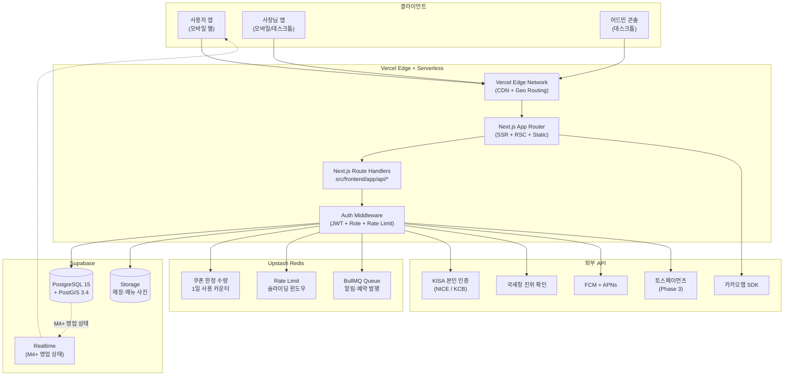
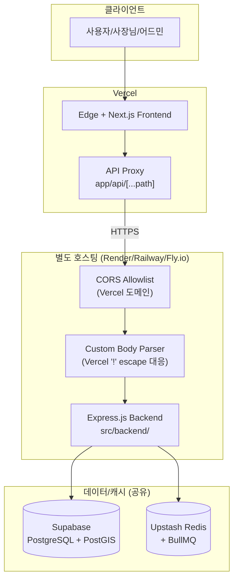
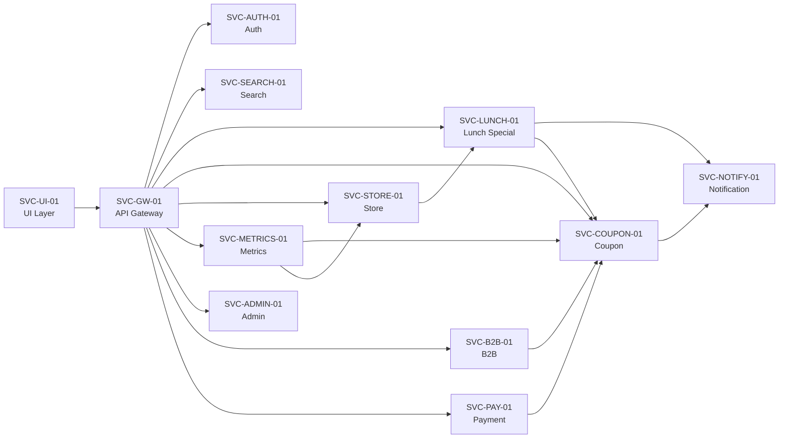
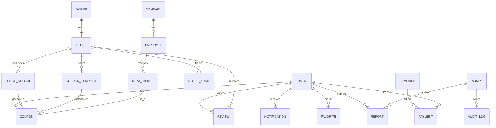
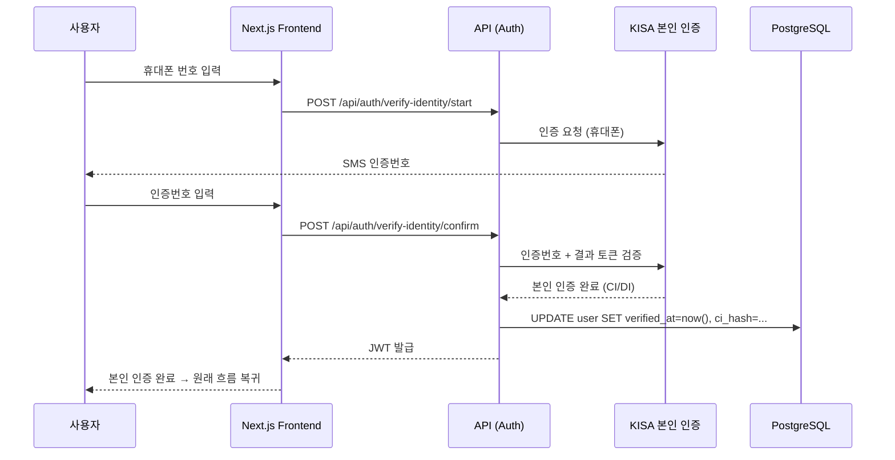
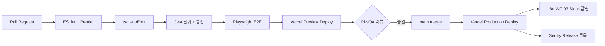

<style>
@media print {
    body, p, li { font-size: 13pt !important; line-height: 1.6 !important; }
    h1 { font-size: 22pt !important; margin-top: 22pt !important; margin-bottom: 14pt !important; }
    h2 { font-size: 18pt !important; margin-top: 18pt !important; margin-bottom: 12pt !important; }
    h3 { font-size: 16pt !important; margin-top: 16pt !important; margin-bottom: 10pt !important; }
    h4 { font-size: 14pt !important; margin-top: 12pt !important; margin-bottom: 8pt !important; }
    ul, ol { margin-top: 5pt !important; margin-bottom: 5pt !important; padding-left: 22pt !important; }
}
</style>

# 시스템 정의서 (System Definition) · 점심특강

**프로젝트명**: 점심특강 (Lunch Special Lecture)
**작성일**: 2026-05-31
**버전**: v1.0
**근거 문서**:
- [기능명세서.md](../02.기획문서/기능명세서.md) v1.0 (F-XXXX 59건 · 처리 로직 풀 명세)
- [요구사항정의서.md](../02.기획문서/요구사항정의서.md) v1.0 (REQ 61건 + NFR 25건 + US 15건)
- [서비스기획서.md](../02.기획문서/서비스기획서.md) v1.0
- [PRD.md](../PRD.md)

**ID 체계**:
- 컴포넌트/서비스 ID: `SVC-{도메인 약어}-{순번}` (예: SVC-COUPON-01)
- 데이터 엔티티: `E-{도메인}` (예: E-USER, E-STORE)
- 환경 변수: `UPPER_SNAKE_CASE`

**문서 범위**:
- 시스템 아키텍처 (Edge ↔ API ↔ DB ↔ Cache ↔ 외부)
- 모듈/서비스 분리 (F-XXXX → 서비스 매핑)
- 데이터 모델 (PostGIS 포함)
- 비기능 보강 (NFR-XXX ↔ 구현 매핑)
- 보안, 트래픽·캐싱, 배포, 모니터링, 운영
- M5+ Backend 분리 트리거

---

## 1. 변경 이력

| 버전 | 일자 | 변경 내용 | 작성자 |
|------|------|----------|--------|
| v0.1 | 2026-05-24 | 템플릿 기반 초안 (167줄, 핵심 골격) | PM |
| v1.0 | 2026-05-31 | 풀 재작성/확장. 기능명세서 v1.0 (F-XXXX 59건) + 요구사항정의서 v1.0 (NFR 25건) 기반. 시스템 아키텍처 Mermaid 3종, 12개 서비스 모듈 정의, ER 다이어그램(17 엔티티), NFR ↔ 구현 매핑, 트래픽·캐싱 전략, 보안 시퀀스 다이어그램 2종, 배포/모니터링/운영 절차, M5+ 분리 트리거 명시. | PM |

---

## 2. 시스템 개요

### 2.1 서비스 정의

점심특강은 **점심 시간(11:00~14:00)에 한정된 위치 기반 식당 탐색·쿠폰 발급 양면 시장 플랫폼**이다. 4가지 역할이 단일 코드베이스 위에서 운영된다.

| 역할 | 약어 | 주 사용처 | 핵심 가치 |
|------|------|----------|----------|
| 일반 사용자 | USR | 사용자 앱 (모바일 웹) | "내 위치 500m 안 점심특선 5초 안에 탐색" |
| 사장님 | OWN | 사장님 앱 (모바일·데스크톱 웹) | "5분 매장 등록 + 30초 점심특선 발행 + ROI 4지표" |
| 어드민 | ADM | 어드민 콘솔 (데스크톱 웹) | "신고 24h 응답 + 계정 정지·복구" |
| B2B 법인 (Phase 2) | B2B | HR 대시보드 | "임직원 식권 자동 발행 + 월말 정산 CSV" |

### 2.2 핵심 흐름

```
[사용자]                                              [사장님]
   |                                                     |
   v                                                     v
GPS 권한 허용 → 메인 지도/리스트(F-0101~108)     사업자 인증(F-0401)
   |                                                     |
   v                                                     v
"오늘의 점심특선" 피드(F-0201~207)              매장 등록 위저드(F-0402~403)
   |                                                     |
   v                                                     v
상세 진입 → 쿠폰 발급(F-0301)                   일별/요일별 특선 발행(F-0404~406)
   |                                                     |
   v                                                     v
본인 인증(F-0302) → QR 토큰(F-0303, 1분)        쿠폰 발행(F-0501~503)
   |                                                     |
   v                                                     v
매장 방문 → 사장님 QR 스캔(F-0304)              QR 스캔 처리 + 위치 검증(F-0304~305)
   |                                                     |
   v                                                     v
위치 100m 검증(F-0305) → 사용 처리              ROI 4지표 대시보드(F-0504~506)
   |                                                     |
   v                                                     v
양쪽 알림 (FCM/인앱)(F-0308)                    매출 통계·쿠폰 분석(F-0507)
```

### 2.3 비즈니스 목표 (M5 Growth 시점)

| 지표 | 목표 | NFR 매핑 |
|------|------|----------|
| MAU | 50,000명 | NFR-004 (10만 동접) |
| 등록 매장 | 3,000개 | NFR-003 (10K 매장에서 200ms PostGIS 응답) |
| 쿠폰 사용률 | 40% (발행 대비) | F-0507 (저성과 가이드) |
| 전체 uptime | 99.5% (월 단위) | NFR-005 |
| **점심 시간 uptime (11~14시)** | **100%** | NFR-006 (사업 실패 직결) |
| 사용자 의사결정 시간 | 5초 이내 | NFR-024 (서비스 슬로건) |
| 사장님 매장 등록 | 5분 이내 / 3단계 | NFR-023 |

---

## 3. 기술 스택 (V0.42 표준)

> 한 줄 표기: `Next.js + Tailwind CSS / Express.js / PostgreSQL / Vercel`
> M1~M4 (현재): Next.js API Routes 통합 / M5+: Express 분리 검토

### 3.1 핵심 스택

| 영역 | 기술 | 버전 | V0.42 표준 | 비고 |
|------|------|------|-----------|------|
| Frontend | Next.js (App Router) + Tailwind CSS | 14.x / 3.4.x | 표준 | SSR + RSC + Edge 런타임 |
| Backend (M1~M4) | Next.js Route Handlers | 14.x | 표준 | `src/frontend/app/api/*` |
| Backend (M5+) | Express.js | 4.x | 표준 (분리 시) | `src/backend/` (현재 `.gitkeep`) |
| Database | PostgreSQL + PostGIS | 15.x + 3.4 | 표준 | Supabase 호스팅 |
| DB Hosting | Supabase | - | 권장 | REST API(RPC) + Realtime |
| Cache / Counter | Redis (Upstash) | 7.x | 추가 | 쿠폰 한정 수량, Rate Limit, 1일 카운터 |
| Queue (M3 베타~) | BullMQ on Redis | 5.x | 추가 | 알림, 예약 발행, 만료 크론 |
| Deploy | Vercel | - | 표준 | Frontend + API Routes 통합 |
| CI/CD | GitHub Actions | - | 표준 | lint → test → preview → prod |

### 3.2 인증·보안·외부 API

| 영역 | 기술 / 서비스 | 용도 | 관련 F-ID |
|------|--------------|------|----------|
| 본인 인증 | KISA 인증 사업자 (NICE / KCB) | 사용자·사장님 1회 본인 인증 | F-0302, F-0401 |
| 인증 토큰 | JWT (HS256) | 액세스 15분 / 리프레시 30일 | F-9003 |
| 비밀번호 해시 | bcryptjs (라운드 12) | 서버리스 호환 (네이티브 bcrypt 금지) | NFR-009 |
| 사업자 진위 | 국세청 진위 확인 API | 사업자 등록번호 검증 | F-0401 |
| 지도·좌표 | 카카오맵 SDK | 메인 지도, 마커 클러스터링, 미니맵 | F-0101, F-0206 |
| 푸시 알림 | FCM (Android·Web) + APNs (iOS) | 쿠폰 사용/만료/위치 트리거 | F-0308, F-7003 |
| 결제 (Phase 3) | 토스페이먼츠 + 카카오·네이버페이 | KRW zero-decimal, confirm API | F-8002, F-8003 |
| 파일 저장 | Supabase Storage | 매장·메뉴 사진 | F-0402, F-0404 |

### 3.3 모니터링·운영

| 영역 | 기술 | 용도 |
|------|------|------|
| 에러 추적 | Sentry | 점심 피크 에러율 0.5%+ 즉시 알람 |
| 성능 모니터링 | Vercel Analytics + Vercel Speed Insights | LCP / TTFB / Core Web Vitals |
| 로그 | Vercel Logs + Loki (60일 보관) | 검색·필터 |
| 감사 로그 | DB (5년 보관) | 어드민 조작, 사장님 매장 수정 |
| 알림 채널 | Slack (n8n WF-03 배포 알림) | 배포 + 인시던트 |
| 지식베이스 | NotebookLM | 산출물 + 통합자료실 RAG 위키 |

---

## 4. 시스템 아키텍처

### 4.1 M1~M4 통합 아키텍처 (현재 기본값)



### 4.2 M5+ 분리 아키텍처 (트래픽 증가 시 검토)



### 4.3 분리 전·후 비교

| 항목 | M1~M4 통합 (현재) | M5+ 분리 |
|------|----------------|---------|
| API 위치 | `src/frontend/app/api/*` | `src/backend/` (Express) |
| 1인 운영 부하 | 1개 프로젝트 | 2개 프로젝트 + 2개 배포 + CORS |
| 비용 | Vercel만 (Hobby ~ Pro $20) | + Render/Railway $7~/월 |
| 콜드스타트 | Vercel Lambda (빠름) | Render Free 슬립 / Paid 정상 |
| 실행 시간 한계 | Lambda 60초 (Pro 3GB) | 무제한 |
| 마이그레이션 | API Routes → Express 동일 폴더 | - |

---

## 5. 모듈·서비스 구성

### 5.1 12개 서비스 모듈 (F-XXXX 매핑)

| ID | 모듈 | 역할 | 처리 F-ID | 의존성 |
|----|------|------|----------|--------|
| SVC-UI-01 | UI Layer (Frontend) | Next.js App Router, 페이지 라우팅, RSC, 클라이언트 상태 | 전 화면 SCR-USR/OWN/ADM | Tailwind, React Query, Zustand |
| SVC-GW-01 | API Gateway / Middleware | 라우팅, JWT 검증, Role 검사, Rate Limit | F-9003 | Redis (Rate Limit), JWT lib |
| SVC-AUTH-01 | Auth Service | KISA 본인 인증, 사업자 진위, 회원가입·로그인, 토큰 발급/갱신 | F-0302, F-0401, F-9001, F-9002 | KISA SDK, 국세청 API, bcryptjs |
| SVC-SEARCH-01 | Restaurant Search Service | 위치 기반 매장 검색, 카테고리·필터, 검색 | F-0101~108 | PostGIS (ST_DWithin), tsvector |
| SVC-LUNCH-01 | Lunch Special Service | 점심특선 피드·상세, 발행, 반복·예약, 영업 상태 | F-0201~207, F-0404~407 | Redis (영업 상태), Storage |
| SVC-COUPON-01 | Coupon Service | 발급/사용/만료, QR 토큰, 위치 검증, 한정 수량 | F-0301~309, F-0501~503 | Redis (DECR atomic), JWT (HS256) |
| SVC-NOTIFY-01 | Notification Service | 인앱·푸시 알림, 큐 처리, 위치+시간 트리거 | F-0308, F-9006, F-7003, F-7004 | FCM, APNs, BullMQ |
| SVC-METRICS-01 | Metrics & Analytics Service | 4지표 대시보드, ROI, 쿠폰 분석, CSV 내보내기 | F-0504~508 | 배치 집계 (시간 단위), Redis 캐시 1h |
| SVC-STORE-01 | Store Management Service | 매장 등록 위저드, 메타 입력, 수정 이력 (audit) | F-0402, F-0403, F-0408 | Storage, audit_log 테이블 |
| SVC-ADMIN-01 | Admin Service | 신고 처리, 계정 정지/복구, 어드민 감사 로그 | F-9003, F-9004, F-9005 | IP 화이트리스트 미들웨어 |
| SVC-B2B-01 | B2B Service (Phase 2) | 임직원 식권 자동 발행, 월말 정산 | F-7005, F-7006 | SVC-COUPON, CSV/PDF 생성 |
| SVC-PAY-01 | Payment Service (Phase 3) | 토스페이먼츠 intent/confirm/refund | F-8002, F-8003 | 토스페이먼츠 SDK, 멱등 처리 |

### 5.2 모듈 간 의존 그래프



### 5.3 서비스 책임 상세

#### SVC-AUTH-01. Auth Service
- KISA SMS 본인 인증 → 휴대폰 번호 해시 저장, 인증 시각 기록
- 국세청 진위 확인 → `owner.business_verified_at` 갱신
- JWT 발급: `{ sub, role, iat, exp }` (HS256, 액세스 15분)
- 리프레시 토큰 회전 (Refresh Token Rotation), HTTP-Only Secure cookie
- 소셜 OAuth: 카카오·네이버 (사용자만, 사장님은 본인 인증 후 일반 가입)

#### SVC-COUPON-01. Coupon Service (핵심)
- 발급: 1매장/1일 + 한정 수량 + 본인 인증 트리플 검증
- Redis `DECR` atomic 보장 (race condition 방지)
- QR 토큰: JWT HS256, 페이로드 `{ couponId, userId, exp: now+60s }`
- 사용 처리: 토큰 검증 → 위치 100m (PostGIS `ST_Distance`) → DB 트랜잭션
- 1일 카운터: Redis Key `user:{id}:date:{YYYYMMDD}:count` (TTL 86400)
- 만료 크론: 5분 주기, 만료 1시간 전 푸시 enqueue

#### SVC-LUNCH-01. Lunch Special Service
- 메인 피드: 위치 + 시간(11~14시) 가중치 정렬
- 실시간 영업 상태: 운영시간 메타 + 사장님 토글 (`paused` 30분 자동 복귀)
- 반복 발행: 크론 (매일 00:00) 으로 당일 활성화
- Edge Cache 60s (메인 피드), 발행 시 캐시 무효화

#### SVC-METRICS-01. Metrics Service
- 시간 단위 배치 집계 (BullMQ 크론 cron `0 * * * *`)
- 4지표: 신규 / 30일 재방문율 / 쿠폰 사용률 / 평균 객단가
- ROI = 쿠폰 비용 ÷ (사용 횟수 × 평균 객단가)
- 캐시 TTL 1h (사장님 대시보드 자주 조회)

---

## 6. 데이터 모델

### 6.1 ER 다이어그램



### 6.2 핵심 엔티티 명세

| 엔티티 | 핵심 컬럼 | 인덱스 | 비고 |
|--------|----------|--------|------|
| **E-USER** | id (uuid), phone_hash, email_enc, verified_at, role, fcm_token, font_scale, agreed_location_at, deleted_at | UNIQUE(phone_hash), idx(deleted_at) | 휴대폰/이메일 AES-256, role=user/owner/admin |
| **E-OWNER** | id (uuid), user_id, business_no_enc, business_verified_at, representative_name | UNIQUE(business_no_enc) | 국세청 진위 확인 결과 영구 보관 (NFR-014) |
| **E-STORE** | id, owner_id, name, category, address, **location geometry(Point, 4326)**, solo_seating, seats, meal_duration, status, opens_at, closes_at, created_at | **GIST(location)**, idx(category, status) | PostGIS, F-0403 메타 필수 |
| **E-LUNCH_SPECIAL** | id, store_id, menu_name, regular_price, sale_price, discount_rate, photo_url, valid_from, valid_to, quantity, status | idx(store_id, valid_from), idx(status) | F-0202 4요소, 할인율 자동 계산 |
| **E-COUPON_TEMPLATE** | id, store_id, discount_type, discount_value, applied_menus[], total_quantity, remaining_quantity, target_type, loyal_threshold, valid_from, valid_to | idx(store_id, valid_to) | F-0501~503, Redis와 이원화 |
| **E-COUPON** | id, user_id, store_id, template_id, lunch_special_id, status, issued_at, used_at, expires_at, used_location geometry | UNIQUE(user_id, store_id, DATE(issued_at)), idx(user_id, status) | F-0306 1매장/1일 제약 |
| **E-NOTIFICATION** | id, user_id, type, title, body, read_at, created_at | idx(user_id, read_at), idx(created_at) | 30일 후 자동 정리 (F-9006) |
| **E-REVIEW** (Phase 2) | id, user_id, store_id, coupon_id, rating, body, owner_reply, created_at | UNIQUE(coupon_id) | 1쿠폰=1리뷰 |
| **E-FAVORITE** (Phase 2) | user_id, store_id, created_at | PK(user_id, store_id) | F-7002 |
| **E-REPORT** | id, reporter_id, target_type, target_id, reason, status, handled_by, handled_at, created_at | idx(status, created_at) | 24h SLA (F-9004) |
| **E-STORE_AUDIT** | id, store_id, actor_id, before_json, after_json, created_at | idx(store_id, created_at) | 30일 보관 (F-0408) |
| **E-AUDIT_LOG** | id, actor_id, action, target_type, target_id, ip, ua, created_at | idx(created_at) | 어드민 5년 보관 |
| **E-COMPANY** (Phase 2) | id, name, business_no_enc, hr_user_id, plan | UNIQUE(business_no_enc) | B2B |
| **E-EMPLOYEE** (Phase 2) | id, company_id, user_id, employee_no, joined_at | idx(company_id) | |
| **E-MEAL_TICKET** (Phase 2) | id, employee_id, coupon_id, issued_at | UNIQUE(coupon_id) | F-7005 |
| **E-CAMPAIGN** (Phase 3) | id, store_id, type, budget, started_at, ended_at, status | idx(store_id, status) | F-8001 광고 |
| **E-PAYMENT** (Phase 3) | id, user_id, amount_krw, payment_key, status (pending/paid/refunded), method, created_at | UNIQUE(payment_key) | F-8002/8003, KRW zero-decimal |

### 6.3 PostGIS 인덱스 전략

```sql
-- 매장 좌표 GIST 인덱스 (반경 검색)
CREATE INDEX idx_store_location ON store USING GIST (location);

-- 반경 검색 쿼리 예시 (F-0101)
SELECT id, name, ST_Distance(location, ST_MakePoint($lng, $lat)::geography) AS distance_m
FROM store
WHERE ST_DWithin(location, ST_MakePoint($lng, $lat)::geography, $radius_m)
  AND status = 'active'
ORDER BY distance_m
LIMIT 50;

-- 쿠폰 위치 검증 (F-0305, 100m)
SELECT 1
FROM store s, coupon c
WHERE c.id = $coupon_id
  AND ST_DWithin(s.location, ST_MakePoint($user_lng, $user_lat)::geography, 100);
```

---

## 7. 디렉터리 구조

### 7.1 M1~M4 (현재) 구조

```
점심특강/
├── src/
│   ├── frontend/                       # Next.js (App Router)
│   │   ├── app/
│   │   │   ├── (user)/                 # 사용자 앱 라우트 그룹
│   │   │   │   ├── page.tsx            # SCR-USR-001 메인 지도
│   │   │   │   ├── list/page.tsx       # SCR-USR-002 메인 리스트
│   │   │   │   ├── search/page.tsx     # SCR-USR-004
│   │   │   │   ├── feed/page.tsx       # SCR-USR-005 점심특선 피드
│   │   │   │   ├── lunch-specials/[id]/page.tsx  # SCR-USR-006
│   │   │   │   ├── coupons/page.tsx    # SCR-USR-007 내 쿠폰함
│   │   │   │   ├── coupons/[id]/qr/page.tsx      # SCR-USR-009
│   │   │   │   ├── notifications/page.tsx        # SCR-USR-010
│   │   │   │   └── settings/page.tsx   # SCR-USR-014
│   │   │   ├── (owner)/                # 사장님 앱 라우트 그룹
│   │   │   │   ├── verify/page.tsx     # SCR-OWN-002 사업자 인증
│   │   │   │   ├── stores/new/page.tsx # SCR-OWN-003 매장 등록 위저드
│   │   │   │   ├── scanner/page.tsx    # SCR-OWN-001 QR 스캐너
│   │   │   │   ├── lunch-specials/page.tsx       # SCR-OWN-004
│   │   │   │   ├── dashboard/page.tsx  # SCR-OWN-005 홈
│   │   │   │   ├── coupons/page.tsx    # SCR-OWN-007 발행
│   │   │   │   └── analytics/page.tsx  # SCR-OWN-008/009
│   │   │   ├── (admin)/                # 어드민 라우트 그룹
│   │   │   │   ├── page.tsx            # SCR-ADM-001 홈
│   │   │   │   └── reports/page.tsx    # SCR-ADM-002 신고 처리
│   │   │   └── api/                    # ★ M1~M4 API 위치
│   │   │       ├── auth/
│   │   │       │   ├── signup/route.ts
│   │   │       │   ├── verify-identity/route.ts
│   │   │       │   └── refresh/route.ts
│   │   │       ├── restaurants/route.ts          # API-GET-restaurants
│   │   │       ├── lunch-specials/route.ts       # API-GET-lunch-specials
│   │   │       ├── lunch-specials/[id]/route.ts
│   │   │       ├── coupons/issue/route.ts
│   │   │       ├── coupons/[id]/token/route.ts
│   │   │       ├── coupons/redeem/route.ts
│   │   │       ├── stores/route.ts
│   │   │       ├── stores/[id]/route.ts
│   │   │       ├── stores/[id]/metrics/route.ts
│   │   │       ├── notifications/route.ts
│   │   │       ├── reports/route.ts
│   │   │       └── _middleware/auth.ts
│   │   ├── components/                 # UI 컴포넌트 (디자인 스타일가이드 준수)
│   │   │   ├── ui/                     # 버튼·카드 등 atomic
│   │   │   ├── map/                    # 카카오맵 래퍼
│   │   │   ├── coupon/                 # 쿠폰 카드·QR
│   │   │   └── dashboard/              # 사장님 4지표 카드
│   │   ├── lib/
│   │   │   ├── auth.ts                 # JWT 발급/검증
│   │   │   ├── db.ts                   # Supabase 클라이언트
│   │   │   ├── redis.ts                # Upstash Redis
│   │   │   ├── geo.ts                  # PostGIS 헬퍼
│   │   │   ├── kisa.ts                 # KISA 본인 인증
│   │   │   ├── nts.ts                  # 국세청 진위
│   │   │   ├── fcm.ts                  # FCM 발송
│   │   │   └── i18n.ts                 # (Phase 4 다국어)
│   │   ├── styles/                     # Tailwind 설정
│   │   └── public/                     # 정적 에셋
│   └── backend/                        # ★ M5+ 활성화 예정
│       └── .gitkeep                    # 현재 빈 폴더
├── tests/
│   ├── unit/
│   ├── integration/
│   └── e2e/                            # Playwright (webapp-testing)
├── prisma/                             # 또는 supabase/migrations/
│   ├── schema.prisma
│   └── migrations/
├── n8n/                                # n8n 워크플로우 JSON
├── 01.관리문서/ 02.기획문서/ ...        # 산출물
└── ...
```

### 7.2 M5+ 분리 시 추가 구조

```
src/backend/                            # Express.js 활성화
├── routes/
│   ├── auth.ts
│   ├── coupons.ts
│   └── ...
├── controllers/
├── services/                           # SVC-* 모듈 1:1 매핑
│   ├── auth.service.ts
│   ├── coupon.service.ts
│   ├── lunch.service.ts
│   └── ...
├── middleware/
│   ├── auth.middleware.ts
│   ├── cors.middleware.ts              # Vercel 도메인 허용
│   └── bodyParser.middleware.ts        # Vercel '!' escape 대응
├── models/
└── server.ts
```

---

## 8. 비기능 요구사항 (NFR ↔ 구현 매핑)

> 요구사항정의서 v1.0의 NFR-001 ~ NFR-025를 구현 방안으로 매핑한다.

### 8.1 성능 (NFR-001 ~ NFR-003)

| NFR | 요구사항 | 구현 방안 |
|-----|----------|----------|
| NFR-001 | 식당 리스트 1초 (P95, 50건) | (1) PostGIS GIST 인덱스 (2) Edge Cache 60s (3) React Query 캐시 |
| NFR-002 | 메인 피드 LCP 2.5초 (모바일 3G) | (1) RSC + Streaming (2) 이미지 lazy load (3) Tailwind CSS purge |
| NFR-003 | PostGIS 평균 200ms (10K 매장) | (1) GIST 인덱스 (2) `ST_DWithin` (인덱스 활용) (3) 결과 제한 50건 |

### 8.2 동시성·가용성 (NFR-004 ~ NFR-006)

| NFR | 요구사항 | 구현 방안 |
|-----|----------|----------|
| NFR-004 | 점심 피크 10만 동접 | (1) Vercel Edge 글로벌 분산 (2) Supabase Read Replica 추가 (3) Redis 캐시 TTL 30s (4) Connection Pooling (PgBouncer) |
| NFR-005 | 전체 uptime 99.5% (월) | (1) Vercel SLA 99.99% (2) Supabase Pro SLA 99.9% (3) Status Page 운영 |
| **NFR-006** | **점심 시간 (11~14시) 100% uptime** | (1) **점심 시간 배포 금지** (Deploy Freeze 10:30~14:30) (2) Health Check 1분 주기 (3) Vercel Multi-Region (Tokyo + Seoul Edge) (4) 자동 롤백 (이전 배포 즉시 promote) (5) Sentry 알람 임계값 0.5% (10분 누적) |

### 8.3 보안 (NFR-007 ~ NFR-011)

| NFR | 요구사항 | 구현 방안 |
|-----|----------|----------|
| NFR-007 | HTTPS / HSTS / TLS 1.2+ | Vercel 자동 (Let's Encrypt), `Strict-Transport-Security` 헤더 |
| NFR-008 | 개인정보 AES-256 + KMS | 휴대폰·이메일·사업자번호 컬럼 암호화. 키는 Supabase Vault 또는 별도 KMS |
| NFR-009 | 비밀번호 bcryptjs 라운드 12 | 네이티브 bcrypt 금지 (Vercel 서버리스 호환) |
| **NFR-010** | **쿠폰 JWT 1분 + 100m 검증** | (1) JWT HS256 `{couponId, userId, exp: now+60s}` (2) PostGIS `ST_Distance` 100m (3) 토큰 자동 갱신 (사용자 액션 불필요) |
| **NFR-011** | **API Rate Limit** (60/min 인증, 30/min 비인증) | Upstash Redis 슬라이딩 윈도우. 키 `ratelimit:{userId|ip}:{minute}` |

### 8.4 컴플라이언스 (NFR-012 ~ NFR-014)

| NFR | 요구사항 | 구현 방안 |
|-----|----------|----------|
| NFR-012 | 개인정보보호법 — 동의 5년 보관 + 월 1회 법무 검토 | `consent_log` 테이블, `created_at` 인덱스. 매월 1일 익명화 통계 자동 발송 |
| **NFR-013** | **위치정보보호법 — 월 1회 사용 내역 알림 + 즉시 철회** | (1) `agreed_location_at` 컬럼 (2) 매월 1일 알림 큐 enqueue (3) 철회 시 즉시 location 컬럼 NULL + 캐시 무효화 |
| NFR-014 | 사업자 인증 결과 영구 보관 | `owner.business_verified_at`, 진위 응답 raw json 별도 테이블 |

### 8.5 호환성·접근성·기타 (NFR-015 ~ NFR-025)

| NFR | 요구사항 | 구현 방안 |
|-----|----------|----------|
| NFR-015~017 | iOS 14+/Android 9+, Safari 14+ 등, 320~1920px 반응형 | Tailwind responsive utilities, browserslist 설정 |
| NFR-018 | WCAG 2.1 AA | Lighthouse Accessibility 90+ CI 검증, ARIA, alt 텍스트 |
| NFR-019 | 큰 글씨 모드 1.25x/1.5x | CSS root 변수 + LocalStorage |
| NFR-020 | M1~M4 통합 / M5+ 분리 | (본 문서 §4, §12) |
| NFR-021 | Sentry + Vercel Analytics | 점심 피크 별도 알람 임계값 (0.5%, 10분 누적) |
| NFR-022 | DB 일 1회 백업, 7일 보관, 월 1회 복구 테스트 | Supabase Point-in-Time Recovery (Pro), 매월 1일 staging 복구 자동화 |
| NFR-023 | 사장님 핵심 동선 3단계 / 5분 | 위저드 임시 저장, 24h 이어쓰기 |
| NFR-024 | 사용자 의사결정 5초 이내 | RSC + Streaming, 카드 1결정 원칙 (F-0202) |
| NFR-025 | 다국어 (Phase 4 검토) | `next-intl` 도입 예정, 키 구조 사전 준비 |

---

## 9. 트래픽·캐싱 전략

### 9.1 점심 피크 트래픽 예측

```
시간대         | 트래픽 비율 (정상 1.0 기준)
00:00~10:00   | 0.3x  (저녁/주말 유저 일부)
10:00~11:00   | 1.5x  (점심 직전 탐색)
11:00~12:00   | 5.0x  (피크 진입)
12:00~13:00   | 7.0x  (★ 최고 피크)
13:00~14:00   | 4.0x  (점심 후반)
14:00~17:00   | 0.5x  (휴게)
17:00~19:00   | 1.0x  (저녁 등록 트래픽 — 사장님 위주)
19:00~24:00   | 0.4x
```

- 점심 시간(11~14시) 평균 트래픽 = 정상 대비 **5~7배**
- 일 트래픽의 약 **55%** 가 11~14시 3시간에 집중

### 9.2 엔드포인트별 캐싱 정책

| API | 캐시 전략 | TTL | 무효화 트리거 |
|-----|----------|-----|-------------|
| `API-GET-restaurants` | Edge Cache + React Query | 60s | 매장 신규/수정 |
| `API-GET-lunch-specials` (메인 피드) | **Edge Cache** + stale-while-revalidate | 60s | 특선 발행/수정 (F-0404, F-0406) |
| `API-GET-lunch-specials/{id}` | Browser Cache | 30s | 상세 진입마다 잔여 카운터 갱신은 별도 Redis 조회 |
| `API-POST-coupons/issue` | **캐시 우회** | - | Redis 한정 수량 atomic DECR |
| `API-POST-coupons/redeem` | **캐시 우회** | - | DB 트랜잭션 + 위치 검증 |
| `API-GET-coupons/me` | 사용자 단위 캐시 | 30s | 발급/사용/만료 시 무효화 |
| `API-GET-stores/{id}/metrics` | **Redis 캐시** | 1h | 배치 집계 완료 시 무효화 |
| `API-GET-stores/{id}/roi` | Redis 캐시 | 1h | 동일 |
| `API-GET-notifications` | 캐시 우회 | - | Realtime/Polling |

### 9.3 Redis 키 설계

| 키 패턴 | 용도 | TTL |
|---------|------|-----|
| `coupon:template:{templateId}:remaining` | 한정 수량 잔여 (atomic DECR) | 유효기간 |
| `user:{userId}:date:{YYYYMMDD}:coupon_count` | 1일 사용 횟수 (5건 제한) | 86400s |
| `user:{userId}:store:{storeId}:date:{YYYYMMDD}:used` | 1매장/1일 (F-0306) | 86400s |
| `store:{storeId}:status` | 영업 상태 (open/paused/closed) | 1800s (paused는 30분) |
| `ratelimit:{userId\|ip}:{minute}` | API Rate Limit | 60s |
| `metrics:store:{storeId}:period:{week\|month}` | 4지표 캐시 | 3600s |
| `feed:lat:{lat}:lng:{lng}:radius:{r}` | 메인 피드 결과 캐시 (좌표 grid) | 30s |

### 9.4 BullMQ 작업 큐

| 큐 이름 | 트리거 | 작업 |
|---------|--------|------|
| `notification` | F-0308, F-7003 | FCM/APNs 발송, 인앱 알림 INSERT |
| `coupon-expire` | 크론 5분 주기 | 만료 임박 (1h 전) 푸시 + 만료 처리 |
| `lunch-special-publish` | 예약 발행 (F-0406) | 발행 시각 도달 시 status=active |
| `metrics-aggregate` | 크론 매시간 0분 | 4지표 배치 집계 |
| `location-notify` (Phase 2) | 크론 점심 시간 | 위치+시간 트리거 푸시 (일 3건 제한) |

---

## 10. 보안 아키텍처

### 10.1 JWT 토큰 정책

| 토큰 | 만료 | 페이로드 | 저장 위치 |
|------|------|---------|----------|
| Access Token | 15분 | `{ sub: userId, role, exp, iat, jti }` | 메모리 (Zustand) |
| Refresh Token | 30일 | `{ sub, type: 'refresh', jti }` | HTTP-Only Secure cookie |
| Coupon Token (F-0303) | 1분 | `{ couponId, userId, exp: now+60s }` | QR 코드 인코딩 |

- 알고리즘: HS256, 시크릿은 `JWT_SECRET` (Vercel 환경변수)
- Refresh Rotation: 갱신 시 기존 jti blacklist (Redis `blacklist:{jti}` TTL=만료까지)
- Role: `user` / `owner` / `admin`. 미들웨어에서 검증.

### 10.2 KISA 본인 인증 시퀀스 (F-0302)



### 10.3 쿠폰 사용 시퀀스 (F-0303 ~ F-0305)

```mermaid
sequenceDiagram
    participant U as 사용자
    participant UF as 사용자 앱
    participant OF as 사장님 앱
    participant API as API (Coupon)
    participant Redis as Upstash Redis
    participant DB as PostgreSQL + PostGIS

    U->>UF: 쿠폰함 → "사용" 탭
    UF->>API: POST /api/coupons/{id}/token
    API->>API: JWT 서명 (HS256, exp=60s)
    API-->>UF: { token }
    UF->>UF: QR 코드 생성 + 화면 밝기 최대

    Note over UF: 매장 방문 + 사장님 카운터 도착

    OF->>OF: QR 스캔
    OF->>API: POST /api/coupons/redeem<br/>{ token, ownerLocation }
    API->>API: JWT 검증 (만료/서명)
    API->>DB: SELECT store.location WHERE coupon.id=?
    API->>DB: ST_DWithin(store.location, ownerLocation, 100)
    alt 100m 초과
        API-->>OF: 400 "매장 100m 이내 사용 필요"
    end
    API->>Redis: GET user:{id}:date:today:count
    alt 5건 초과
        API-->>OF: 409 "오늘 한도 초과"
    end
    API->>DB: BEGIN; UPDATE coupon SET used_at=now(); COMMIT
    API->>Redis: INCR user:{id}:date:today:count
    API-->>OF: 200 "사용 완료"
    API-->>UF: WebSocket / FCM 알림
    API-->>OF: FCM 알림
```

### 10.4 데이터 암호화

| 데이터 | 방식 | 키 관리 |
|--------|------|--------|
| 휴대폰 번호 | AES-256-GCM 컬럼 암호화 + SHA-256 해시(검색용) | Supabase Vault |
| 이메일 | AES-256-GCM | Supabase Vault |
| 사업자 등록번호 | AES-256-GCM | Supabase Vault |
| 위치 이력 | 익명화 (사용자 ID 해시) + 30일 보관 후 자동 파기 | - |
| 결제 정보 | 토스페이먼츠가 PCI-DSS 책임 (PG사 보관) | - |

### 10.5 네트워크·접근 제어

- **HTTPS/HSTS**: `Strict-Transport-Security: max-age=31536000; includeSubDomains; preload`
- **CORS 허용 도메인**: `*.lunch-special.kr`, Vercel preview 도메인
- **CSP**: 카카오맵, FCM 도메인 화이트리스트
- **어드민 IP 화이트리스트**: 어드민 미들웨어에서 `X-Forwarded-For` 검증 (사무실 IP만)
- **API Rate Limit**: NFR-011 (사용자 60/min, 비인증 30/min, 쿠폰 발급 10/min)
- **봇 방지**: Vercel WAF + Cloudflare Turnstile (회원가입·신고)

---

## 11. 배포 · 모니터링 · 운영

### 11.1 CI/CD 파이프라인 (GitHub Actions)



- **점심 시간 배포 금지**: 10:30~14:30 deploy freeze (GitHub Actions schedule guard)
- **자동 롤백**: Sentry 에러율 0.5% (10분 누적) 도달 시 Vercel `promote` 이전 배포

### 11.2 환경 변수

| 키 | 용도 | 등록 위치 |
|----|------|----------|
| `SUPABASE_URL` | Supabase 프로젝트 URL | Vercel + .env.local |
| `SUPABASE_SERVICE_ROLE_KEY` | 서버 사이드 Supabase 키 | Vercel (Encrypted) |
| `SUPABASE_ANON_KEY` | 클라이언트 사이드 키 | Vercel + 클라이언트 |
| `JWT_SECRET` | JWT HS256 시크릿 | Vercel (Encrypted) |
| `JWT_REFRESH_SECRET` | Refresh 토큰 시크릿 | Vercel (Encrypted) |
| `REDIS_URL` | Upstash Redis 연결 | Vercel |
| `KAKAOMAP_KEY` | 카카오맵 JavaScript 키 | Vercel + 클라이언트 |
| `NICE_API_KEY` | KISA 인증 사업자 키 | Vercel (Encrypted) |
| `NTS_API_KEY` | 국세청 진위 확인 키 | Vercel (Encrypted) |
| `FCM_SERVER_KEY` | FCM 서버 키 | Vercel (Encrypted) |
| `APNS_KEY_ID` / `APNS_TEAM_ID` | APNs 발송 | Vercel (Encrypted) |
| `TOSS_SECRET_KEY` | 토스페이먼츠 (Phase 3) | Vercel (Encrypted) |
| `NEXT_PUBLIC_TOSS_CLIENT_KEY` | 토스 클라이언트 키 | Vercel + 클라이언트 |
| `NEXT_PUBLIC_SITE_URL` | 절대 URL (콜백·이메일) | Vercel + 클라이언트 |
| `SENTRY_DSN` | Sentry 에러 추적 | Vercel |
| `SENTRY_AUTH_TOKEN` | Sentry Release 업로드 | GitHub Actions Secret |
| `SLACK_WEBHOOK_URL` | n8n WF-03 배포 알림 | n8n Credentials |

### 11.3 모니터링·알람

| 항목 | 도구 | 임계값 | 알림 |
|------|------|--------|------|
| 에러율 (전체) | Sentry | 0.1% (1h 누적) | Slack #dev-alert |
| **에러율 (점심 피크 11~14시)** | Sentry | **0.5% (10분 누적)** | Slack + PagerDuty P0 |
| LCP (사용자 앱) | Vercel Speed Insights | 2.5s P75 초과 | Slack #perf |
| API 응답 시간 | Vercel Analytics | P95 1s 초과 | Slack |
| Redis 메모리 | Upstash | 80% | Slack |
| PostgreSQL Connection | Supabase | 80% | Slack |
| 쿠폰 사용 실패율 | 커스텀 메트릭 | 5% (10분) | Slack #ops |

### 11.4 로그·감사

| 로그 | 저장소 | 보관 | 비고 |
|------|--------|------|------|
| 액세스 로그 | Vercel Logs / Loki | 60일 | grep·필터 |
| 에러 로그 | Sentry | 90일 | breadcrumb + stack |
| 어드민 감사 로그 | DB `audit_log` | **5년** | NFR-014 컴플라이언스 |
| 사장님 매장 수정 이력 | DB `store_audit` | 30일 | F-0408 |
| 동의 이력 | DB `consent_log` | 5년 | NFR-012 |
| 위치 이력 | DB (해시 후) | 30일 | 자동 파기 |

### 11.5 백업·복구

- **자동 백업**: 일 1회 (새벽 04:00 KST), 7일 보관 (NFR-022)
- **PITR (Point-in-Time Recovery)**: Supabase Pro 7일 윈도우
- **복구 테스트**: 매월 1일 staging에 자동 복원 + 무결성 검증
- **재해 복구 RPO**: 24시간 / **RTO**: 4시간 (점심 외 시간 한정)

### 11.6 인시던트 대응

| 등급 | 정의 | 대응 시간 | 사례 |
|------|------|----------|------|
| **P0** | **점심 시간 다운 / 데이터 손실** | **즉시 (5분 내)** | 11~14시 전체 다운 = 사업 실패 |
| P1 | 핵심 기능 장애 (쿠폰 발급/사용 불가) | 30분 내 | Redis 다운, KISA API 장애 |
| P2 | 비핵심 기능 장애 (통계 표시 오류) | 4시간 내 | 4지표 캐시 갱신 실패 |
| P3 | UI 미세 이슈 | 영업일 내 | 폰트 깨짐, 색상 |

### 11.7 운영자 1명 기준 일과 (M3~M4)

| 시간 | 작업 | 도구 |
|------|------|------|
| 09:00~09:30 | 모니터링 (대시보드 + Sentry + Slack 알람 정리) | Vercel, Sentry |
| 09:30~10:30 | 사장님 응대 (매장 등록 검수, 문의 답변) | 어드민 콘솔 |
| 10:30~11:00 | 점심 피크 사전 점검 (Status Page + 캐시 워밍) | Status Page |
| **11:00~14:00** | **모니터링 집중 (점심 피크)** | Sentry + Vercel |
| 14:00~15:00 | 신고·이의제기 처리 (24h SLA) | SCR-ADM-002 |
| 15:00~17:00 | 산출물 갱신, 사장님 ROI 가이드 발송 | NotebookLM |
| 17:00~18:00 | 일일 리포트 + Slack 공유 | n8n 자동 |

---

## 12. M5+ Backend 분리 트리거

### 12.1 분리 검토 트리거 조건

다음 중 **하나 이상** 충족 시 M5 분리 PoC 시작.

| 트리거 | 측정 방법 | 임계값 |
|--------|----------|--------|
| Vercel Lambda 60초 초과 작업 | Sentry "Function Timeout" | 주 5회 이상 |
| 함수 호출 한도 초과 | Vercel Usage Dashboard | Pro 플랜 80% 도달 |
| 장기 실행 큐 작업 | BullMQ 평균 작업 시간 | 30초 초과 |
| 외부 시스템 통합 (자체 호스팅 유리) | 정성 평가 | PM 판단 |
| 점심 피크 동접 | Vercel Analytics | 5만 동접 도달 (NFR-004 절반) |

### 12.2 분리 시 마이그레이션 절차

```
1. PoC (1주):     Express 셋업 + Coupon Service 1개 이전
2. 검증 (1주):    부하 테스트 + 성능 비교
3. 단계 이전:     Coupon → Notification → Metrics → 나머지
4. 프록시 전환:   Next.js [...path] 라우트로 점진 전환
5. 모니터링:      2주간 병행 운영 후 API Routes 제거
```

### 12.3 분리 시 변경 사항

| 항목 | 변경 |
|------|------|
| `src/backend/` | 활성화 (현재 `.gitkeep`만) |
| Hosting | Render 또는 Railway ($7~/월) |
| CORS | Vercel 도메인 화이트리스트 |
| Body Parser | Vercel `!` escape 대응 커스텀 파서 |
| 환경 변수 | Render에 동일 셋 등록 |
| DB 연결 | Express → Supabase Pooler (서버리스 외) |
| 모니터링 | Sentry 별도 프로젝트 + Render Logs |
| 알람 | n8n WF-03에 Render 배포 알림 추가 |

### 12.4 인프라아키텍처(#10) 산출물과의 연계

> 인프라아키텍처(#10) 산출물에서 "현재 단계 (M1~M4 통합)"를 명시한다. M5 분리 시 시스템정의서·인프라아키텍처를 동시 v1.1로 갱신한다.

---

## 13. 다음 단계 (병렬 가능 산출물)

본 시스템정의서(#11) 완료로 다음 산출물이 Group B 병렬 가능 상태가 된다.

| # | 산출물 | 의존 |
|---|--------|------|
| #10 | 인프라아키텍처 | #9 화면설계서 + 본 문서의 §4 아키텍처 |
| #12 | 데이터베이스설계서 | #6 기능명세서 + #7 API스펙 + 본 문서의 §6 ER |
| #13 | 디자인스타일가이드 | #4 서비스기획서 + #9 화면설계서 |

---

**작성 완료 여부**: [x] 12개 섹션 풀 작성. F-XXXX 59건 + NFR 25건 + 17 엔티티 + 12 서비스 매핑 + Mermaid 5종 + 시퀀스 2종 완비
