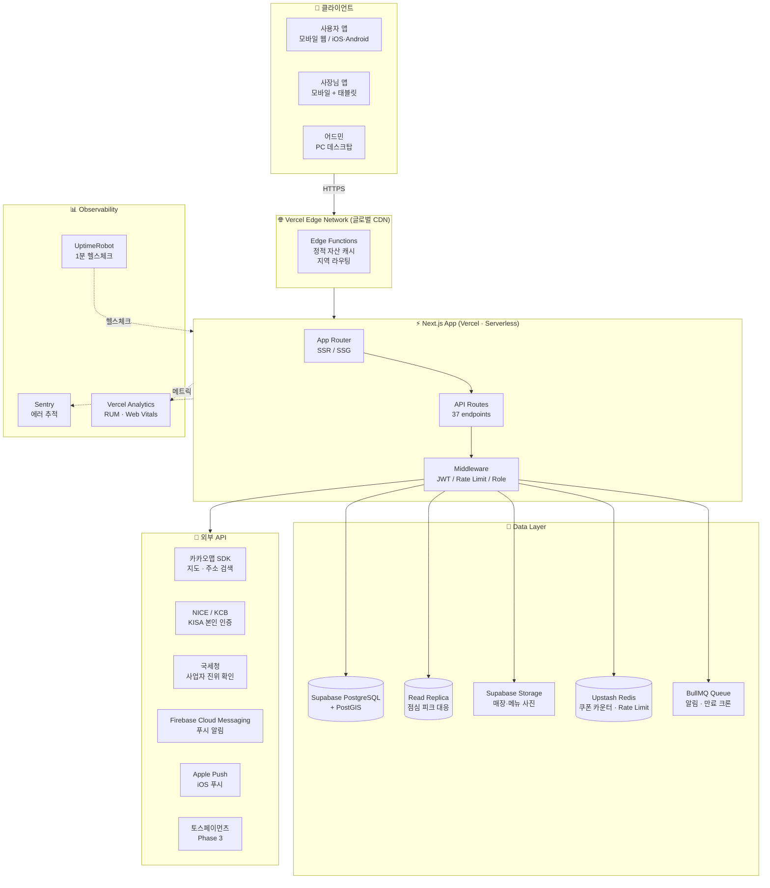
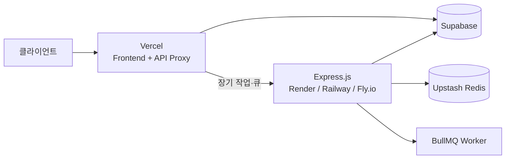

<style>
@media print {
    body, p, li { font-size: 13pt !important; line-height: 1.6 !important; }
    h1 { font-size: 22pt !important; margin-top: 22pt !important; margin-bottom: 14pt !important; }
    h2 { font-size: 18pt !important; margin-top: 18pt !important; margin-bottom: 12pt !important; }
    h3 { font-size: 16pt !important; margin-top: 16pt !important; margin-bottom: 10pt !important; }
    h4 { font-size: 14pt !important; margin-top: 12pt !important; margin-bottom: 8pt !important; }
    ul, ol { margin-top: 5pt !important; margin-bottom: 5pt !important; padding-left: 22pt !important; }
    pre, code { font-size: 10pt !important; }
}
</style>

# 인프라 아키텍처 (Infrastructure Architecture) · 점심특강

**프로젝트명**: 점심특강 (Lunch Special Lecture)
**작성일**: 2026-06-01
**버전**: v1.0
**근거 문서**:
- [시스템정의서.md](시스템정의서.md) v1.0 (서비스 모듈 12종 + 데이터 모델)
- [API스펙.md](../02.기획문서/API스펙.md) v1.0 (37 API + NFR 매핑)
- [기능명세서.md](../02.기획문서/기능명세서.md) v1.0 (F-ID 59건)
- [요구사항정의서.md](../02.기획문서/요구사항정의서.md) v1.0 (NFR-001~025)
- [화면설계서.md](../02.기획문서/화면설계서.md) v1.0 (33 화면)

**현재 마일스톤 단계**: **M1~M4 통합 (Vercel + Next.js API Routes)**
**분리 트리거**: M5+ 트래픽 증가 또는 Lambda 60초 초과 작업 발생 시 Express 분리 검토

---

## 1. 시스템 구성도 (M1~M4 통합)

### 1.1 전체 아키텍처



### 1.2 M5+ 분리 시 (Express 백엔드 분리)



**M5+ 분리 트리거 (시스템정의서 §12 참조)**:
- Vercel Lambda 60초 한계 초과 작업 (PDF 워터마크, 대용량 이미지 처리)
- Vercel Pro 함수 호출 한도 초과
- 장기 실행 큐/크론 필요
- 외부 시스템 통합으로 자체 호스팅 우위

---

## 2. 서버 구성

### 2.1 호스팅 환경별 사양

| 구분 | 환경 | 호스팅 | 사양 | 비용 (월) | 용도 |
|------|------|--------|------|-----------|------|
| **Frontend + API** | Production | Vercel Pro | 1TB 대역폭, 1M Function 호출 / 60s timeout / 3GB 메모리 | $20 | M1~M4 단일 배포 |
| **Frontend + API** | Staging | Vercel Pro (동일 프로젝트, 별도 환경) | 동일 | 포함 | QA·UAT |
| **Frontend + API** | Preview | Vercel Pro | PR마다 자동 생성 | 포함 | PR 리뷰 |
| **Database** | Production | Supabase Pro | 8GB DB, 100GB 대역폭, **PostGIS 활성** | $25 | 메인 PostgreSQL |
| **Database Replica** | Production | Supabase Pro | Read Replica 1대 | $25 | 점심 피크 분산 (NFR-004) |
| **Database** | Staging | Supabase Free | 500MB DB | $0 | 테스트 |
| **Storage** | Production | Supabase Storage | 100GB 사진 (매장·메뉴) | 포함 | 이미지 |
| **Cache** | Production | Upstash Redis | 256MB, 10K commands/day | $10 | 쿠폰 한정 수량·Rate Limit |
| **Queue** | Production | BullMQ on Upstash | 10K jobs/day | 포함 | 알림·만료 크론 |
| **CI/CD** | — | GitHub Actions | 2,000분/월 (Public) | $0 | 빌드·테스트·배포 |
| **n8n Cloud** | Production | n8n Cloud Starter | 5K workflow 실행/월 | $20/€ | WF 01~05 자동화 |
| **DNS / SSL** | Production | Vercel + Let's Encrypt | 자동 갱신 | $0 | HTTPS/HSTS |
| **Sentry** | Production | Sentry Team | 50K 이벤트/월 | $26 | 에러 추적 |
| **UptimeRobot** | Production | UptimeRobot Pro | 50 모니터, 1분 간격 | $7 | uptime SLA |

**M1~M4 월 추정 비용**: **약 $108~$130 / 월** (도메인·법무 자문 제외)

### 2.2 사양 산정 근거 (NFR-004 점심 피크 10만 동접)

| 시간대 | 평소 RPS | 점심 피크 RPS (11~14시) | Vercel 처리 |
|--------|---------|------------------------|------------|
| 일반 (00~10시, 14~24시) | ~50 | — | Edge cache 흡수 |
| 점심 피크 (11~14시) | — | **5,000 ~ 7,000 RPS** | Serverless auto-scale + Edge cache + Supabase Read Replica |

> 메인 피드(`API-GET-lunch-specials`) Edge cache 60s TTL로 90%+ 흡수, 쿠폰 발급(`API-POST-coupons-issue`)만 DB 직접 호출.

---

## 3. 네트워크 구성

### 3.1 도메인·SSL

| 항목 | 값 |
|------|-----|
| **Production 도메인** | `lunch-special.com` (사용자), `owner.lunch-special.com` (사장님), `admin.lunch-special.com` (어드민) |
| **Staging 도메인** | `staging.lunch-special.com`, `staging-owner.lunch-special.com` |
| **Preview 도메인** | `*.vercel.app` (PR마다 자동 생성) |
| **SSL 인증서** | **Let's Encrypt** (Vercel 자동 발급·갱신) |
| **HSTS** | `max-age=63072000; includeSubDomains; preload` (NFR-007) |
| **TLS 버전** | TLS 1.2+ 강제 (TLS 1.0/1.1 차단) |
| **HTTP/2** | Vercel Edge 기본 |
| **CDN** | Vercel Edge Network (글로벌 100+ POPs) |

### 3.2 CORS 정책

| 출처 | 허용 메서드 | 비고 |
|------|-----------|------|
| `https://lunch-special.com` | GET, POST, PATCH, DELETE | 사용자 앱 |
| `https://owner.lunch-special.com` | GET, POST, PATCH, DELETE | 사장님 앱 |
| `https://admin.lunch-special.com` | GET, POST, PATCH, DELETE | 어드민 (IP 화이트리스트 추가) |
| Vercel preview URLs | GET, POST, PATCH, DELETE | 자동 허용 (개발 편의) |
| 기타 외부 출처 | **차단** | Same-Origin 정책 |

### 3.3 어드민 IP 화이트리스트 (NFR-008)

```
사무실 고정 IP: 211.xxx.xxx.xxx/32
재택 VPN: 10.x.x.x/24
긴급 hotfix용: 임시 등록 (24h 만료)
```

미허용 IP에서 `/admin/*` 접근 시 403 + Sentry alert.

### 3.4 방화벽 (Vercel + Supabase 기본 제공)

| 인바운드 | 규칙 |
|---------|------|
| 80 / 443 | Public (HTTPS 강제) |
| 그 외 포트 | 차단 |

| 아웃바운드 | 규칙 |
|-----------|------|
| Supabase (https://*.supabase.co) | 허용 |
| External APIs (카카오맵·NICE·국세청·FCM·APNS·토스페이) | 허용 (도메인 화이트리스트) |
| 기타 | 차단 |

---

## 4. 배포 환경

| 환경 | URL | 용도 | 배포 방식 | 데이터 |
|------|-----|------|-----------|--------|
| **개발 (Local)** | `localhost:3000` | 개발/디버깅 | `pnpm dev` | Docker PostgreSQL + 시드 |
| **Preview** | `*.vercel.app` | PR 리뷰 | PR 생성 시 자동 (GitHub Actions) | Staging DB 공유 |
| **Staging** | `staging.lunch-special.com` | QA · UAT · 부하 테스트 | `main` 머지 시 자동 | Staging DB (격리) |
| **Production** | `lunch-special.com` | 서비스 운영 | Staging 검증 후 수동 promote | Production DB |

### 4.1 CI/CD 파이프라인 (GitHub Actions)

```mermaid
flowchart LR
    PR[PR 생성] --> Lint[ESLint + Prettier]
    Lint --> Test[Jest 단위 + Supertest 통합]
    Test --> Build[Next.js build]
    Build --> Preview[Vercel Preview 배포]
    Preview --> Review[코드 리뷰 + QA]
    Review --> Merge[main 머지]
    Merge --> StagingD[Staging 자동 배포]
    StagingD --> SmokeT[Playwright Smoke 테스트]
    SmokeT --> Approve[수동 승인]
    Approve --> ProdD[Production 배포]
    ProdD --> Alert[n8n WF-03 Slack 배포 알림]
```



### 4.2 배포 정책 (NFR-006 점심 100% uptime)

| 항목 | 정책 |
|------|------|
| **배포 freeze 시간** | **매일 10:30 ~ 14:30** (점심 시간 ± 30분) — 긴급 hotfix 제외 |
| **배포 방식** | Vercel **Atomic Deployment** (이전 빌드 즉시 롤백 가능) |
| **롤백 SLA** | 1분 이내 (`vercel rollback`) |
| **카나리** | Vercel Edge에서 `x-deployment-id` 헤더로 5% 트래픽 카나리 |
| **Production 배포 빈도** | 주 2회 (화·목), 점심 시간 외 |

---

## 5. 외부 연동 서비스

### 5.1 외부 API 매트릭스

| 서비스 | 용도 | 연동 방식 | 관련 F-ID | 비용 | SLA |
|--------|------|-----------|----------|------|-----|
| **카카오맵 SDK** | 지도 시각화, 주소→좌표 변환 | JS SDK + REST API | F-0101, F-0206 | 무료 (월 30만 호출까지) | 99.5% |
| **NICE / KCB** | KISA 휴대폰 본인 인증 | iframe + Server Callback | F-0302, F-0401 | 건당 ₩50~100 | 99.9% |
| **국세청 사업자 진위 확인** | 사업자 등록번호 검증 | REST API | F-0401 | 무료 (Open API) | 99% |
| **Firebase Cloud Messaging** | Android 푸시 알림 | Admin SDK | F-0308, F-7003 | 무료 (무제한) | 99.95% |
| **Apple Push Notification** | iOS 푸시 알림 | HTTP/2 API | F-0308, F-7003 | $99/년 (Developer 계정) | 99.9% |
| **토스페이먼츠** (Phase 3) | 선결제 | REST API + Webhook | F-8002 | 거래 수수료 2.9% | 99.95% |
| **n8n Cloud** | 워크플로우 자동화 | Webhook + Slack | 운영 자동화 | $20/월 | 99% |
| **Slack** (n8n via) | 팀 알림 채널 | Incoming Webhook | 운영 알림 | 무료 | 99.99% |

### 5.2 API Key 관리

모든 외부 API Key는 [`.AP-key.md`](../.AP-key.md) 및 Vercel 환경 변수에 저장 (gitignore 보호).

| Key 이름 | 저장 위치 | 회전 주기 |
|---------|----------|----------|
| `KAKAOMAP_APP_KEY` | Vercel Env | 6개월 |
| `NICE_API_KEY` | Vercel Env (Server-only) | 1년 |
| `NTS_API_KEY` | Vercel Env (Server-only) | 1년 |
| `FCM_SERVER_KEY` | Vercel Env (Server-only) | 1년 |
| `SUPABASE_URL`, `SUPABASE_ANON_KEY` | Vercel Env (Public) | — |
| `SUPABASE_SERVICE_ROLE_KEY` | Vercel Env (Server-only, **유출 시 즉시 회전**) | 3개월 |
| `JWT_SECRET` (HS256) | Vercel Env (Server-only) | 6개월 |
| `TOSS_SECRET_KEY` (Phase 3) | Vercel Env (Server-only) | 6개월 |
| `UPSTASH_REDIS_URL` | Vercel Env | 1년 |

---

## 6. 트래픽·캐싱 전략 (NFR-001~006)

### 6.1 점심 피크 곡선

```
RPS
7000 |              ╱──────╲
6000 |             ╱        ╲
5000 |            ╱          ╲
4000 |           ╱            ╲
3000 |          ╱              ╲
2000 |         ╱                ╲
1000 |        ╱                  ╲
 100 |───────╱                    ╲────────
       09  10  11  12  13  14  15  16  17  18
                  ▲▲▲ 점심 피크 (5~7x)
```

### 6.2 엔드포인트별 캐싱 정책

| API | Cache 위치 | TTL | 무효화 트리거 |
|-----|-----------|-----|--------------|
| `API-GET-lunch-specials` (메인 피드) | Vercel Edge | **60s** | 사장님 발행/취소 시 webhook 무효화 |
| `API-GET-lunch-specials/{id}` | Edge | 30s | 동일 |
| `API-GET-restaurants` | Edge | 120s | 매장 등록/수정 시 무효화 |
| `API-POST-coupons-issue` | **No cache** | — | Redis 카운터 atomic 보장 |
| `API-POST-coupons-redeem` | No cache | — | 단일 트랜잭션 |
| `API-GET-metrics` | App-level | 1h (시간 단위 집계) | 사장님 진입 시 갱신 |
| `API-GET-coupons-me` | No cache | — | 사용자별 |
| 정적 자산 (이미지·CSS·JS) | Edge | 31536000 (1년) | 빌드 해시 변경 |

### 6.3 Read Replica 분산 (NFR-004)

- 쓰기 작업: Master DB 직접
- 읽기 작업: Read Replica 우선 (Supabase 기본 라우팅)
- 점심 피크 시 Read Replica 자동 스케일 업

---

## 7. 보안 아키텍처 (NFR-007~014)

### 7.1 보안 레이어

| 레이어 | 통제 |
|--------|------|
| **전송** | HTTPS 강제 (HSTS preload), TLS 1.2+ |
| **인증** | JWT (HS256, 15분 액세스 + 30일 리프레시) + KISA 본인 인증 |
| **권한** | JWT `role` claim + 미들웨어 검증 (USR/OWN/ADM 3종) |
| **Rate Limit** | Upstash Redis 슬라이딩 윈도우 (60 req/min 인증, 30 req/min 비인증) |
| **데이터** | AES-256 컬럼 암호화 (휴대폰·이메일·위치 이력) |
| **쿠폰 토큰** | JWT HS256 + **60초 만료** + **PostGIS 100m 위치 검증** |
| **CSRF** | Same-Origin + CORS 화이트리스트 |
| **XSS** | DOMPurify (리뷰 Phase 2), CSP 헤더 |
| **SQL Injection** | Prepared Statement (Supabase 기본) |
| **어드민 보호** | IP 화이트리스트 + 2FA (TOTP) |

### 7.2 비밀번호 정책

- bcryptjs (서버리스 호환), salt rounds 12
- 최소 8자, 영문+숫자+특수문자 1개 이상
- 직전 3개 재사용 금지
- 90일 강제 변경 (어드민만)

### 7.3 컴플라이언스

| 법규 | 대응 |
|------|------|
| **개인정보보호법** | 동의 흐름 + 5년 보관, 월 1회 법무 검토 (NFR-012) |
| **위치정보보호법** | 위치 수집 동의 + 월 1회 사용 내역 알림 (NFR-013) |
| **사업자 인증** | 국세청 진위 확인 API + 결과 영구 보관 (NFR-014) |

---

## 8. 모니터링 & 알람 (NFR-021)

### 8.1 메트릭 수집

| 메트릭 | 도구 | 임계값 |
|--------|------|-------|
| **에러율** | Sentry | 0.5% 초과 시 즉시 Slack alert |
| **점심 피크 에러율** | Sentry (11~14시 별도 dashboard) | 0.2% 초과 시 즉시 PagerDuty |
| **API P95 응답 시간** | Vercel Analytics | 1초 초과 시 alert |
| **uptime** | UptimeRobot (1분 간격) | 99.5% 이하 시 alert |
| **DB 연결 풀** | Supabase Dashboard | 80% 초과 시 alert |
| **Redis 큐 크기** | Upstash Console | 1,000 초과 시 alert |
| **쿠폰 발급 성공률** | 자체 메트릭 (Logflare) | 95% 미만 시 alert |

### 8.2 로그 보관

| 로그 | 저장소 | 보관 기간 |
|------|--------|----------|
| 애플리케이션 로그 | Vercel Logs + Logflare | 60일 |
| Sentry 에러 | Sentry | 90일 |
| 어드민 감사 로그 | DB (`audit_logs` 테이블) | **5년** (NFR-012) |
| 매장 수정 이력 | DB (`store_audit_logs`) | 30일 (F-0408) |

### 8.3 인시던트 대응 (P0~P3)

| 심각도 | 정의 | SLA | 대응 |
|--------|------|-----|------|
| **P0** | 점심 시간 다운 / 결제 실패 / 보안 침해 | **5분 이내** | 즉시 hotfix, PagerDuty 전 팀 호출 |
| **P1** | 핵심 기능 (쿠폰 발급/사용) 불가 | 30분 이내 | 담당자 호출 |
| **P2** | 부가 기능 오류 | 2시간 이내 | 다음 영업일 처리 |
| **P3** | UI 버그 | 1주일 이내 | 다음 배포 포함 |

---

## 9. 백업 & 재해 복구 (NFR-022)

### 9.1 백업 정책

| 대상 | 방식 | 빈도 | 보관 | 복구 시간 (RTO) |
|------|------|------|------|----------------|
| **PostgreSQL** | Supabase Auto Backup | **일 1회** (UTC 17:00 = KST 02:00) | 7일 | 30분 |
| **Point-in-Time Recovery** | Supabase Pro | 실시간 WAL | 7일 | 7일 이내 임의 시점 |
| **Storage (사진)** | Supabase Storage 자체 이중화 | 실시간 | 영구 | 즉시 |
| **Redis 카운터** | Upstash AOF + RDB | 매 분 | 1일 | 5분 (재계산 가능) |
| **환경 변수** | Vercel + 1Password Vault | 즉시 | 영구 | 5분 |
| **소스 코드** | GitHub + GitLab 미러 | Git push | 영구 | 즉시 |

### 9.2 복구 절차 (월 1회 모의 훈련)

```
1. UptimeRobot/Sentry alert 수신 → 인시던트 채널 (Slack) 자동 생성
2. 영향 범위 식별 (어떤 사용자/매장이 영향)
3. 롤백 우선:
   - 배포 이슈 → Vercel rollback (1분)
   - DB 이슈 → PITR로 직전 정상 시점 복구
4. 데이터 손실 시 영향 사용자에게 알림
5. 사후 보고서 (Post-mortem) 24h 이내 작성
```

### 9.3 RPO / RTO 목표

| 시나리오 | RPO (데이터 손실 허용) | RTO (서비스 복구 시간) |
|---------|----------------------|----------------------|
| 배포 실패 (롤백) | 0 (무손실) | 1분 |
| DB 장애 (PITR) | 5분 | 30분 |
| 전체 리전 장애 | 1시간 | 4시간 |
| 보안 침해 | 즉시 격리 | 24시간 (재구축) |

---

## 10. 환경 변수 (Vercel + Supabase)

### 10.1 Vercel 등록 환경 변수

```bash
# ── Database ────────────────────────────────────────
SUPABASE_URL="https://xxx.supabase.co"
SUPABASE_ANON_KEY="eyJhbGc..."         # Public (Frontend)
SUPABASE_SERVICE_ROLE_KEY="eyJhbGc..." # Server-only ⚠️
DATABASE_URL="postgresql://..."        # 직접 연결용

# ── Auth ────────────────────────────────────────────
JWT_SECRET="<256-bit random>"          # HS256 서명
JWT_ACCESS_EXPIRES_IN="15m"
JWT_REFRESH_EXPIRES_IN="30d"

# ── External APIs ───────────────────────────────────
NEXT_PUBLIC_KAKAOMAP_KEY="..."         # Public
NICE_API_KEY="..."                     # Server-only
NICE_API_SECRET="..."                  # Server-only
NTS_API_KEY="..."                      # Server-only

# ── Push ────────────────────────────────────────────
FCM_SERVER_KEY="..."                   # Server-only
APNS_KEY_ID="..."
APNS_TEAM_ID="..."
APNS_PRIVATE_KEY="..."

# ── Cache & Queue ───────────────────────────────────
UPSTASH_REDIS_URL="..."
UPSTASH_REDIS_TOKEN="..."

# ── Storage ─────────────────────────────────────────
SUPABASE_STORAGE_BUCKET="lunch-photos"

# ── Monitoring ──────────────────────────────────────
SENTRY_DSN="..."
SENTRY_AUTH_TOKEN="..."

# ── Payments (Phase 3) ──────────────────────────────
TOSS_SECRET_KEY="test_sk_..."
NEXT_PUBLIC_TOSS_CLIENT_KEY="test_ck_..."

# ── n8n / Slack ─────────────────────────────────────
N8N_WEBHOOK_DEPLOY="https://xxx.app.n8n.cloud/webhook/deploy"
SLACK_WEBHOOK_ALERTS="https://hooks.slack.com/services/..."

# ── App ─────────────────────────────────────────────
NEXT_PUBLIC_SITE_URL="https://lunch-special.com"
NODE_ENV="production"
```

---

## 11. 비용 추적

### 11.1 월별 인프라 비용 추정

| 항목 | M1 (월 1만 MAU) | M3 (월 1만 MAU + 베타) | M6 (월 5만 MAU 목표 달성) |
|------|---------------|----------------------|--------------------------|
| Vercel Pro | $20 | $20 | $40 (사용량 추가) |
| Supabase Pro + Replica | $50 | $50 | $70 |
| Upstash Redis | $10 | $10 | $20 |
| Sentry Team | $26 | $26 | $26 |
| UptimeRobot | $7 | $7 | $7 |
| n8n Cloud | $20 | $20 | $20 |
| KISA 본인 인증 (NICE) | $10 (가입 100명 × ₩100) | $50 | $200 |
| 카카오맵 API | $0 (무료 한도) | $0 | $0 |
| 도메인 | $1 | $1 | $1 |
| **합계** | **~$144 / 월** | **~$184 / 월** | **~$384 / 월** |

> Production 출시(M4) 후 매월 검토. M6 매출 6,105만 원 대비 인프라 비용 약 0.5% 이내 유지 목표.

### 11.2 M5+ 분리 시 추가 비용

| 항목 | 비용 |
|------|------|
| Render Standard (Express 호스팅) | $25/월 |
| 별도 DB 연결 풀 | $0 (Supabase 그대로 활용) |
| 추가 모니터링 | $0 (Sentry 통합) |
| **추가 합계** | **+$25 / 월** |

---

## 12. 단계별 전환 계획

### 12.1 M1~M4 (현재): Vercel 통합 단일 배포

- 모든 코드: `src/frontend/` (Next.js App Router)
- API: `src/frontend/app/api/*` (Route Handlers)
- `src/backend/`: **빈 폴더 (`.gitkeep`)** — M5+ 활성화 예정
- 1인/소규모 운영 최적

### 12.2 M5+ 분리 트리거 발생 시

1. `src/backend/`에 Express.js 코드 추가
2. Render / Railway / Fly.io 중 선택 (월 $25~50)
3. Vercel `pages/api/[...path].ts`로 Express 백엔드 프록시 추가
4. CORS 화이트리스트 갱신
5. 데이터베이스 연결은 그대로 (Supabase 공유)
6. 큐/크론을 Express로 이관 (BullMQ Worker)

### 12.3 M12+ (수도권 확대 시)

- Multi-region 검토 (서울 + 도쿄 fallback)
- Supabase 별도 인스턴스 또는 PostgreSQL HA 클러스터
- CDN 캐시 적극 활용

---

## 13. 변경 이력

| 버전 | 일자 | 변경 내용 | 작성자 |
|------|------|----------|--------|
| v1.0 | 2026-06-01 | 최초 작성. 시스템정의서 v1.0 + API스펙 v1.0 기반. M1~M4 통합 아키텍처 풀 정의 (Vercel + Supabase + Upstash Redis + 외부 API 8종), 점심 피크 10만 동접 대응 캐싱 전략, 보안 레이어 11종, 백업·재해 복구 정책 (RPO 5분 / RTO 30분), 환경 변수 24종, 비용 추정 (M1 $144/월 → M6 $384/월), M5+ 분리 트리거 정의. | PM |

---

**작성 완료**: [x] 시스템 구성도 + 서버 구성 + 네트워크 + 배포 + 외부 연동 + 트래픽·캐싱 + 보안 + 모니터링 + 백업·재해 복구 + 환경 변수 + 비용 + M5+ 전환 계획

**다음 산출물**: W4 구현 셋업 — Vercel 프로젝트 생성, GitHub Actions CI/CD 스캐폴딩, n8n 워크플로우 import. 본 문서는 W4 진입 시 인프라 셋업 체크리스트로 활용.
